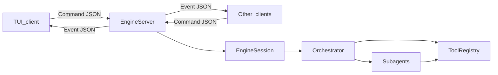
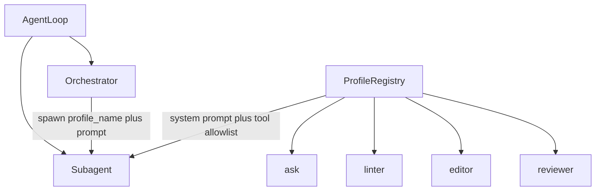
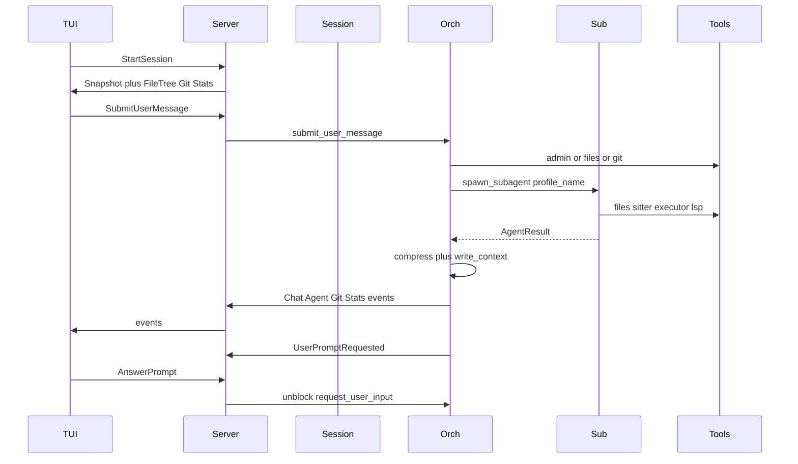

# Engine class and method design

This is an **engine-only** plan. No TUI widgets. The TUI later becomes one client of a serializable protocol.

## How clients talk to the engine

In-process imports will not scale if this engine is reused from a TUI, a web UI, tests, or another app. The split is:

- **Core:** an `EngineSession` that owns the workspace, orchestrator, tools, and state.
- **Contract:** JSON commands in, JSON events out (all dataclasses, serializable).
- **Transport:** a local server wrapping the session. Start with **newline-delimited JSON over a Unix domain socket** (no port fights, easy for a TUI). The same messages can later ride WebSocket/HTTP without changing classes.



[`app.py`](app.py) only boots a server for a workspace path. Clients never import `Orchestrator` or tools directly.

---

## Folder layout

Matches your sketch, plus a thin `protocol/` and `runtime/` so the TUI contract is not buried in agent code.

```
app.py
protocol/
  commands.py
  events.py
  snapshot.py
runtime/
  session.py
  server.py
  state.py
agents/
  agent_loop.py
  orchestrator.py
  subagent.py
  profile.py              # AgentProfile + ProfileRegistry
  profiles/               # named subagent personalities
    ask.py
    linter.py
    editor.py
    reviewer.py
  compressor.py
tools/
  base.py
  registry.py
  git/
  files/
  lsp/
  sitter/                 # tree-sitter, separate from LSP
  admin/
  executor/
llm/
  provider.py
```

`agents/` holds the loop hierarchy. `agents/profiles/` holds named subagent personalities only (not the orchestrator). `tools/` holds `BaseTool` plus one package per family, with tree-sitter separate from LSP.

---

## Protocol: the TUI surface

### Commands (client → engine)

Defined in [`protocol/commands.py`](protocol/commands.py). Each command is a dataclass with `to_json()` / `from_json()`.

| Command | Purpose |
|---|---|
| `StartSession(workspace)` | Bind engine to a project root |
| `SubmitUserMessage(text)` | User prompt from the chat box |
| `AnswerPrompt(prompt_id, text)` | Reply when orchestrator asked a question |
| `OpenFile(path)` / `CloseFile(path)` | Drive the center-panel file view |
| `RequestSnapshot()` | Full state for first paint / reconnect |
| `AbortAgent(agent_id=None)` | Stop one subagent or the whole run |
| `Shutdown()` | Clean stop |

The TUI does **not** implement folder-tree walking, git status, or agent polling. It sends commands and renders events.

### Events (engine → clients)

Defined in [`protocol/events.py`](protocol/events.py). These map 1:1 onto the TUI panels you listed.

| Event | TUI panel |
|---|---|
| `ChatMessageAdded` | Center chat (full height, or bottom half when a file is open) |
| `UserPromptRequested` | Prompt box / modal when orch needs input |
| `FileTreeUpdated` | Left sidebar |
| `FileContent` / `FileChanged` | Center top (opened file + live edits / diffs) |
| `AgentStarted` / `AgentUpdated` / `AgentFinished` | Right middle (working agents) |
| `GitStateUpdated` | Right bottom (branch, status, diffs) |
| `StatsUpdated` | Right top (tokens, elapsed, agent count, cost) |
| `ContextFileUpdated` | Optional; orch long-term memory file |
| `ErrorOccurred` / `SessionEnded` | Global |

`FileChanged` carries a unified diff so the TUI can show “git things” and in-file diffs without talking to git itself.

### Snapshot

[`protocol/snapshot.py`](protocol/snapshot.py) — `EngineSnapshot` is the reconnect payload:

- `messages`, `open_files`, `file_tree`
- `agents` (id, role, profile, status, current_tool, parent_id)
- `stats` (tokens_in/out, elapsed_s, active_agents)
- `git` (branch, dirty, staged/unstaged diffs)
- `pending_prompt` (id + question, or null)

`RequestSnapshot` returns this once. After that, clients apply events.

---

## Runtime classes

### `EngineSession` — [`runtime/session.py`](runtime/session.py)

The only object the server talks to.

```python
class EngineSession:
    def __init__(self, workspace: Path, llm: LLMProvider): ...
    async def start(self) -> EngineSnapshot: ...
    async def handle(self, command: Command) -> None: ...
    def subscribe(self) -> asyncio.Queue[Event]: ...
    def snapshot(self) -> EngineSnapshot: ...
    async def shutdown(self) -> None: ...
```

`handle()` routes:

- `SubmitUserMessage` → `orchestrator.submit_user_message()`
- `AnswerPrompt` → unblocks `orchestrator.request_user_input()`
- `OpenFile` → `FileTools.read()` then emit `FileContent`
- `AbortAgent` → cancel the named task

After mutating tools, session refreshes git + stats and emits `GitStateUpdated` / `StatsUpdated`.

### `EngineServer` — [`runtime/server.py`](runtime/server.py)

```python
class EngineServer:
    def __init__(self, session: EngineSession, socket_path: Path): ...
    async def serve(self) -> None: ...
    async def _on_client(self, reader, writer) -> None: ...
```

One session per workspace process. Multiple clients can subscribe to the same event fan-out.

### `SessionState` — [`runtime/state.py`](runtime/state.py)

Mutable source of truth behind `snapshot()`. Agents, messages, open files, git cache, pending prompt, token counters. Session writes here; protocol only reads copies.

---

## Agent classes



### Subagent profiles — [`agents/profile.py`](agents/profile.py) + [`agents/profiles/`](agents/profiles/)

Profiles are **only for subagents**. They are named personalities the orchestrator picks when spawning work (ask, linter, editor, reviewer, …). The orchestrator is not a profile; it has its own fixed tool set (including admin). `Subagent` stays one class — the profile is what changes prompt, tools, and limits.

```python
@dataclass
class AgentProfile:
    name: str                    # "ask" | "linter" | "editor" | "reviewer"
    description: str             # shown to orch so it can choose
    system_prompt: str
    tool_names: list[str]        # never includes admin
    model: str
    max_turns: int
    temperature: float = 0.2

class ProfileRegistry:
    def register(self, profile: AgentProfile) -> None: ...
    def get(self, name: str) -> AgentProfile: ...
    def list(self) -> list[AgentProfile]: ...
```

Built-in profiles (each module in `agents/profiles/` exports one `AgentProfile`):

| Profile | Job | Typical tools |
|---|---|---|
| `ask` | Read-only Q&A about the repo | files (read/search), sitter, lsp |
| `linter` | Find issues, no edits | files (read), sitter, lsp diagnostics, executor (run linters) |
| `editor` | Make code changes | files (read/write/edit), sitter, lsp, executor |
| `reviewer` | Review diffs / propose verdict | files (read), git, sitter, lsp |

`SpawnSubagent` takes a **profile name**, not a free-form system prompt. Orch can still pass a task string (the subagent’s only “user prompt”). New profiles later are just another file in `agents/profiles/` plus `ProfileRegistry.register`.

`AgentStarted` / snapshot agent rows include `profile` so the TUI agent list can show `linter`, `editor`, etc.

### `AgentLoop` — [`agents/agent_loop.py`](agents/agent_loop.py)

Base class. Both orch and subagent use the same turn cycle.

```python
class AgentLoop:
    def __init__(self, profile, tools, session, llm): ...
    async def run(self, task: str) -> AgentResult: ...
    async def step(self) -> StepOutcome: ...          # one model+tools turn
    def _build_messages(self) -> list[Message]: ...
    async def _invoke_model(self) -> LLMResponse: ...
    async def _dispatch_tools(self, calls) -> list[ToolResult]: ...
    def _should_stop(self) -> bool: ...
    def _emit(self, event: Event) -> None: ...
```

`run()` loop: emit `AgentUpdated` → `_invoke_model` → if tool calls, `_dispatch_tools` → append results → repeat until stop, max turns, or abort.

`AgentResult`: `{status, final_text, files_touched, tool_trace}`.

### `Orchestrator` — [`agents/orchestrator.py`](agents/orchestrator.py)

Extends `AgentLoop`. **Only agent that can wait on a human.**

```python
class Orchestrator(AgentLoop):
    async def submit_user_message(self, text: str) -> None: ...
    async def request_user_input(self, question: str) -> str: ...
    async def spawn_subagent(self, profile_name: str, prompt: str) -> str: ...
    async def on_subagent_done(self, agent_id: str, result: AgentResult) -> None: ...
    def write_context(self, note: str) -> None: ...
```

- `submit_user_message`: append user turn, start/continue `run()`.
- `request_user_input`: emit `UserPromptRequested`, block until `AnswerPrompt`. Subagents must not call this.
- `spawn_subagent`: admin tool target; `ProfileRegistry.get(profile_name)`, starts a `Subagent` with that profile, emits `AgentStarted` (includes profile name). Several may run at once.
- `on_subagent_done`: compress transcript, append a short result into orch messages, `write_context()`, emit `AgentFinished`.
- `write_context`: append to `{workspace}/.engine/context.md` so orch keeps a long memory that survives compression. That file is also injected into orch’s `_build_messages()`.

### `Subagent` — [`agents/subagent.py`](agents/subagent.py)

Same loop, **no user-input channel**. The “user prompt” is the task string from orch, not a human.

```python
class Subagent(AgentLoop):
    def __init__(self, profile: AgentProfile, tools, session, llm): ...
    async def run(self, task: str) -> AgentResult: ...
    def finish(self, result: AgentResult) -> AgentResult: ...
```

`__init__` binds one profile. Tools are `registry.for_agent("subagent", profile.tool_names)`.

When `run()` ends, result goes only to `Orchestrator.on_subagent_done`. No events that ask the TUI for a reply.

### `ConversationCompressor` — [`agents/compressor.py`](agents/compressor.py)

Used when a subagent returns, and later if orch’s own history grows too large.

```python
class ConversationCompressor:
    async def compress(self, messages: list[Message]) -> CompressedTranscript: ...
```

`CompressedTranscript`: `{summary, outcome, files_touched, leftover_questions}`. Full subagent messages are dropped from the live orch context after this.

---

## Tool classes

### `BaseTool` + `ToolRegistry`

[`tools/base.py`](tools/base.py), [`tools/registry.py`](tools/registry.py)

```python
class BaseTool:
    name: str
    description: str
    parameters: dict
    allowed_roles: set[str]   # {"orchestrator"} or {"orchestrator", "subagent"}

    async def execute(self, ctx: ToolContext, **kwargs) -> ToolResult: ...

class ToolRegistry:
    def register(self, tool: BaseTool) -> None: ...
    def for_agent(self, role: str, names: list[str]) -> list[BaseTool]: ...
    async def execute(self, name: str, ctx: ToolContext, args: dict) -> ToolResult: ...
```

`ToolContext` carries `workspace`, `agent_id`, `role`, and a callback to emit `FileChanged` / `GitStateUpdated`. Registry rejects admin tools if `role != "orchestrator"`.

### Tool families (each extends `BaseTool`)

**`tools/files/`** — sidebar + center file panel

- `ListTree` — recursive listing (honors `.gitignore`)
- `ReadFile` / `WriteFile` / `EditFile`
- `SearchFiles` (content / glob)

`WriteFile` / `EditFile` emit `FileChanged` with a unified diff.

**`tools/git/`** — right-bottom git panel

- `GitStatus`, `GitDiff`, `GitLog`, `GitBranch`
- Mutating tools (`GitAdd`, `GitCommit`) stay behind the same class; session always re-emits `GitStateUpdated` after them

**`tools/lsp/`** — language-server intelligence (needs a running server)

- `GetDiagnostics`, `GoToDefinition`, `FindReferences`, `Hover`, `DocumentSymbols`
- Implement after files + git + sitter; loop can run without LSP

**`tools/sitter/`** — tree-sitter, its own family (no language server required)

- `ParseFile` — syntax tree for a path (language inferred from extension)
- `QueryTree` — run a tree-sitter query, return captures (nodes, ranges, text)
- `GetNodeAt` — node / parent / named children at a line/col
- `ListSymbols` — cheap local outline from the CST (functions, classes, imports)

Used by `ask`, `linter`, `editor`, `reviewer` for structure-aware reads without waiting on LSP. LSP stays for true diagnostics/defs/refs.

**`tools/admin/`** — orchestrator only

- `SpawnSubagent(profile_name, task)` → `orchestrator.spawn_subagent()`; `profile_name` must exist in `ProfileRegistry`
- `ListProfiles` → names + descriptions so orch can pick ask / linter / editor / reviewer
- `WriteContext` → `orchestrator.write_context()`
- `ListAgents` / `AbortAgent`

**`tools/executor/`** — command runner

- `RunCommand(cmd, cwd, timeout)` — captured stdout/stderr, no TTY
- Available to orch and subagents; not a user-input path

---

## LLM boundary

[`llm/provider.py`](llm/provider.py) — keep the loop independent of one vendor.

```python
class LLMProvider(Protocol):
    async def complete(
        self, messages: list[Message], tools: list[ToolSpec]
    ) -> LLMResponse: ...
```

`LLMResponse`: `{text, tool_calls, usage}`. First concrete impl can be Anthropic or OpenAI; the loop only sees this protocol. Usage feeds `StatsUpdated`.

---

## End-to-end flow



---

## Implementation order

1. Protocol dataclasses + `EngineSession.snapshot` / `handle` stubs (clients can attach immediately).
2. `EngineServer` NDJSON Unix socket.
3. `BaseTool`, files, git — enough to feed sidebar, file panel, git panel.
4. `LLMProvider` + `AgentLoop` + `Orchestrator` (single-agent chat + user prompts + context file).
5. `ProfileRegistry` + built-in profiles (`ask`, `linter`, `editor`, `reviewer`) + `Subagent` + `ConversationCompressor` + admin `SpawnSubagent` / `ListProfiles`.
6. Executor, then tree-sitter tools, then LSP.

Do not start the TUI until step 2 works: a dummy client should connect, send `StartSession`, and print events.
