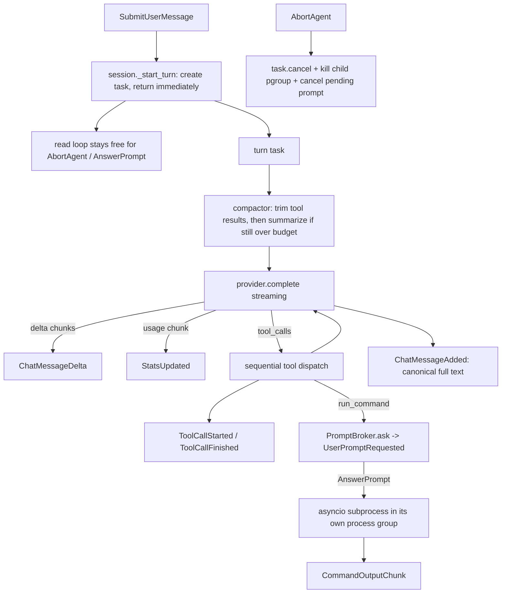

# Agent runtime foundation

## What this plan is, and what it is not

The write side is done and documented. The next milestone in [.cursor/plans/engine_class_design_9b10c713.plan.md](engine-class-design.md) is the multi-agent layer (`Orchestrator`, `AgentProfile`, `Subagent`, `ConversationCompressor`, admin tools). That layer cannot be built yet, and this plan is the reason why:

- `Orchestrator.request_user_input()` needs a prompt round trip. There is no `UserPromptRequested`/`AnswerPrompt`.
- `AbortAgent` needs a cancellable turn. The turn is currently `await`ed inside the socket read loop.
- `StatsUpdated` needs token accounting. `LLMResult` carries only `text` and `tool_calls`.
- The `linter` and `editor` profiles need `executor/RunCommand`. There is no shell tool at all.
- Subagent transcripts need a compressor, which needs a token budget, which needs real usage numbers.

So: **foundation only.** No `Orchestrator`, no `Subagent`, no profiles, no `SpawnSubagent`. Every phase here is a prerequisite that stands on its own and ships behind its own tests.

## The six defects this plan fixes

Stated plainly up front, because the phases are ordered by them:

0. **A fresh install is broken.** [requirements.txt](../../requirements.txt) pins `openrouter>=1.0`, but `openrouter` 1.x requires Python ≥3.10 and the project runs on 3.9.6. The installed version is 0.10.8 — below the pin. Found while checking whether the 3.9 floor was worth keeping, and split out into its own prerequisite plan rather than bundled here.
1. **A turn cannot be interrupted, and the abort command cannot even be read.** [runtime/server.py](../../runtime/server.py) `_read_commands` does `await self._session.handle(command)` in the same loop that reads the next line, and `submit_user_message` in [runtime/commands/lifecycle.py](../../runtime/commands/lifecycle.py) awaits the whole agent turn. For the duration of a turn — potentially minutes across 8 tool turns — that client's reader is parked. An `AbortAgent` typed into `dummy_client.py` would sit unread in the socket buffer until the thing it wants to cancel had already finished. (A *second* client could be heard, since each connection gets its own read task. That is an accident, not a design.)
2. **The user sees nothing for the whole turn.** `stream: False` in [llm/openrouter.py](../../llm/openrouter.py), and the assistant text is emitted once, at the end, by `session._add_message`.
3. **Nothing is metered.** No tokens, no cost, no elapsed time, no way to know a turn cost $2 until the OpenRouter dashboard says so.
4. **The agent cannot run anything.** It can edit code with 8 write tools and cannot run the test suite to find out whether the edit worked. `subprocess` appears in the repo only for `rg`, `git`, and LSP servers.
5. **History grows without bound.** `_build_messages()` concatenates every message. Tool results are capped at 80,000 chars *each* ([tools/registry.py](../../tools/registry.py) `MAX_RESULT`). Three `list_files` calls on a large repo can exceed a 128k context window, and the failure mode is an opaque provider 400.

## Turn lifecycle after this plan



---

## Prerequisite — interpreter and dependency floor (separate plan)

Land [Interpreter and dependency floor](../../interpreter_dependency_floor_b3f21a08.plan.md) first. It is deliberately **not** a phase of this plan: approving streaming and cancellation work should not implicitly approve a 3.9 → 3.14 interpreter migration, and that migration was discovered mid-review rather than being part of this brief.

What this plan needs from it, and nothing more:

- **A known, pinned `openrouter` version.** Everything in 1.2 below was verified against the *installed 0.10.8*. `requirements.txt` pins `openrouter>=1.0`, and 1.x requires Python ≥3.10, so today the pin is unsatisfiable and the installed version is below it. Phase 1 has to know which surface it is coding against.
- Nothing else. **No phase here is built on the absence of a 3.11 API**, so if the prerequisite is abandoned per its own fallback ladder — keep 3.9, fix the pin downward to `openrouter>=0.10.8,<1` — Phases 1-8 proceed unchanged. Correcting my own earlier framing: for wrapping a *single* awaitable, `asyncio.wait_for(aw, t)` and `async with asyncio.timeout(t)` are equivalent; `asyncio.timeout` only pays off around a block containing several awaits, which the stream loop is not. `TaskGroup` in the executor is `asyncio.gather` over two reader tasks.

---

## Phase 0 — `EngineConfig`, and the single-tenant assumption

Every knob this plan introduces is process-wide, and the earlier draft said "read them once into an `EngineConfig`" in prose while Phases 1, 4, 5, and 7 went on describing `os.environ` reads at the point of use. That is an aspiration that does not survive implementation, so it becomes a phase with named call sites and lands **before** the phases that consume it.

### 0.1 New `runtime/config.py`

```python
@dataclass
class EngineConfig:
    llm_stream: bool = True             # ENGINE_LLM_STREAM
    llm_timeout_s: float = 600.0        # ENGINE_LLM_TIMEOUT_S
    stream_idle_s: float = 90.0         # ENGINE_LLM_IDLE_S
    max_turns: int = 16                 # ENGINE_MAX_TURNS
    exec_approval: str = "auto"         # ENGINE_EXEC_APPROVAL: auto|always|never
    exec_timeout_s: int = 120           # ENGINE_EXEC_TIMEOUT_S
    exec_file_limit_mb: int = 2048      # ENGINE_EXEC_FILE_LIMIT_MB
    context_budget: int = 120_000       # ENGINE_CONTEXT_BUDGET
    subscriber_capacity: int = 4096     # ENGINE_SUBSCRIBER_CAPACITY
    subscriber_bytes: int = 1 << 20     # ENGINE_SUBSCRIBER_BYTES — 1 MiB, not STREAM_LIMIT
    warnings: list[str] = field(default_factory=list)

    @classmethod
    def from_env(cls, workspace: Path) -> EngineConfig: ...
```

Decisions:

- **`from_env` loads `env.sh` first, before reading anything.** This is the ordering trap: `_load_env_sh` currently runs as a *side effect* of `OpenRouterLLM.from_env(workspace)` in [llm/openrouter.py](../../llm/openrouter.py), which `EngineSession.__init__` calls. A config object that read `os.environ` before that point would miss every knob set in `env.sh` — and would do so silently, since the defaults are all valid. So `EngineConfig.from_env` calls `_load_env_sh(workspace / "env.sh")` itself. Calling it twice is safe: it skips any key already set to a non-placeholder value, so it is idempotent by construction. `OpenRouterLLM.from_env` keeps its own call so the LLM client stays usable standalone.
- **Malformed values produce a warning, not a silent default.** `ENGINE_MAX_TURNS=sixteen` must not quietly become 16. `_env_int`/`_env_float`/`_env_bool` helpers append to `config.warnings`, and `_bind_loop` emits each as `WarningOccurred` — the same treatment `registry.errors` already gets. `exec_approval` is validated against the three legal values for the same reason: a typo like `ENGINE_EXEC_APPROVAL=nver` silently falling back to `auto` is the benign direction, but falling back *without saying so* is not.
- **Constructed once in `EngineSession.__init__`**, before `OpenRouterLLM.from_env`, and stored as `self._config`. Not in `_bind_loop`: the LLM client is built in `__init__` and needs `llm_stream`/`llm_timeout_s`.
- **Tests construct `EngineConfig(max_turns=2)` directly** instead of monkeypatching `os.environ`. This is the concrete payoff beyond tidiness — every test in Phases 4, 5, and 7 that needs a non-default knob would otherwise need `monkeypatch.setenv` plus a reload, and process-global state in a test suite that runs asyncio sessions is a source of order-dependent flakes.

### 0.2 Call sites, named

Nothing below reads `os.environ`:

- **`OpenRouterLLM.__init__`** takes `config: EngineConfig` and uses `llm_stream`, `llm_timeout_s`, `stream_idle_s` (Phase 1.2).
- **`AgentLoop.__init__`** takes `config` and uses `max_turns` in place of the module constant, and `context_budget` when constructing the compactor (Phases 4.3, 7.1). `MAX_TURNS = 16` stays as the dataclass default, not as a module global read at call time.
- **`ToolContext`** gains `config: Any = None`, so `runtime/tools/shell.py` reads `exec_approval`, `exec_timeout_s`, and `exec_file_limit_mb` off `ctx.config` (Phase 5.1). This replaces the plan's earlier `ask_user`-only threading and is why `config` belongs on `ToolContext` rather than being passed per-call.
- **`EngineSession.subscribe()`** passes `subscriber_capacity` and `subscriber_bytes` into `Subscriber` (Phase 2.5).
- **`runtime/commands/files.py`** builds a bare `ToolContext` for `UndoLastEdit`; add `config=session._config` there so the one hand-built context is not the odd one out.

### 0.3 The single-tenant assumption

Recorded as a decision rather than left implicit: `EngineConfig` is per-*process*, not per-session, because it is read from the environment once at construction.

This matches what the engine already is. `app.py` binds one workspace per process; `start_session` in [runtime/commands/lifecycle.py](../../runtime/commands/lifecycle.py) rejects any `StartSession` whose workspace differs from the boot workspace; `_load_env_sh` already mutates `os.environ` process-wide from the workspace's own `env.sh`. One process, one workspace, one trust level — the config model matches the isolation model.

The constraint bites the moment that stops being true. If a multi-workspace host ever shares a process, `ENGINE_EXEC_APPROVAL=never` set for a trusted workspace would silently apply to an untrusted one. Because every consumer now takes a `config` *object* rather than reading the environment, the fix at that point is to construct a different `EngineConfig` per session and pass it — mechanical, and it touches no call site. That is the entire reason this phase exists rather than being a comment.

### 0.4 Tests — `tests/test_config.py`

Defaults with an empty environment; each knob read from a monkeypatched environment; a knob set in `env.sh` is picked up (guards the ordering trap); a malformed integer yields the default **plus** a warning string; an invalid `exec_approval` yields `auto` plus a warning; `from_env` called twice does not double-apply `env.sh` or clobber a real environment variable.

---

## Phase 1 — The LLM boundary

### 1.1 New `llm/provider.py`

Vendor-neutral types plus the structural interface. `typing.Protocol`, not an ABC: the engine never needs `isinstance`, only "has a `complete`", and a Protocol means a test double is a plain class with no import of engine code.

```python
@dataclass
class Usage:
    prompt_tokens: int = 0
    completion_tokens: int = 0
    total_tokens: int = 0
    reasoning_tokens: int = 0
    cached_tokens: int = 0
    cost: float = 0.0
    requests: int = 0

    def __add__(self, other: Usage) -> Usage: ...


@dataclass
class LLMResult:
    text: str = ""
    tool_calls: list[ToolCall] = field(default_factory=list)
    usage: Usage | None = None
    finish_reason: str | None = None
    model: str | None = None


class LLMProvider(Protocol):
    model: str

    async def complete(
        self,
        messages: list[dict],
        tools: list[dict] | None = None,
        *,
        on_delta: Callable[[str, str], None] | None = None,
    ) -> LLMResult: ...
```

Decisions:

- **`ToolCall` and `LLMResult` move here** from `llm/openrouter.py`, which re-exports both so `from llm.openrouter import LLMResult` keeps working. Nothing else in the repo imports them today except `agents/agent_loop.py` (type-free) and `runtime/session.py` (`OpenRouterLLM` only), so the blast radius is one line of re-export.
- **`on_delta(channel, text)`, a callback, not an async generator.** An async generator would force the agent loop to become a generator too and every caller up to the command handler to iterate it. The callback mirrors the existing `on_tool` hook, and it is invoked from inside the stream's `async for` — i.e. on the event loop thread — which is what makes `session._emit`'s `queue.put_nowait` legal. An async-generator design would be strictly more code for the same guarantee.
- **`channel` is `"text"` or `"reasoning"`,** one parameter instead of two callbacks or two event types. `ChatStreamDelta` in the SDK carries both `content` and `reasoning`.
- **`Usage.cost` comes from the provider,** never computed locally. `ChatUsage.cost` is already in the stream's final chunk. A local price table would be wrong within a week.
- **`reasoning_tokens` / `cached_tokens`** are read from `usage.completion_tokens_details.reasoning_tokens` and `usage.prompt_tokens_details.cached_tokens`. Both are `OptionalNullable` in the SDK, so read through a `_int_or_zero` helper rather than direct attribute access — the sentinel is `UNSET`, not `None`, and `int(UNSET)` raises.
- **Reasoning text is displayed but not fed back.** Round-tripping thinking blocks requires replaying `reasoning_details` in the assistant message, which is provider-specific and would silently break non-reasoning models. Deferred; noted in the code so nobody assumes it works.

### 1.2 Rewrite `OpenRouterLLM.complete` in [llm/openrouter.py](../../llm/openrouter.py)

The installed SDK is `openrouter` 0.10.8. Verified surface, so the implementation is not guesswork:

- `send_async(stream=True, ...)` returns `eventstreaming.EventStreamAsync[ChatStreamChunk]`, which implements `__aiter__`/`__anext__` and `__aenter__`/`__aexit__` (the latter calls `response.aclose()`).
- `ChatStreamChunk`: `.choices[i].delta` (`ChatStreamDelta` with `content`, `reasoning`, `tool_calls`), `.choices[i].finish_reason`, `.usage` (`ChatUsage`), `.error` (`ChatStreamChunkError` with `code`, `message`).
- `ChatStreamToolCall`: `index: int` (required), `id`, `function.name`, `function.arguments` (all optional; arguments arrive as string fragments).
- `send_async` accepts `retries: RetryConfig`, `timeout_ms: int`, `stream_options`.
- `ChatStreamOptions.include_usage` is **deprecated and a no-op** — usage is always included. Do not set it; it emits a pydantic deprecation warning.

Streaming implementation, decision by decision:

- **Tool call assembly** keys an accumulator on `delta.index`, not on list position: providers may send calls out of order and only the first fragment carries `id` and `function.name`. Final list is sorted by index. If `id` is absent across every fragment, synthesize `f"call_{index}"` — the id only has to round-trip back to the same provider in the `tool` message.
- **Fragment concatenation is string append,** never `json.loads` per fragment. Partial JSON is invalid JSON; parsing happens once at the end, and `ToolCall.arguments()` already returns `{}` on `JSONDecodeError`.
- **Parse chunks duck-typed, via `getattr`, never by importing `components.ChatStreamChunk`.** This continues the discipline the existing `_result_from`/`_text_from`/`_tool_calls_from` already follow, and it buys two things: the parser survives SDK churn across the 0.10.8 → 1.x jump (prerequisite plan, step 4) with at most a field-name tweak instead of an import error, and it makes the whole thing testable with `types.SimpleNamespace` fakes and no SDK in the loop. The pydantic models are a serialization detail of one provider; the parser is engine code.
- **Idle timeout, not total timeout, for streams.** A stalled stream never raises — this is the failure that hangs a turn forever. Wrap each step as `await asyncio.wait_for(stream.__anext__(), timeout=self._config.stream_idle_s)` in an explicit `while True` with `except StopAsyncIteration: break`. Default 90s. Note this is **not** a 3.9 workaround: for a single awaitable `wait_for` and `asyncio.timeout` are equivalent, and `asyncio.timeout` only pays off around a block with several awaits. Keep `wait_for` regardless of the prerequisite plan's outcome.
- **`timeout_ms` on the call** still applies, and covers request establishment and the non-streaming path. Value comes from `config.llm_timeout_s` (Phase 0), not from `os.environ`.
- **Retries via the SDK's `RetryConfig("backoff", BackoffStrategy(500, 8000, 1.5, 60000), True)`.** This is safe *specifically because* SDK retries happen inside `send_async`, before the `EventStreamAsync` is handed back, so they cannot replay a stream whose deltas we already forwarded to clients. Mid-stream failures are **not** retried and surface as an exception — retrying them would duplicate text in the client. This asymmetry is deliberate; state it in a comment or it will get "fixed."
- **`async with stream:`** so the httpx response is closed on the normal path, on exception, and on `CancelledError`. Without it, an aborted turn leaks a connection per abort.
- **`chunk.error` is checked before deltas** and raises `LLMError(code, message)`, a new exception type in `llm/provider.py`. OpenRouter delivers mid-stream provider failures in-band with HTTP 200; ignoring `.error` looks like a silent truncation.
- **`stream=True` is the default, with `config.llm_stream = False` (`ENGINE_LLM_STREAM=0`) as an escape hatch,** and the non-streaming path is kept (not deleted) because it is the only path a fake provider in tests needs to emulate, and because some OpenRouter upstreams still mis-handle streamed tool calls.

Not changed: `_load_env_sh`, the placeholder-key detection, or the manual `Authorization` header (it works; touching it is unrelated risk).

### 1.3 New `agents/hooks.py`

`AgentLoop.__init__` already takes 11 parameters, and this plan adds five callbacks. Collapse them:

```python
@dataclass
class AgentHooks:
    on_tool: Callable[[str, dict, str], None] | None = None       # existing
    on_tool_start: Callable[[str, str, dict], None] | None = None
    on_delta: Callable[[str, str, str], None] | None = None       # message_id, channel, text
    on_message_start: Callable[[str], None] | None = None
    on_usage: Callable[[Usage], None] | None = None
    on_state: Callable[[str, int, int], None] | None = None       # state, turn, max_turns
    on_compact: Callable[[dict], None] | None = None
```

`AgentLoop` takes `hooks: AgentHooks | None`. Keep `on_tool=` as a deprecated passthrough for one commit so the diff to `runtime/session.py` and `AgentLoop` can land separately if needed. `ToolContext` gets its own two new fields (Phase 5/6) rather than being folded in here — `ToolContext` crosses into `tools/`, `AgentHooks` does not.

### 1.4 Tests

`tests/test_llm_stream.py`, with no network. Build a fake `EventStreamAsync`-shaped object (an async iterator of small namespace objects) and feed the real `_result_from_stream` parser:

- text deltas concatenate in order, `on_delta` called per chunk with `channel="text"`
- reasoning deltas route to `channel="reasoning"` and do **not** appear in `LLMResult.text`
- a tool call split across four chunks (`id`+`name` first, then three argument fragments) reassembles, and `arguments()` parses
- two interleaved tool calls at indices 0 and 1 do not cross-contaminate
- a chunk with `.error` raises `LLMError` carrying code and message
- usage from the final chunk populates `Usage`, including `UNSET` reasoning/cached details resolving to 0
- a stream that stalls raises `TimeoutError` after the patched idle timeout, and the stream's `__aexit__` ran
- `CancelledError` thrown into the iteration propagates and still closes the stream

---

## Phase 2 — Protocol additions

Adding a type is "dataclass + handler" thanks to the `@command`/`@event` registries and `ProtocolMessage` serde. Two traps specific to this codebase:

- **Python 3.9 annotation resolution.** `protocol/message.py` `_type_hints` falls back to `_resolve_annotation`, which `eval`s the annotation string against the *defining module's* globals. So any new nested type used in an event field (`Stats`, `PendingPrompt`) **must be imported at the top of `protocol/events.py`**, exactly as `EngineSnapshot`/`GitState` already are. Miss it and the field silently decodes to `Any` — i.e. a raw dict — instead of the dataclass.
- **`protocol/__init__.py` is registry-driven for commands and events but not for snapshot types.** `globals().update(COMMANDS)` covers new commands/events automatically; `Stats` and `PendingPrompt` need adding to the explicit import block and `__all__`.

### 2.1 New commands in [protocol/commands.py](../../protocol/commands.py)

- `AbortAgent(agent_id: str | None = None)` — the field is unused today (one turn per session) but is in the master design, and adding it later would be a wire-format change. Non-`None` values return `ErrorOccurred("subagents are not implemented")` rather than being ignored.
- `AnswerPrompt(prompt_id: str, text: str)`.

### 2.2 New events in [protocol/events.py](../../protocol/events.py)

| Event | Fields |
|---|---|
| `ChatMessageStarted` | `id`, `role`, `ts` |
| `ChatMessageDelta` | `id`, `channel`, `text` |
| `ToolCallStarted` | `call_id`, `name`, `arguments_json` |
| `ToolCallFinished` | `call_id`, `name`, `preview`, `ok`, `duration_ms` |
| `CommandOutputChunk` | `call_id`, `stream`, `text` |
| `AgentStateChanged` | `state`, `turn`, `max_turns` |
| `StatsUpdated` | `stats: Stats` |
| `UserPromptRequested` | `prompt_id`, `question`, `kind`, `choices: list[str]`, `default: str \| None` |
| `ContextCompacted` | `strategy`, `messages_before`, `messages_after`, `chars_saved`, `summary` |

Decisions:

- **`ChatMessageAdded` survives unchanged as the canonical end-of-message event.** The sequence becomes `ChatMessageStarted` → N × `ChatMessageDelta` → `ChatMessageAdded` (full text, same `id`). A client that ignores the two new events behaves exactly as today. This is why the streaming work needs no coordinated client change, and why deltas are safe to drop under backpressure (2.5): the full text always follows.
- **`role="tool"` `ChatMessageAdded` is retired** in favour of `ToolCallStarted`/`ToolCallFinished`. Today `session._on_tool` fabricates a chat message containing `name(args)\npreview` — it is telemetry wearing a chat message's clothes, it cannot express "running" versus "done", and it has no duration or ok flag. Nothing persists it (`_state.messages` only holds user/assistant), so there is no migration: the change is confined to `session._on_tool` and `dummy_client.format_event`.
- **`AgentStateChanged.state`** ∈ `idle` | `compacting` | `thinking` | `calling_tool` | `waiting_for_user` | `aborting`. This is the acknowledgement channel for `AbortAgent`: without it, a client that sends an abort has no way to know it landed.
- **`FileTreeUpdated` is how the tree arrives, including on snapshot.** It has been declared and dead since the protocol was written. `SnapshotReady.file_tree` is emptied the same way `messages` already is (see 2.5 — the 16 MB git-diff incident). Emit `FileTreeUpdated` from `_emit_snapshot` after `SnapshotReady`, from `session._on_edit` when `created_dirs` is non-empty or the edit was a create, and after `undo_last_edit`. Not on every edit; `list_tree` walks the whole workspace. If the encoded tree would exceed `EVENT_SOFT_LIMIT` (512 KiB), emit a shallow top-level listing plus `WarningOccurred("file tree truncated; N entries omitted")` rather than one oversized line.

### 2.3 New snapshot types in [protocol/snapshot.py](../../protocol/snapshot.py)

Hand-written `to_json`/`from_json`, matching the existing file style (that file does not inherit `ProtocolMessage`).

```python
@dataclass
class Stats:
    prompt_tokens: int = 0
    completion_tokens: int = 0
    reasoning_tokens: int = 0
    cached_tokens: int = 0
    total_tokens: int = 0
    cost: float = 0.0
    requests: int = 0
    tool_calls: int = 0
    turns: int = 0
    elapsed_s: float = 0.0
    last_turn_tokens: int = 0
    last_turn_cost: float = 0.0


@dataclass
class PendingPrompt:
    prompt_id: str
    question: str
    kind: str
    choices: list[str]
    default: str | None = None
```

`from_json` must tolerate absence for both — sessions already stored in `.engine/session.db` have neither key. `Stats.from_json(None)` returns `Stats()`, mirroring `GitState.from_json`'s existing `if not data: return cls.empty()`.

### 2.4 `EngineSnapshot`, `SessionState`, persistence

- `EngineSnapshot` gains `stats: Stats = field(default_factory=Stats)`, `pending_prompt: PendingPrompt | None = None`, and `file_tree_count: int = 0`, wired into its hand-written `to_json`/`from_json`. `file_tree` remains on the type so older snapshots decode, but `_emit_snapshot` always sends it as `[]` and puts the count in `file_tree_count`, matching `messages` / `message_count`.
- `SessionState` ([runtime/store/state.py](../../runtime/store/state.py)) gains `stats: Stats` and `pending_prompt: PendingPrompt | None`; `snapshot()` passes them through; `from_snapshot()` restores `stats` and **drops** `pending_prompt`.
- `_persist_payload` in [runtime/store/sqlite.py](../../runtime/store/sqlite.py) currently strips `file_tree`, `git`, `language`, `language_supported`. **Keep `stats`** — cumulative spend per session is exactly the kind of thing you want to survive a restart. **Strip `pending_prompt`** — the coroutine waiting on it died with the process, so persisting it would resurrect a question nobody can answer.
- `SessionSummary` gains nothing. Adding cost to the session list means parsing every stored blob in `list_sessions`, which already does `json.loads` per row — tempting, but it is scope, and `ListSessions` is a picker.

### 2.5 Bounded subscriber buffers with a delta-drop policy

`session.subscribe()` returns an unbounded `asyncio.Queue` and `_emit` uses `put_nowait`. Today the worst case is a slow client accumulating a few dozen events. Streaming changes the arithmetic: one turn becomes hundreds or thousands of `ChatMessageDelta` events plus `CommandOutputChunk`s from a verbose build, so a client that stops draining grows memory in proportion to model output.

**Why not `asyncio.Queue(maxsize=...)` at all.** The policy needs three things a bounded `Queue` cannot give: non-blocking append (`put_nowait` raises rather than shedding), eviction of a *specific* element (to make room for a non-droppable event by removing a droppable one), and eviction from the *newest* end. `Queue` only exposes FIFO `get_nowait`, so making room means popping items off the front and re-pushing the ones you wanted to keep, which reverses their order — a correctness bug, not an inefficiency. `Queue._queue` is the private deque and reaching into it is worse than replacing it.

**New `runtime/subscriber.py`.** Own module: it is a self-contained data structure with its own tests, and `runtime/session.py` is already 280 lines. Not named `runtime/events.py`, which would read as a sibling of `protocol/events.py` at every import site.

```python
DROPPABLE = (ChatMessageDelta, CommandOutputChunk)
CAPACITY = 4096
RECOVERY_MARK = CAPACITY // 4


class Subscriber:
    def __init__(self, capacity: int = CAPACITY, max_bytes: int = 1 << 20) -> None:
        self._items: deque[Event] = deque()
        self._wakeup = asyncio.Event()
        self._capacity = capacity
        self._max_bytes = max_bytes
        self._bytes = 0
        self._overflowed = False
        self.dropped = 0

    # producer side — called from EngineSession._emit, never blocks, never awaits
    def put(self, event: Event) -> None: ...

    # consumer side — called from EngineServer._write_events
    async def get(self) -> Event: ...

    # compatibility shims (see below)
    def get_nowait(self) -> Event: ...
    def empty(self) -> bool: ...
    def qsize(self) -> int: ...
```

#### The wakeup mechanism — answering "what wakes a blocked consumer"

A `deque` plus an `asyncio.Event`. The deque is the buffer; the Event is purely the "buffer is non-empty" signal. The consumer never blocks on the deque, it blocks on the Event:

```python
async def get(self) -> Event:
    while True:
        if self._items:
            event = self._items.popleft()
            self._maybe_note_recovery()
            return event
        self._wakeup.clear()
        if self._items:          # defensive: see note below
            continue
        await self._wakeup.wait()
```

```python
def put(self, event: Event) -> None:
    ...  # capacity policy below
    self._items.append(event)
    self._wakeup.set()
```

`await self._wakeup.wait()` is the only suspension point, and `Event.set()` schedules every waiter's future via `call_soon`, so an append always wakes a parked consumer on the next loop iteration.

**Why the clear/check ordering is safe.** `put` is called from `EngineSession._emit`, which is synchronous and contains no `await`, and both producer and consumer live on the one event loop. So no producer can interleave between the consumer's `if self._items` test and its `self._wakeup.clear()` — the classic clear-then-miss race is structurally impossible here, for exactly the reason the write funnel's `_apply_sync` is atomic: **a stretch of code with no `await` cannot be interleaved on a single loop.** The defensive re-check after `clear()` is kept anyway, because it is one branch and it is what makes the structure still correct if someone later feeds it from a worker thread via `call_soon_threadsafe`.

There is deliberately **no** multi-consumer support. Each client connection gets its own `Subscriber` from `subscribe()`; `_emit` fans out by iterating subscribers. Two consumers on one `Subscriber` would each need their own read cursor, and nothing in the design wants that.

#### Why an 8 MiB subscriber ceiling will not work

This is not hypothetical. An earlier revision packed the full git diffs into `SnapshotReady`. The encoded line hit ~16 MB, `EngineServer._write_events` substituted `ErrorOccurred` because the payload exceeded `STREAM_LIMIT` (8 MiB), and the client never got a snapshot. That is why chat history was pulled out of `SnapshotReady` and streamed as `ChatHistoryAdded`, and why `snapshot()` already calls `read_git(..., diffs=False)`.

The draft of this section equated `subscriber_bytes` with `STREAM_LIMIT` and then said a huge `SnapshotReady` is "the wire's problem." That recreates the incident: the event the client most needs in order to resync is the one the wire is guaranteed to drop. `STREAM_LIMIT` is a **fuse**, not a design target. Nothing we emit on purpose should get near it.

Three consequences, all in this phase:

1. **`SnapshotReady` stays lean.** Empty `messages` (already), empty git diffs (already), **empty `file_tree`** (new — same reason). Carry `session_id`, `workspace`, `open_files`, `ended`, `language`, `stats`, `pending_prompt`, `message_count`, and a `file_tree_count` so the client can size its UI. The tree arrives next as `FileTreeUpdated`. Do not put unbounded blobs back into the snapshot. Ever.
2. **`subscriber_bytes` defaults to 1 MiB**, not 8. That is a burst of streamed tokens, not one maximum wire line. Equating the buffer with the fuse means one fat event fills the buffer *and* sits on the cliff.
3. **Producers shrink or split before `_emit`.** `_write_events` dropping an oversized line remains a last-resort bug report, not a strategy. `EVENT_SOFT_LIMIT = 512 * 1024` is the per-event budget. If a payload would exceed it, the emitting code changes shape (stream, truncate with a warning, or omit) rather than hoping the client survives the fuse.

`EngineSnapshot` already has `file_tree`. Empty it at emit time the same way `messages` is emptied in `_emit_snapshot`; add `file_tree_count` next to `message_count`. Existing clients that read `snapshot.file_tree` get `[]` and then a `FileTreeUpdated` — the same dance they already do for history.

#### Two ceilings: item count and bytes

`Subscriber` tracks `capacity` (4096 items) and `max_bytes` (`config.subscriber_bytes`, default **1 MiB**). 4096 coalesced `CommandOutputChunk`s at ~4 KB is ~16 MB, which is why a byte ceiling exists at all; it must sit well below `STREAM_LIMIT` or the buffer can hold a line the socket will refuse.

Sizing must not cost an encode. `encode(event)` already runs in `_write_events`, and running it again in `put` would double the JSON work on the hot path for every token. Instead `_approx_size(event)` is O(1) and reads named fields. Approximate, bounded-error, and it is a *budget*, not an accounting ledger.

The named-field list is a **maintenance liability** if it is just a comment: a future event with an unbounded `str` (or a nested blob like `GitState.unstaged_diff`) that is not on the list is sized as 256 bytes and reintroduces the 16 MB incident with no symptom until the fuse trips. So the list is a module-level table, not a chain of `isinstance`, and a test owns it.

```python
# Every unbounded payload field must be listed here. The flat-256 fallback
# is only for structurally short events (ids, enums, flags). Adding a new
# event with a large string and not extending this table is a test failure.
SIZE_FIELDS: dict[type, tuple[str, ...]] = {
    ChatMessageDelta: ("text",),
    ChatMessageAdded: ("text",),
    ChatHistoryAdded: ("text",),
    CommandOutputChunk: ("text",),
    FileContent: ("content",),
    FileEdited: ("diff",),
    FileTreeUpdated: (),          # sized via a dedicated walker; see below
    GitStateUpdated: (),          # sized via git.staged_diff + git.unstaged_diff
    ContextCompacted: ("summary",),
    ErrorOccurred: ("message",),
    WarningOccurred: ("message",),
}

SMALL_STRING_FIELDS = frozenset({
    "id", "role", "ts", "path", "tool", "edit_id", "call_id", "name",
    "state", "channel", "kind", "prompt_id", "question", "default",
    "strategy", "stream", "reason", "session_id", "workspace",
})
```

`_approx_size` sums `len(getattr(event, name) or "")` for each listed field, plus the two git-diff strings and a cheap `FileTreeUpdated` walk (name/path lengths only, not a JSON encode). Anything else is 256.

**The test that makes this fail loudly** (`test_approx_size_covers_unbounded_fields` in `tests/test_subscriber.py`): walk `EVENTS`, and for every dataclass `str` field whose name is *not* in `SMALL_STRING_FIELDS`, the event type must appear in `SIZE_FIELDS` with that field listed (or have a dedicated branch named in the table as `()`). A new `PayloadDumped(body: str)` event that nobody registered fails CI. Nested types (`EngineSnapshot`, `GitState`) are included by walking their fields the same way when they appear on an event. This is the same shape as the `CONTEXT_ERROR_MARKERS` pin: the enumeration is allowed; silence is not.

**The byte ceiling evicts droppable items only.** After evicting every droppable victim, a non-droppable event still appends — *provided its own `_approx_size` is under `EVENT_SOFT_LIMIT`*. That is the producer's job, not the buffer's. A `SnapshotReady` that is still huge after the lean-snapshot rule is a bug in `_emit_snapshot`, and the test in 2.5 pins it. The buffer does not try to be the second fuse.

#### Fat events other than the snapshot

The same incident applies anywhere a single line can grow without bound:

- **`FileContent` after snapshot / `OpenFile`.** A large generated file is the next 16 MB line. If `len(content)` exceeds `EVENT_SOFT_LIMIT`, emit `FileContent` with the first `EVENT_SOFT_LIMIT` bytes plus a trailing `\n... (truncated; N bytes omitted; use read_file)` and a `WarningOccurred`. The open-set still records the path; the agent already has windowed `read_file`.
- **`GitStateUpdated` on `RequestGit`.** This is the original bomb, just on a different event: `read_git(workspace)` defaults to `diffs=True`. Cap `staged_diff` and `unstaged_diff` at `EVENT_SOFT_LIMIT // 2` each, with a `WarningOccurred` naming the omitted byte count. Path lists (`staged` / `unstaged` / `untracked`) always go through — they are the UI. Full diffs of a dirty tree are not a reconnect payload.
- **`FileEdited.diff`.** Already truncated in the tool result at 4,000 chars (`DIFF_RESULT_MAX`). Keep the event under `EVENT_SOFT_LIMIT` the same way if a pathological diff appears.
- **`FileTreeUpdated`.** If the encoded tree exceeds `EVENT_SOFT_LIMIT`, send a shallow top-level listing (names only, no recursion) plus the warning. A 20,000-file workspace must not become one NDJSON line.

#### The capacity policy in `put`

Either ceiling being exceeded triggers the same policy:

1. **Under both ceilings** → append, `set()`, done. The overwhelmingly common path: one deque append, one already-set `Event.set()`.
2. **At a ceiling, and the incoming event is droppable** → `self.dropped += 1` and return. **Drop the newest, not the oldest.** This is the load-bearing choice: deltas are rendered by concatenation, so shedding from the tail leaves the client's on-screen text a correct *prefix* of the true text, while shedding from the head would leave a hole in the middle and garble everything after it. Either way the following `ChatMessageAdded` carries the full canonical text and repairs the display — but a prefix that lags is a legible degradation, and a hole is a bug report. Same argument for `CommandOutputChunk`, whose complete output arrives in the tool result.
3. **At a ceiling, and the incoming event is not droppable** → scan `self._items` from the right for droppable entries and `del self._items[i]` until both ceilings admit the new event (or no victims remain), then append. `collections.deque` supports `__delitem__` at an arbitrary index (O(n), and n is bounded at 4096, on a path that only executes when a client is already misbehaving). Scanning from the right rather than the left preserves the prefix property from point 2.
4. **At the item ceiling, not droppable, and no droppable victim exists** → the buffer is 4096 consecutive non-droppable events, meaning the client has stopped reading entirely. Replace the newest item with a single collapsing notice — `ErrorOccurred("event stream overflowed; N events dropped, send RequestSnapshot to resync")` — and set `self._overflowed = True` so subsequent overflows update the count in place instead of consuming a slot each. `_emit` must **not** be re-entered to produce this event (that would recurse through the fan-out), so `Subscriber` constructs the `ErrorOccurred` itself. This is the only case where a non-delta event is lost, and it is announced rather than silent. The byte ceiling does not have an equivalent "drop the snapshot" branch — a snapshot that does not fit was produced wrong.

#### Making drops observable

`_maybe_note_recovery()`, called from `get()`: once the buffer has drained below `RECOVERY_MARK` and `self.dropped > 0`, append one `WarningOccurred(f"dropped {n} streaming events while the client was behind; full message text was not affected")`, reset `dropped` to 0 and `_overflowed` to False. `WarningOccurred` already exists in the protocol, so this needs no new event type. Bounded at one notice per drain cycle. The point is that a silently lossy transport is the kind of thing that gets diagnosed as "the model truncates its answers sometimes."

#### Call-site changes

- `EngineSession.subscribe() -> Subscriber`; `_subscribers: list[Subscriber]`; `unsubscribe(subscriber)` unchanged in shape.
- `EngineSession._emit` becomes `for sub in list(self._subscribers): sub.put(event)`. Still no `await`, still safe to call from any handler.
- `EngineServer._write_events` takes a `Subscriber` and awaits `subscriber.get()` instead of `queue.get()`. Its oversized-payload substitution (`len(payload) >= STREAM_LIMIT` → `ErrorOccurred`) is untouched, and stays the right place for that check since it is about the wire, not the buffer.
- **Compatibility shims are required, not optional.** `tests/test_protocol.py` calls `queue = session.subscribe()` then `queue.empty()` and `queue.get_nowait()` in four places. Providing `empty()`, `get_nowait()` (raising `asyncio.QueueEmpty` to match) and `qsize()` keeps those tests untouched, which is what makes this change reviewable — a diff that rewrites the transport *and* the tests asserting on it proves much less.

#### Tests — `tests/test_subscriber.py`

- a consumer blocked in `get()` is woken by a later `put()` (assert it returns without the test timing out)
- FIFO order preserved across interleaved puts and gets
- at capacity, an incoming delta is dropped and `dropped` increments, while the buffer's existing contents are unchanged
- at capacity, an incoming non-delta evicts the **newest** delta (assert the surviving deltas are the leading prefix, not a hole)
- at capacity with no droppable victim, the newest slot becomes a single `ErrorOccurred`, and a second overflow updates the count rather than adding a second notice
- draining below the recovery mark yields exactly one `WarningOccurred` naming the drop count, and a second drain yields none
- the byte ceiling bites before the item ceiling for large chunks: many 4 KB `CommandOutputChunk`s stay under 1 MiB in the buffer while well under 4096 items
- a non-droppable event whose `_approx_size` is under `EVENT_SOFT_LIMIT` is admitted after droppable victims are evicted
- `_approx_size` is not called with an encode: a registered small event (e.g. `AgentStateChanged`) reports 256
- `test_approx_size_covers_unbounded_fields` walks `EVENTS` and fails if a non-`SMALL_STRING_FIELDS` `str` (or a nested `GitState` / `EngineSnapshot` blob field) is missing from `SIZE_FIELDS`
- `_emit_snapshot` produces a `SnapshotReady` whose encoded size is under `EVENT_SOFT_LIMIT` even on a workspace with a large `file_tree` and dirty git diffs (guards the 16 MB incident); `file_tree` and git diffs are empty; a `FileTreeUpdated` follows
- `FileContent` for a file larger than `EVENT_SOFT_LIMIT` is truncated and accompanied by `WarningOccurred`
- `RequestGit` diffs are capped; path lists are intact
- a full stream of deltas plus a terminal `ChatMessageAdded` under heavy dropping still delivers the `ChatMessageAdded` (the property the whole policy rests on)
- `empty()`/`get_nowait()`/`qsize()` behave like the `asyncio.Queue` methods they replace, including `QueueEmpty`

### 2.6 Tests

Extend `tests/test_protocol.py`: round-trip each new command and event; `Stats` and `PendingPrompt` round-trip through `EngineSnapshot`; a stored snapshot JSON with **no** `stats` key decodes to `Stats()`; `UserPromptRequested.choices` survives as `list[str]` (guards the 3.9 annotation-resolution trap); queue overflow drops deltas and preserves a trailing `ChatMessageAdded`. Update `test_snapshot_streams_history_after_ui_bootstrap`: after `SnapshotReady` the next events are `FileTreeUpdated` then `FileContent` (not `FileContent` immediately), and `snapshot.file_tree` is `[]` with `file_tree_count` set.

---

## Phase 3 — The turn as a task, and cancellation

### 3.1 `submit_user_message` stops awaiting

[runtime/commands/lifecycle.py](../../runtime/commands/lifecycle.py) becomes a launcher:

```python
@handles(SubmitUserMessage)
def submit_user_message(session, command: SubmitUserMessage) -> None:
    if not session._require_session():
        return
    if session._loop is None:
        session._emit(ErrorOccurred(message="set OPENROUTER_API_KEY"))
        return
    session.start_turn(command.text)
```

Note it becomes **sync**. `EngineSession.handle` already handles both (`if inspect.isawaitable(result)`).

`EngineSession.start_turn(text)`:

1. If `self._turn_task` is not None and not done → `ErrorOccurred("agent is busy; send AbortAgent first")` and return. **Refuse, do not queue.** A queued second message would be composed against a history the user has not seen yet, and the user's intent behind a rapid second message is almost always "no, do this instead" — which is an abort followed by a new message. Refusing makes that explicit; queueing would silently do the wrong thing. This is also the answer to cross-client serialization: one turn slot per session, first come.
2. `_add_message("user", text)` and `_persist()` — before launching, so the message is durable even if the process dies mid-turn.
3. `self._turn_task = asyncio.get_running_loop().create_task(self._run_turn(text))`, plus `_turn_seq += 1` for correlation.

`EngineSession._run_turn(text)`:

- `try: reply = await self._loop.run(text)` → `_add_message("assistant", reply)`.
- `except asyncio.CancelledError:` → `_add_message("assistant", "(aborted by the user)")`, emit `AgentStateChanged("idle")`, **do not re-raise** (the cancellation has been fully handled at the boundary; re-raising would surface as a spurious task exception).
- `except Exception as exc:` → `ErrorOccurred(f"llm error: {exc}")`, preserving today's behaviour.
- `finally:` → `_persist()`, `self._turn_task = None`, emit final `StatsUpdated`, `AgentStateChanged("idle")`.

A strict `contextvars`/`asyncio.shield` audit is unnecessary here: the only code that must not be interrupted is the write funnel, and it contains no `await` by construction (Phase 1 of the write-side plan). **Cancellation cannot land inside a file write.** That invariant, written for a different reason, is what makes this phase safe.

#### Swallowing `CancelledError` means the task does not look cancelled

`_run_turn` catches `asyncio.CancelledError` and does not re-raise, because the task *is* the cancellation boundary — the abort has been fully handled by the time the `except` body runs, and re-raising would surface as a spurious "Task exception was never retrieved" on a perfectly normal user action. The consequence, which is invisible until it costs someone an afternoon:

> After an abort, `self._turn_task.cancelled()` is **False** and `.exception()` is **None**. The task looks like it completed normally, because as far as asyncio is concerned it did.

This needs a comment on `_run_turn` stating it, and three call sites need to not assume otherwise:

- `aclose()`'s `await asyncio.gather(self._turn_task, return_exceptions=True)` is unaffected — it awaits completion and discards the result either way. It works *because* it does not inspect `cancelled()`.
- Nothing may branch on `task.cancelled()` to decide whether the turn was aborted. The authoritative signal is the session's own state: `abort_turn()` sets `self._aborting = True`, `_run_turn`'s `finally` clears it, and the emitted `AgentStateChanged("aborting")` → `("idle")` pair is what clients observe. Use that, not the task's flag.
- `abort_turn()` returning True means "a cancellation was requested", not "the turn has stopped". The turn stops one or more loop iterations later, when the `CancelledError` is delivered at its next suspension point. Any caller that needs the stronger guarantee must await the task — which is precisely why `Shutdown` goes through `aclose()` and not `close_session()`.

(On a 3.11+ floor there would be `Task.cancelling()`/`uncancel()` to express this properly. There is no equivalent on 3.9, and even on 3.11 it is the wrong tool here: `uncancel` is for nested cancellation scopes, not for a task that owns its own abort semantics. The explicit `_aborting` flag is the right answer on every version.)

### 3.2 `AbortAgent` handler — new `runtime/commands/agent.py`

New module (not `lifecycle.py`: agent-control commands are their own family, and `runtime/commands/__init__.py` already imports per-module for side effects — add `from runtime.commands import agent as _agent`).

```python
@handles(AbortAgent)
def abort_agent(session, command: AbortAgent) -> None:
    if command.agent_id:
        session._emit(ErrorOccurred(message="subagents are not implemented"))
        return
    if not session.abort_turn():
        session._emit(ErrorOccurred(message="no agent turn in flight"))
```

`EngineSession.abort_turn()`:

1. Emit `AgentStateChanged("aborting", ...)` **first**, so the client gets acknowledgement even if teardown takes a moment.
2. Cancel any pending prompt future (Phase 6). Without this, a turn blocked in `PromptBroker.ask` would ignore the cancel until the 300s prompt timeout: `asyncio.Future.cancel()` on the awaited future is what actually unblocks it.
3. Kill any live child process group (Phase 5). `task.cancel()` alone leaves an orphaned `npm test`.
4. `self._turn_task.cancel()`; return True.

### 3.3 `AgentLoop` cancellation correctness

Two real bugs that only become visible once cancellation exists:

- **`except Exception` does not catch `CancelledError`.** In Python 3.8+ `CancelledError` inherits from `BaseException`, so `AgentLoop.run`'s rollback (`del self._history[marker:]`) is skipped on cancel and the partial turn stays in history forever. Fix: an explicit `except asyncio.CancelledError:` branch before the `except Exception:`.
- **A cancel between dispatching a tool and appending its result leaves an orphaned tool-call group.** `_dispatch` appends one assistant message with `tool_calls`, then appends one `tool` message per call in a loop. Interrupt mid-loop and history holds an assistant message claiming N tool calls with fewer than N results — which most providers reject outright on the next request, and the error will point at the *next* message, not this one.

  Fix, and it is a deliberate choice among three: (a) synthesize `tool` messages reading "cancelled" for the missing ids, (b) truncate to the marker and lose the exchange, (c) leave it and hope. Choose a hybrid: **truncate to `marker`, then re-append the user message and a single `assistant` message `"(aborted by the user before completion)"`.** Rationale: option (a) teaches the model that tools sometimes return "cancelled", which invites retry loops; option (b) alone diverges from `_state.messages`, where the user message is already persisted and already on the client's screen. The hybrid keeps `_state.messages` and the LLM history telling the same story, and guarantees no orphaned tool group by construction rather than by careful bookkeeping.

- `_dispatch` also grows an `asyncio.CancelledError` guard around the per-call `await`, so an in-flight tool's `ToolCallFinished` is emitted with `ok=False` before the exception propagates. Otherwise a client shows a tool spinning forever.

### 3.4 Shutdown paths

`close_session()` is currently sync and called from `app.py`'s signal handler. It must now stop a running turn:

- `close_session()` calls `abort_turn()` and, because it cannot await, relies on `_run_turn`'s `finally` to persist. Add a short async `aclose()` used by the `Shutdown` command handler that does `abort_turn()` then `await asyncio.gather(self._turn_task, return_exceptions=True)` so `SessionEnded` is emitted after the turn is actually finished.
- Ordering guarantee to preserve: `SessionEnded` must be the last event a client sees. Emitting it while a turn task still holds the loop would interleave `ChatMessageDelta` after it.
- **[app.py](../../app.py)'s signal handler needs updating too.** `_stop()` is sync: it calls `session.close_session()` then `server.stop()`, after which `serve()` returns and `asyncio.run` tears down the loop. With a turn task in flight, the cancellation is requested but the task never gets a chance to resume, producing `Task was destroyed but it is pending!` on every Ctrl-C during a turn — plus a skipped `_persist()`, so the aborted turn is lost from the session. Fix: `_stop()` schedules `loop.create_task(_graceful())` where `_graceful()` awaits `session.aclose()` and then calls `server.stop()`. Keep the current behaviour as a fallback on a second signal (the standard "press Ctrl-C again to force" pattern) so a wedged turn cannot make the process unkillable.

### 3.5 Tests — `tests/test_turn_control.py`

Needs a `FakeProvider` (new `tests/fakes.py`): scripted `LLMResult`s, an optional `asyncio.Event` to park inside `complete()`, and a delta script.

- `SubmitUserMessage` returns before the turn finishes (`session._turn_task is not None`, not done)
- a second `SubmitUserMessage` while busy emits `ErrorOccurred` and does not create a second task
- `AbortAgent` mid-`complete()` → task ends, `assistant: (aborted by the user)` in `_state.messages`, `AgentStateChanged("aborting")` then `("idle")` emitted
- `AbortAgent` with no turn → `ErrorOccurred`
- `AbortAgent` with `agent_id="x"` → `ErrorOccurred` naming subagents
- **abort between tool dispatch and result append** → `_loop._history` contains no assistant message with `tool_calls`, and `_validate_history()` (Phase 7) passes
- abort while the turn is blocked in `PromptBroker.ask` unblocks within one loop iteration, not after the prompt timeout
- `Shutdown` during a turn emits `SessionEnded` after the turn task completes

---

## Phase 4 — Usage and stats

### 4.1 Accumulation in `AgentLoop`

- `self._usage = Usage()`; after each `complete()`, `self._usage += result.usage or Usage()` with `requests += 1`, then `hooks.on_usage(result.usage)`.
- `tool_calls` counted in `_dispatch`.
- `turns` counted per model call, and `on_state("thinking", turn, self._config.max_turns)` fires before each so a client can render "turn 3 of 16". No module-level `MAX_TURNS` is read at call time.
- Timing with `time.monotonic()` (never `time.time()` — wall clock can jump).

### 4.2 Emission in `EngineSession`

`_on_usage(usage)` folds into `self._state.stats` and emits `StatsUpdated`.

Cadence decision: **emit on each model call and once at turn end; never per tool call and never per delta.** Per-delta would multiply event volume for a number that changes only at chunk boundaries. `tool_calls` increments are picked up by the next model call's emission — a counter lagging by a few hundred milliseconds is not worth an event.

`last_turn_tokens` / `last_turn_cost` are reset in `start_turn`, so a client can show "this turn: 12k tokens / $0.04" next to the session total. Cheap, and the single most useful number in practice.

### 4.3 `MAX_TURNS`

Raise the default from 8 to 16, as `EngineConfig.max_turns` (Phase 0) rather than a module constant read at call time. Justification, not preference: a realistic edit task is search → read → read → edit → `run_command` → read failure → edit → `run_command`. That is 8 turns with no slack, and the observable symptom of the cap is the bare string `stopped after 8 tool turns` with the work half-finished. With `run_command` landing in Phase 5, 8 becomes actively misleading. Also surface `turn`/`max_turns` in `AgentStateChanged` so hitting the cap is visible before it happens.

### 4.4 Tests — `tests/test_stats.py`

`Usage.__add__` including `UNSET`-derived zeros; two model calls accumulate `requests=2`; `StatsUpdated` emitted once per model call and once at turn end (count them off a subscribed queue); stats survive `save`/`load` through SQLite; a pre-existing row without `stats` loads as `Stats()`; `elapsed_s` is monotonic and non-zero.

---

## Phase 5 — The executor

### 5.1 New `runtime/tools/shell.py`

Named `shell.py`, not `exec.py` or `executor.py`: `exec` shadows a builtin and `runtime/tools/` names are all short nouns (`fs`, `git`, `lsp`, `sitter`, `search`).

```python
async def run_command(
    workspace: Path,
    command: str,
    cwd: str = "",
    timeout: int = DEFAULT_TIMEOUT,
    *,
    on_output: Callable[[str, str], None] | None = None,
    approve: Callable[[str, str], Awaitable[bool]] | None = None,
) -> CommandResult
```

Decision log, since almost every line here is a security or UX trade:

- **`asyncio.create_subprocess_shell`, not `create_subprocess_exec`, and not `subprocess.run` in a thread.**
  - *Async over threaded:* `rg` and `git` use blocking `subprocess.run` with a 10s timeout, which is fine for bounded reads. A build or test run is minutes, and a blocking call in a thread cannot be killed when the turn is aborted — the task abandons the thread and `npm test` keeps running. An asyncio subprocess gives incremental output and a real kill.
  - *Shell over exec:* the model will write `pytest -q 2>&1 | tail -40` and `cd sub && npm test`. Refusing shell metacharacters would force it into contortions and, worse, create the illusion that we are parsing and validating a command line. We are not. The honest position: **the model is the author of these strings and shell access is the point; the approval gate is the real control, and any string-level checks are advisory.**
- **`start_new_session=True`** puts the child in its own process group, so `os.killpg(os.getpgid(proc.pid), SIGTERM)` reaches the whole tree. Killing only the direct child leaves `npm`'s spawned `jest` alive — the single most common orphan in practice.
- **Kill escalation:** `SIGTERM` → wait 3s → `SIGKILL`, on both timeout and cancellation. Wrap in `except ProcessLookupError` (it may have exited between the check and the signal).
- **Cancellation:** the `finally` block kills the group, so `AbortAgent` genuinely stops a build. `session.abort_turn()` needs a handle to the live process — keep a `_live_procs: set` on the session, registered via a `ToolContext` callback, rather than reaching from the session into the tool.
- **`cwd`** defaults to the workspace and, when given, goes through `resolve_in_workspace` — refuse outside, consistent with every other tool. This is a soft boundary (the shell string can `cd /` anyway) and is documented as convenience, not containment.
- **Environment scrubbing:** inherit `os.environ` but delete every `OPENROUTER_*` key. `_load_env_sh` in [llm/openrouter.py](../../llm/openrouter.py) loads the API key into the process environment, so without this, `env` or `echo $OPENROUTER_API_KEY` exfiltrates the key into a tool result, into the journal-adjacent event stream, and back into the model's context. `guard_write_path` already denies *writing* `env.sh`; this closes the read side. Also set `PYTHONUNBUFFERED=1` and `CI=1`/`TERM=dumb` so output streams instead of buffering and tools skip ANSI and interactive prompts.
- **No TTY**, per the master design. Interactive programs will hang until the timeout; the mitigation is `stdin=DEVNULL`, which makes them fail fast instead.
- **Timeouts:** default from `ctx.config.exec_timeout_s` (120s), hard max 600s, clamped like `search`'s `max_matches`. Timeout is **not** an exception to the model — return the partial output plus `(timed out after Ns; process group killed)` so it can see how far the build got.
- **Only wall-clock time is bounded. Memory, CPU, disk, and process count are not.** Worth stating plainly rather than leaving as an absence: a command that fork-bombs, allocates until the OOM killer intervenes, or fills the disk does all of that *within* its 120 seconds, and the process-group kill only cleans up afterwards. The one cheap, portable, hazard-free mitigation is taken: prepend `ulimit -f` to the shell string, which bounds any single file the command writes and so bounds the most likely accidental disk-fill (a runaway log or a test writing fixtures in a loop).

  **Blocks, not megabytes.** POSIX `ulimit -f` is in **512-byte blocks**. Getting the multiplier wrong by 2× silently over- or under-shoots the cap, so the conversion lives in one helper and is unit-tested, not inlined at the call site:

  ```python
  def file_limit_blocks(mb: int) -> int:
      """POSIX ulimit -f units: 512-byte blocks. 1 MiB = 2048 blocks."""
      return max(1, mb) * 2048
  ```

  Default `exec_file_limit_mb = 2048` → `ulimit -f 4194304` (2 GiB). Always spawn through `create_subprocess_shell` so the builtin is `/bin/sh`'s `ulimit` (POSIX blocks), not a user alias and not zsh's `ulimit -f` display mode. Do not use `ulimit -f "$bytes"` and do not divide by 1024. The test asserts `file_limit_blocks(1) == 2048` and that the argv/script prefix contains that number, not the megabyte value.

  The rest of the resource envelope is deliberately **out of scope**, with reasons, because the obvious implementations are each worse than the gap:
  - `preexec_fn` with `resource.setrlimit` is the textbook answer and is **unsafe here**: `preexec_fn` runs between `fork` and `exec` in a process that has live threads — the LSP reader threads and the warm-start thread from [runtime/tools/lsp.py](../../runtime/tools/lsp.py) — which is exactly the configuration CPython's own documentation warns can deadlock in the child.
  - `RLIMIT_AS` is unreliable on macOS, the primary development target, so a memory cap would be a cap that silently does nothing on the machine most likely to run this.
  - `RLIMIT_NPROC` is per-*user*, not per-process-group, so setting it low enough to stop a fork bomb also starves the user's other processes, including the engine itself.
  - Real containment is cgroups (Linux-only) or a sandbox profile, which is a deployment concern rather than a tool concern, and is where this belongs if the engine ever runs somewhere multi-tenant.

  For a single-user local tool driving a shell the user could have typed into themselves, an unbounded-resource command is the same risk they already carry; the approval gate is the control. The gap is recorded here so it is a decision, not an oversight.
- **Output capture:** stdout and stderr captured **separately** and presented as two labeled sections. Merging loses the distinction that test runners rely on (pytest summary on stdout, warnings on stderr). Read both concurrently with two `asyncio.Task`s over `readline`, not `communicate()`, which returns only at exit and defeats streaming.
- **Output caps:** 30,000 chars per stream / 60,000 total, leaving room under `MAX_RESULT = 80_000` for the header. Beyond the cap, **keep draining but stop accumulating** — a full pipe blocks the child, which would turn a runaway logger into a deadlock rather than a truncation. Truncation is head + tail with `... (N chars elided) ...` in the middle: the head has the command echo and early failures, the tail has the summary line, and the middle is repetition.
- **Non-zero exit is not an error.** Return `exit code: 1` with the output. The whole reason for this tool is letting the model read a test failure; raising would send it through `registry.execute`'s `except Exception` and flatten a 200-line pytest report into `error: ...`.
- **Live output events:** `on_output(stream, text)` → `CommandOutputChunk`, coalesced to at most one event per 100ms or 4KB. Unbuffered per-line emission of a verbose build is thousands of NDJSON lines and is exactly what Phase 2.5's drop policy exists to survive.
- **Hard denials (no approval possible), deliberately short:** any command containing `sudo` (privilege escalation is never in scope for an agent) and any command referencing `.engine` (the session DB and journal — the same reasoning as `guard_write_path`'s `.engine/**` denial: undo cannot repair a corrupted undo log). Everything else — `git push`, `rm -rf`, `curl | sh` — goes to the approval gate. A long denylist here would be security theatre: it is trivially bypassed by `$(echo su)do` and it lulls you into trusting it.
- **Approval gate,** `ctx.config.exec_approval` ∈ `auto` (default) | `always` | `never`, validated at config construction (Phase 0):
  - `auto`: allow without asking when the command matches the read-only prefix allowlist (`git status`, `git diff`, `git log`, `git show`, `ls`, `cat`, `pwd`, `which`, `python -V`, `pytest`, `npm test`, `go test`, `go build`, `cargo test`, `make test`, `ruff`, `mypy`, `tsc --noEmit`) **and** contains no `;`, `&&`, `||`, `|`, `>`, or backtick. The metacharacter check is what stops `git status && rm -rf .` from matching a "safe" prefix. Ask for everything else.
  - `always`: ask for every command.
  - `never`: run everything, ask nothing. For CI and the test suite.
  - Denial returns `error: command not approved by the user` — a normal tool result the model can react to, not an exception.

### 5.2 New `tools/shell.py`

One `@tool` wrapper, explicit `parameters` schema (as every built-in does), async, forwarding `ctx.on_output` and `ctx.ask_user`. Result format:

```
$ pytest -q
exit code: 1  (4.2s)
--- stdout ---
...
--- stderr ---
...
```

The command echo matters: with 16 turns of history the model needs to see *which* command produced which output.

### 5.3 `ToolContext` additions

```python
config: Any = None        # EngineConfig, added in Phase 0
ask_user: Any = None      # Callable[..., Awaitable[str]]
on_output: Any = None     # Callable[[str, str, str], None]
on_proc: Any = None       # Callable[[object, bool], None] register/unregister
```

Typed `Any` to match the existing fields (`lsp`, `files`, `journal` are all `Any` to keep `tools/base.py` free of runtime imports). `runtime/commands/files.py` builds a bare `ToolContext` for `UndoLastEdit` — pass `config=session._config` there (Phase 0.2) so the hand-built context is not the one place that still reads nothing. The new fields default to `None` only so tests that construct a `ToolContext` without a config keep working; production call sites always pass one.

### 5.4 Tests — `tests/test_shell.py`

All hermetic, `/bin/sh` only, no network: `echo` round-trip; exit code 3 returned not raised; stdout and stderr separated; a `sleep 30` with `timeout=1` is killed and reports partial output; a child that spawns a grandchild (`sh -c 'sleep 30 &'`) leaves nothing behind after the kill (poll with `os.kill(pid, 0)`); output cap truncates with the elision marker and the process still exits (no pipe deadlock); `OPENROUTER_API_KEY` set in the parent is absent from `env` output; `cwd="../"` refused; `sudo ls` and a command mentioning `.engine` hard-refused; `EngineConfig(exec_approval="always")` with a denying `approve` returns the not-approved error and never spawns; `auto` mode allows `git status` but asks for `git status && rm -rf x`; task cancellation kills the group; `file_limit_blocks(1) == 2048` and the spawned script prefix contains `ulimit -f 2048` for a 1 MiB config, not `ulimit -f 1`. Do not monkeypatch `ENGINE_EXEC_APPROVAL` in these tests — that is the whole point of Phase 0.

---

## Phase 6 — The user-prompt round trip

### 6.1 New `runtime/prompts.py`

```python
class PromptBroker:
    def __init__(self, emit, on_state): ...
    async def ask(self, question, *, kind="text", choices=(), default=None, timeout=300.0) -> str
    def answer(self, prompt_id: str, text: str) -> bool
    def cancel_all(self) -> None
    def pending(self) -> PendingPrompt | None
```

- `ask()` mints a `uuid4().hex` id, stores an `asyncio.Future` in `self._pending`, sets `SessionState.pending_prompt` so a client that reconnects mid-question re-renders it from the snapshot, emits `UserPromptRequested` and `AgentStateChanged("waiting_for_user")`, then `await asyncio.wait_for(future, timeout)`.
- On `asyncio.TimeoutError` → return `default` if set, else raise `PromptTimeout`. For `kind="confirm"` the default is `"no"`: an unanswered approval request must not become an approval. Fail closed.
- `finally` clears `_pending[prompt_id]` and `state.pending_prompt`.
- `answer()` returns False for an unknown id so the handler can emit `ErrorOccurred("unknown prompt: ...")` — a stale client answering a prompt from a previous turn must not resolve the current one.
- `cancel_all()` is called by `abort_turn()`; without it, abort waits out the full 300s timeout.
- **At most one prompt is outstanding** because the agent loop dispatches tools sequentially. The broker is a dict anyway, since that costs nothing and parallel dispatch is a plausible future; `pending()` returning the single most recent is documented as reflecting that assumption.

### 6.2 Handler in `runtime/commands/agent.py`

```python
@handles(AnswerPrompt)
def answer_prompt(session, command: AnswerPrompt) -> None:
    if not session._require_session():
        return
    if not session._prompts.answer(command.prompt_id, command.text):
        session._emit(ErrorOccurred(message=f"unknown prompt: {command.prompt_id}"))
```

Sync, and it resolves a future — so the waiting turn resumes on the next loop iteration. This is the payoff of Phase 3: were `submit_user_message` still awaited inside `_read_commands`, this command could never be read from the same client, and the prompt would deadlock the session permanently.

### 6.3 Wiring

`EngineSession` constructs `self._prompts = PromptBroker(self._emit, self._on_state)` in `_bind_loop`, and passes `ctx.ask_user = self._prompts.ask` through `AgentLoop` into `ToolContext`.

### 6.4 Tests — `tests/test_prompts.py`

`ask` emits `UserPromptRequested` and blocks; `answer` resolves it with the text; unknown id returns False and leaves the future pending; `confirm` timing out returns `"no"`; `cancel_all` raises `CancelledError` in the waiter; `pending_prompt` appears in the snapshot while outstanding and is gone after; `pending_prompt` is stripped by `_persist_payload`; a prompt id from an earlier turn cannot resolve the current one.

---

## Phase 7 — Context compaction

### 7.1 New `agents/compactor.py`

Named `compactor.py`, not `compressor.py`: the master design's `ConversationCompressor` is a different thing (it summarizes a *finished subagent transcript* into a result). This one keeps a live history under budget. Two files with near-identical names would guarantee confusion when the orchestrator lands.

**Token estimation.** No `tiktoken`, and this is a considered rejection rather than laziness: it is the wrong tokenizer for most OpenRouter models (Claude, Gemini, Llama all differ from cl100k), it is a compiled dependency on a code path that currently has none, and — decisively — after the first model call we get the provider's own authoritative `usage.prompt_tokens` for free. So:

- **Authoritative signal:** `prompt_tokens` from the previous `complete()`. Real, exact, one turn stale.
- **Pre-flight estimate:** `len(json.dumps(messages)) / 4`, used only to decide whether to compact *before* the first call of a resumed session where no usage exists yet.
- **Budget:** `config.context_budget` (Phase 0), default 120_000 tokens; compaction triggers at 70% of it. No per-model context-length registry — that table would need maintaining against OpenRouter's whole catalogue and would be wrong for new models on release day. An absolute knob is honest about what it is.

**Which failure mode this prefers, stated rather than implied.** A single global threshold is wrong in both directions: a 1M-token model compacts at 84k and throws away detail it did not need to, and a 32k model can still overflow before 84k is reached. The plan **prefers premature compaction**, and the reasoning is asymmetric cost:

- Compacting too early degrades quality gradually and recoverably. Old tool output is re-runnable; the summary keeps the thread; the user sees a `ContextCompacted` event explaining it.
- Overflowing is a hard provider 400 that kills the turn, and `AgentLoop.run`'s rollback then discards the whole exchange. The user loses the work and gets an opaque error naming the wrong thing.

So the threshold is set for the small-window case and accepts waste on the large-window one. Two cheap mitigations make that trade less lossy, and both are in scope:

- **Count message framing, not just content.** The `len(json.dumps(messages)) / 4` estimate undercounts because every message carries role tokens, delimiters, and — for tool calls — the function name and JSON scaffolding. Add a flat `TOKENS_PER_MESSAGE = 4` overhead per message plus `TOKENS_PER_TOOL_CALL = 8`, the same correction OpenAI's own counting examples apply. Without it the estimate is optimistic in exactly the direction that causes overflow.
- **Adapt on the authoritative number.** The provider's `usage.prompt_tokens` from the previous call is exact, so after the first call the estimator is calibrated rather than guessed: track `ratio = actual_prompt_tokens / estimated` and scale subsequent estimates by it.
- **Adapt on failure: halve the budget, compact, retry once.** If a call fails and the failure looks like a context overflow, halve `config.context_budget` for the remainder of the session, compact, and retry exactly once. That converts the one unrecoverable failure mode into a recoverable one and auto-discovers a 32k window with no model table. The retry is capped at one attempt so a single genuinely oversized message cannot loop.

#### Detecting the overflow without depending on error prose

The obvious detector is a substring match on the provider's error message, and on its own that is a **maintenance liability**: the day a provider rewords its error, the match stops firing, the safety net disappears, and *nothing fails* — the symptom is a turn that dies with a raw provider error months later, with no signal pointing at the stale marker list. So the detector is two independent signals, and the string match is the weaker one:

- **Structural, primary:** the call failed **and** the last reported `prompt_tokens` was ≥80% of the current budget. This reads no message text, so it cannot rot. It is the signal that actually carries the safety net.
- **Textual, secondary:** a match against `CONTEXT_ERROR_MARKERS`, a module-level tuple in `agents/compactor.py`. Each entry carries an inline comment naming the provider and the date the phrasing was observed, so staleness is auditable by reading the tuple rather than by archaeology. This exists to catch the case where the first call of a session overflows and there is no prior `prompt_tokens` to compare against.

Either signal triggers the retry. Two further requirements so a rot cannot be silent:

- **`tests/test_compaction.py` pins the exact strings.** One parametrised case per marker asserting it matches its recorded verbatim provider message, plus a negative case asserting an unrelated error (a 401, a rate limit) does **not** match. That makes editing or dropping a marker a test failure rather than a silent behaviour change — which is the specific hole being closed here. The test doubles as the documentation of where each phrasing came from.
- **Taking the retry path emits `WarningOccurred`** naming the new budget. A safety net that engages invisibly is indistinguishable from one that has stopped working; if the budget halves twice in a session, the user should be able to see that, and it is the fastest route to noticing the structural signal is doing all the work because the markers went stale.

The large-window waste is left on the table. Anyone running a long-context model raises `config.context_budget` (via `ENGINE_CONTEXT_BUDGET` in `env.sh`, loaded once by `EngineConfig.from_env`). The calibration above means the default never *silently* overflows — which is the property worth having.

**Strategy, in strict order:**

1. **Trim old tool results — deterministic, no LLM call.** Every `tool` message older than the last `KEEP_FULL_TOOL_RESULTS` (default 3) is truncated to its first 400 chars plus `\n... (trimmed; re-run the tool if you need this again)`. This is where nearly all the budget goes: a single `list_files` on a large repo is tens of thousands of characters, and `MAX_RESULT` allows 80,000 *per call*. Cheap, reversible by re-running the tool, and it costs no tokens to perform.
2. **Summarize the oldest exchanges — one extra LLM call.** If still over budget, take whole exchanges from the front (never splitting an assistant-`tool_calls` group from its `tool` messages), send them to the provider with a fixed summarization instruction, and store the result as a **second system message immediately after the main system prompt**, replaced rather than appended on each subsequent compaction.

   Why a second system message: `_build_messages()` already puts exactly one system message first, so a dedicated slot at index 1 can never be split by later compaction, never reordered, and never mistaken for a real user turn. The alternative — injecting the summary as a `user` message — makes the model treat a summary as an instruction, which shows up as the model "answering" the summary.

**The invariant that matters more than any of the above:**

> Every `assistant` message carrying `tool_calls` must be immediately followed by exactly one `tool` message per call id, and no `tool` message may exist without its assistant parent.

Break it and the provider returns a 400 that names the wrong message. Enforcement:

- `_validate_history(messages) -> list[str]` returning violations, called in tests and asserted after every compaction.
- The trimmer only ever **shrinks `content`** — it never deletes a `tool` message.
- The summarizer only removes contiguous groups starting at index 1 and always cuts on a group boundary.
- Compaction runs only at the **top of `run()` and between turns**, never mid-`_dispatch`, so no group is ever half-built when it executes.
- The **last exchange is never compacted**, so the model can always see what it just did.

`hooks.on_compact` → `ContextCompacted`, so a client can show "compacted 34 messages, saved 180k chars" instead of the model mysteriously forgetting.

**Interaction with the subscriber / `EVENT_SOFT_LIMIT`.** Compaction and the byte ceiling are two reactions to the same pressure (context and output size) and they share the event stream. The events a compaction can emit are `ContextCompacted`, `WarningOccurred` (budget-halve), and — if the summarizer itself is a model call — the usual `ChatMessageDelta` / `StatsUpdated` stream. Deltas are already droppable and coalesced. `ContextCompacted.summary` is the one field that could grow: it is a **clip of at most 400 characters** on the wire (the full summary lives only in the second system message fed to the model). `WarningOccurred` is a short budget string. A test in `test_compaction.py` builds a 50 KB internal summary and asserts the emitted `ContextCompacted` encodes under `EVENT_SOFT_LIMIT` and that `_approx_size` sees `summary` (it is in `SIZE_FIELDS`). No new event type, no second size regime.

### 7.2 `.engine/context.md`

The README documents this file as "long-term agent memory, appended across sessions." **There is no code for it** — `context.md` exists in `.engine/` on disk, but grepping the repo for `context.md` or `write_context` returns nothing. The write side belongs to `Orchestrator.write_context()` in the master design.

Decision: implement the **read** side now, since compaction is precisely what makes durable memory necessary — if summarization is dropping detail, the file is where a note survives. `AgentLoop._build_messages()` reads `{workspace}/.engine/context.md` if present, caps it at 4000 chars, and appends it to the system prompt under a `## Workspace notes` heading. Read once per `run()`, not per turn. The write side stays deferred, and the README gets a one-line correction saying so rather than continuing to document a feature that does not exist.

### 7.3 Tests — `tests/test_compaction.py`

Trimming shrinks old `tool` messages and leaves the last three intact; `_validate_history` passes after trimming; a history with an orphaned `tool` message is *detected* (guards the guard); the summarizer never splits a tool group (construct a history where a naive front-truncation would, and assert the cut moves to the boundary); the summary lands at index 1 and is replaced, not duplicated, on a second compaction; the last exchange is never touched; under budget, compaction is a no-op that makes zero LLM calls; the estimate includes per-message and per-tool-call overhead (a history of many tiny messages estimates higher than its raw JSON length / 4); calibration against a `FakeProvider`-reported `prompt_tokens` scales later estimates; every entry in `CONTEXT_ERROR_MARKERS` matches its recorded verbatim provider message and an unrelated 401 or rate-limit error does not; the structural signal alone (failure plus `prompt_tokens` ≥80% of budget) triggers the retry with no marker match; the retry halves the budget, compacts, fires exactly once, emits `WarningOccurred`, and does not loop; a 50 KB internal summary is clipped to 400 chars on `ContextCompacted` and the encoded event stays under `EVENT_SOFT_LIMIT`; `context.md` is injected, capped, and its absence is silent.

---

## Phase 8 — Client, prompt, docs

### 8.1 [dummy_client.py](../../dummy_client.py)

- **`ChatMessageDelta` prints incrementally** — `print(text, end="", flush=True)`, no leading newline — with the existing `print(f"\n{text}")` retained for every other event type. Track the streaming message id so `ChatMessageAdded` for an already-streamed id prints just a newline instead of repeating the full text.
- **`AnswerPrompt` needs an explicit branch.** `command_from_line`'s generic path handles zero-field and single-field commands only, and prints `usage: AnswerPrompt` for anything else. Add `answer <text>` that fills in the last-seen `prompt_id` automatically — nobody is pasting a uuid at a REPL prompt.
- `abort` → `AbortAgent()` (the generic zero-field path already covers `abortagent`; `abort` is the alias, alongside the existing `start`/`undo` aliases).
- `format_event` branches for `ToolCallStarted`/`ToolCallFinished`, `CommandOutputChunk` (indented, live), `AgentStateChanged`, `StatsUpdated` (one line: `tokens 12.4k in / 3.1k out · $0.041 · 18.2s · turn 3/16`), `UserPromptRequested` (prominent, with the id stashed), `ContextCompacted`.
- `_help_text()` gains the aliases; the rest is already generated from `COMMANDS`.

### 8.2 `DEFAULT_SYSTEM` in [agents/agent_loop.py](../../agents/agent_loop.py)

Append, in the existing terse style:
- `run_command` for tests, builds, and linters; prefer running the test suite over asserting an edit is correct.
- A non-zero exit code is information, not a failure — read the output.
- Commands have no TTY and a 120s default timeout; keep them non-interactive.
- Some commands ask the user for approval; a denial is an answer, not a retry prompt.
- Old tool results get trimmed; re-run the tool rather than guessing at what it said.

### 8.3 [README.md](../../README.md)

Sections to update: tool catalogue (23 → 24, new **Execution** family), Commands and Events tables, a new "Streaming and cancellation" section explaining the `Started`/`Delta`/`Added` triple and why the last one is still canonical, a "Usage and cost" section, an "Executor" section documenting the approval modes and the env scrub, a "Context compaction" section with the tool-call pairing invariant, the operational-limits table (idle timeout, command timeout/output caps, subscriber 1 MiB / 4096 items, `EVENT_SOFT_LIMIT` 512 KiB, `STREAM_LIMIT` 8 MiB as fuse only, context budget, `MAX_TURNS` 8 → 16), a note that `SnapshotReady` never carries history, git diffs, or the file tree (those stream as their own events — the 16 MB incident), the concurrency-model paragraph (one turn task per session, refuse-not-queue), and the `context.md` correction. Also a Configuration table row per `EngineConfig` knob, since [README.md](../../README.md) already documents `OPENROUTER_API_KEY` and `OPENROUTER_MODEL` that way. **No new dependencies and no change to `requirements.txt`** — every phase uses only the standard library plus the SDK already pinned; the interpreter row and the pinning belong to the prerequisite plan.

### 8.4 New test modules

`tests/fakes.py` (`FakeProvider`, `FakeApprover`), `test_config.py`, `test_llm_stream.py`, `test_subscriber.py`, `test_turn_control.py`, `test_stats.py`, `test_shell.py`, `test_prompts.py`, `test_compaction.py`. Everything hermetic and offline; the existing `lsp` marker convention is untouched. Existing `tests/test_protocol.py` queue shims keep their `empty()`/`get_nowait()` assertions valid. The snapshot-order test must change: `FileTreeUpdated` now sits between `SnapshotReady` and `FileContent`, and `snapshot.file_tree` is empty. Any *new* test that submits a message must `await session._turn_task`.

---

## Explicitly out of scope

- `Orchestrator`, `Subagent`, `AgentProfile`/`ProfileRegistry`, `SpawnSubagent`, `ListProfiles`, `ConversationCompressor`, and the `AgentStarted`/`AgentUpdated`/`AgentFinished` events. Next plan; this one is its prerequisite.
- Parallel tool dispatch. Tempting once tools can take minutes, but it breaks the one-task-per-turn cancellation story and multiplies event interleaving. Revisit with subagents, where it belongs.
- Git-mutating tools (`GitAdd`, `GitCommit`). `run_command` covers them behind the approval gate; dedicated tools with structured results are a separate call.
- File delete and move tools. They belong in the write funnel with journal entries and undo support — a write-side follow-up, not a runtime one.
- Prompt caching. `cache_control` exists in the SDK and is real money on long sessions, but it interacts with compaction (a cache breakpoint above a summary that gets rewritten invalidates every turn) and needs the compactor to be stable first.
- Provider fallback via `models=[...]`. One new abstraction at a time.
- **Resource containment for `run_command` beyond wall-clock time and a file-size cap.** Memory, CPU, and process-count limits are deferred with the reasoning in Phase 5.1: `preexec_fn` is unsafe alongside the LSP reader threads, `RLIMIT_AS` is unreliable on macOS, `RLIMIT_NPROC` is per-user, and real containment is a cgroup or sandbox profile — a deployment concern, and the thing to reach for if the engine is ever hosted rather than local.
- **Per-session configuration.** All knobs are process-wide, matching the existing one-process-one-workspace model (Phase 0.3). `EngineConfig` is in this plan; constructing a *different* config per session is not.
