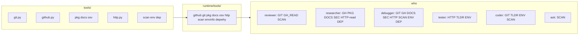

# Developer tools (GitHub plus the rest)

The engine already auto-discovers `@tool` wrappers under [`tools/`](../../tools/) and keeps real logic in [`runtime/tools/`](../../runtime/tools/). Profiles pick tools by name via bundles in [`agents/profile.py`](../../agents/profile.py). GitHub MCP is optional and complementary; this work is **first-party**, so reviewer/researcher/tester get structured schemas without shell or an extra MCP server.

`gh pr create` already runs inside worktree settle ([`runtime/tools/git.py`](../../runtime/tools/git.py) `apply_worktree`). Coder/tester/reviewer prompts say not to open PRs. That stays. New GitHub write tools are approval-gated and **not** given to those three.

What is missing today beyond generic `web_search` / `run_command`: official library docs, vulnerability data, changelogs, structured HTTP (tester still shells out to curl), CLI cheat sheets, and cheap repo hygiene (TODOs, local versions, "why is this dep here"). Those are the extra families below.

## Implementation pattern

Follow [`docs/adding-a-tool.md`](../adding-a-tool.md):

- Framework-free helpers in `runtime/tools/` (plain `Path` + args, unit-testable with a mocked subprocess or HTTP).
- Thin `@tool` wrappers with an explicit `parameters` schema and a field `description` on every arg.
- Failures return `"error: ..."` strings. Missing `gh` → `"error: gh not installed ...; authenticate with gh auth login"`.
- Cap output in the helper (lists ~20, bodies/files ~20–50k). Do not rely on the registry’s 80k chop.
- Reuse the existing git exec env (`GIT_TERMINAL_PROMPT=0`, `GH_PROMPT_DISABLED=1`) already used by settle. Do **not** route `gh` through `run_command` — reviewer/researcher have no shell, and `gh` is not on the shell auto-allowlist.
- HTTP tools follow [`runtime/tools/web.py`](../../runtime/tools/web.py): `urllib`, http/https only, `USER_AGENT`, timeouts, no `file://`.

Shared `run_gh(workspace, args, timeout=60) -> str` in a new [`runtime/tools/github.py`](../../runtime/tools/github.py):

- `shutil.which("gh")` first.
- `cwd=workspace` so `gh` uses the repo’s remotes (works in agent worktrees too).
- Prefer `gh … --json <fields>` then format as short labeled lines (same style as `git_status`).
- Non-zero exit: return stderr/stdout prefixed with `error:`.

Write / mutating tools take `ctx: ToolContext` and call `ctx.ask_user(...)` when `exec_approval` is `auto` or `always` (same policy as MCP destructive tools / shell). `never` skips the prompt. Denied → `"error: user denied …"`. Applies to GitHub writes **and** non-GET `http_request`.

## Bundles and who gets them

New / extended lists in [`agents/profile.py`](../../agents/profile.py).

- **`GIT` (extend)** — `git_status`, `git_diff`, `git_log`, `git_show`, `git_blame`, `git_range`
  - coder, reviewer, debugger (tester stays without GIT)
- **`GH_READ`** — PR/issue/CI/release/compare + code search + remote file
  - reviewer, researcher, debugger
- **`GH_WRITE`** — `gh_pr_comment`, `gh_issue_create` only
  - researcher, debugger
- **`PKG`** — `pkg_info`
  - researcher
- **`DOCS`** — `docs_lookup`, `tldr`
  - researcher, debugger; `tldr` also on coder and tester (they run CLIs)
- **`SEC`** — `osv_query`
  - researcher, debugger
- **`HTTP`** — `http_request`, `openapi_ops`
  - tester, debugger; researcher gets `openapi_ops` only (no live POST to random URLs)
- **`SCAN`** — `todo_scan`
  - ask, coder, reviewer, debugger
- **`ENV`** — `runtime_info`
  - coder, tester, debugger
- **`DEP`** — `dep_why`
  - researcher, debugger

**Not assigned to any profile:** `gh_pr_create` (implemented as a tool + helper; settle keeps using [`apply_worktree`](../../runtime/tools/git.py)). Orch stays spawn-only.

Ask stays this-repo only except `todo_scan`. Coder still has no GitHub tools.

## Tool catalogue

### Local git — [`tools/git.py`](../../tools/git.py) + [`runtime/tools/git.py`](../../runtime/tools/git.py)

- `git_log(max=20, path="")` — `git log --oneline -n` (optional path).
- `git_show(rev)` — `git show --stat` plus a clipped patch.
- `git_blame(path, start_line=0, end_line=0)` — optional 1-based window.
- `git_range(base, head)` — `git log --oneline base...head` plus `git diff --stat base...head`. The tool reviewer needs for “what did this branch change vs main” without GitHub.

### GitHub read — new [`tools/github.py`](../../tools/github.py)

Default repo = whatever `gh` infers from `cwd`. Optional `repo` (`owner/name`) on every call.

- `gh_pr_list(state="open", limit=20)`
- `gh_pr_view(number, include_diff=false)` — title, body, author, branches, files. Diff only when asked, clipped.
- `gh_pr_comments(number)` — issue comments + review comments, clipped bodies.
- `gh_pr_checks(number)` — `gh pr checks`.
- `gh_issue_list` / `gh_issue_view`
- `gh_run_list` / `gh_run_view` — failing CI; `view` returns a clipped log, not the full artifact dump.
- `gh_release_list(limit=10)` / `gh_release_view(tag="")` — changelog / notes. Latest if tag empty.
- `github_compare(base, head, repo="")` — `gh api repos/.../compare/{base}...{head}`: ahead/behind, files, clipped commits.
- `github_search_code(query, limit=20, this_repo=false)` — `gh search code --json repository,path,url,textMatches`. If `this_repo`, prefix `repo:{owner/name}` from `gh repo view`.
- `github_file(repo, path, ref="")` — raw contents via `gh api` `Accept: application/vnd.github.raw`, 50k cap.

### GitHub write — same module, approval-gated

- `gh_pr_comment(number, body)` — `gh pr comment`.
- `gh_issue_create(title, body="")`.
- `gh_pr_create(title, body="", base="")` — implemented, **not** in any `tool_names`.

### Package registry — new [`tools/pkg.py`](../../tools/pkg.py) + [`runtime/tools/pkg.py`](../../runtime/tools/pkg.py)

- `pkg_info(ecosystem, name)` — `pypi` / `npm` / `crates` / `go` / `maven` / `nuget` / `rubygems`.
- Return latest version, summary, homepage, license, yanked/deprecated if present. No tarball download.
- Endpoints: PyPI JSON, npm registry, crates.io API, `proxy.golang.org/{module}/@v/list`, Maven Central search, NuGet `v3-flatcontainer` / search, RubyGems API.

### Official docs and cheat sheets — new [`runtime/tools/docs.py`](../../runtime/tools/docs.py)

Generic `web_search` is noisy for “what does this API take”. These hit canonical indexes.

- `docs_lookup(source, query)` — `mdn` (MDN search API), `pypi` (project description / home), `npm` (readme excerpt), `crates` (docs.rs / crates.io description), `go` (pkg.go.dev search). Cap 20k. Return title, URL, short excerpt.
- `tldr(topic)` — [tldr.sh pages](https://tldr.sh/) raw markdown (`https://raw.githubusercontent.com/tldr-pages/tldr/main/pages/common/{topic}.md`, fall back to `linux` / `osx`). Coder/tester/debugger use this before guessing CLI flags.

### Advisories — new [`runtime/tools/osv.py`](../../runtime/tools/osv.py)

- `osv_query(ecosystem, package, version="")` — POST `https://api.osv.dev/v1/query`. Return IDs, summary, severity, affected ranges, aliases (CVE). Empty version = known vulns for the package. Researcher/debugger: “is lodash 4.17.20 safe?” without scraping blogs.

### Structured HTTP — new [`runtime/tools/httpx.py`](../../runtime/tools/httpx.py) (name avoids clashing with the `httpx` package)

Tester’s prompt still says “curl via `run_command`”. A first-class tool is safer (scheme check, size cap, approval) and usable without a TTY.

- `http_request(method, url, headers="", body="", timeout=20)` — GET/HEAD/POST/PUT/PATCH/DELETE. http/https only. Cap response 50k. GET/HEAD skip approval; other methods use `ask_user`. Return status, selected headers, body.
- `openapi_ops(url)` — GET a swagger/openapi JSON or YAML URL (or a well-known path). List `METHOD path — summary` capped at ~80 operations. Researcher uses this to brief tester; tester uses it to know what to hit.

### Repo hygiene

- `todo_scan(path="", pattern="")` — walk with [`runtime/tools/fs.py`](../../runtime/tools/fs.py) skip-list; match `TODO` / `FIXME` / `XXX` / `HACK`. Output `path:line:text`, default 80 hits. Ask uses this for surveys; coder/reviewer/debugger for leftover work.
- `runtime_info()` — `python`, `node`, `go`, `git`, `gh`, `rg` versions via `shutil.which` + `-V`/`version`. One screen. Stops “works on my machine” guesses.
- `dep_why(ecosystem, name)` — `npm ls name`, `go mod why name`, `pip show name`, or `cargo tree -i name` in the workspace. Researcher has no shell; this is how they explain a lockfile edge.

## Profile prompt updates

- [`agents/profiles/reviewer.py`](../../agents/profiles/reviewer.py) — `gh_pr_*` / checks / `git_range` / `todo_scan` for an existing PR or branch; still no create/merge/push.
- [`agents/profiles/researcher.py`](../../agents/profiles/researcher.py) — prefer `docs_lookup` / `pkg_info` / `github_search_code` / `osv_query` / `openapi_ops` before generic `web_search`; may comment or open an issue only after approval.
- [`agents/profiles/debugger.py`](../../agents/profiles/debugger.py) — `gh_run_*` / `gh_pr_checks` / `osv_query` / `http_request` / `runtime_info` / `dep_why`; same write caveat.
- [`agents/profiles/tester.py`](../../agents/profiles/tester.py) — prefer `http_request` / `openapi_ops` over ad-hoc curl; `tldr` for runner flags. Still must call `run_command` at least once (test runner).
- [`agents/profiles/coder.py`](../../agents/profiles/coder.py) — `tldr` / `runtime_info` / `todo_scan` / git history only. Still no GitHub.
- [`agents/profiles/ask.py`](../../agents/profiles/ask.py) — may `todo_scan`; still no web/GitHub.

## Tests and docs

- [`tests/test_github.py`](../../tests/test_github.py) — mock `run_gh`: missing binary, non-zero `gh`, JSON → labeled text, caps, `this_repo` prefix, write denied vs approved.
- [`tests/test_git.py`](../../tests/test_git.py) — `git_log` / `show` / `blame` / `range` against a temp repo.
- [`tests/test_pkg.py`](../../tests/test_pkg.py), [`tests/test_docs.py`](../../tests/test_docs.py), [`tests/test_osv.py`](../../tests/test_osv.py), [`tests/test_http.py`](../../tests/test_http.py) — unknown source/ecosystem; mocked HTTP; `http_request` rejects `file://`; POST denied without approval.
- [`tests/test_scan.py`](../../tests/test_scan.py) — hits + skip-list (do not walk `.git` / `node_modules`).
- Update [`tests/test_orchestrator.py`](../../tests/test_orchestrator.py) discovery and [`tests/test_profiles.py`](../../tests/test_profiles.py) allowlists: reviewer has `gh_pr_view` but not `gh_pr_create` / `gh_pr_comment`; researcher/debugger have writes; coder has `git_log` / `tldr` but no `gh_*`; tester has `http_request` but not `gh_pr_view`; ask has `todo_scan` only from the new set.
- README: optional `gh` in Requirements; new catalogue rows; tool count. Mention `gh auth login`.

## Out of scope

- GitHub MCP server (already documented in [`docs/adding-an-mcp-server.md`](../adding-an-mcp-server.md)).
- Merge, push, PR review-submit, gist, notifications.
- Giving orch filesystem or `gh` tools.
- A new `shipper` profile.
- Linear/Jira/Slack (MCP).
- JWT decode, listen-ports, RFC-by-number, caniuse dump (MDN via `docs_lookup` covers compat questions).
