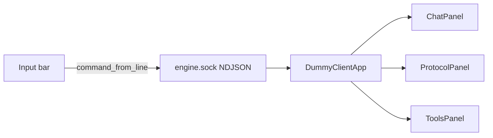

# Dummy client 3-panel TUI

## What changes

[`dummy_client.py`](../../dummy_client.py) is a stdin/stdout REPL that dumps every protocol event into one stream. It becomes a small **Textual** app (asyncio-native, matches the existing socket loop) with a client-shaped layout. The Unix socket, NDJSON codec, and `command_from_line` stay as they are.



## Layout

```
+---------------------------+----------------------+
|                           | Protocol             |
|  Agent chat               | commands + events    |
|                           +----------------------+
|                           | Tools                |
|                           | name / args / result |
+---------------------------+----------------------+
| > type a message or /command                     |
+--------------------------------------------------+
```

- **Left (~2/3):** scrollable chat. User bubbles, streamed assistant text, history replay, and outstanding `UserPromptRequested` prompts.
- **Right top (~1/3 height):** outbound commands plus inbound protocol events that are **not** chat or tools.
- **Right bottom:** live tool cards (`ToolCallStarted` / `CommandOutputChunk` / `ToolCallFinished`).
- **Footer input:** same REPL grammar (`start`, `abort`, `undo`, `/openfile`, plain text = chat). Header shows agent state + token/cost stats.

Auto-send `StartSession` on connect so it behaves like a client, not a protocol console. `exit` / `quit` / Ctrl-C still disconnect only this client.

## Event routing

| Destination | Events / actions |
|---|---|
| Chat | `ChatHistoryAdded`, `ChatMessageStarted`/`Delta`/`Added`, `UserPromptRequested` |
| Protocol | every **sent** command (`→ StartSession …`); inbound `SnapshotReady`, `SessionList`, `FileContent`, `FileEdited`, `FileClosed`, `FileTreeUpdated`, `GitStateUpdated`, `AgentStateChanged`, `StatsUpdated`, `ContextCompacted`, `ErrorOccurred`, `WarningOccurred`, `SessionEnded`, `ChatHistoryComplete` |
| Tools | `ToolCallStarted` (name, `call_id`, pretty `arguments_json`), `CommandOutputChunk` (stdout/stderr under the in-flight/`call_id` card), `ToolCallFinished` (ok/error, duration, preview) |

Reuse existing formatters (`_format_file_content`, `_format_file_edited`, `_format_git`, snapshot summary) for the protocol log so those events stay readable.

## Implementation

**Library:** add `textual` to [`requirements.txt`](../../requirements.txt). No other new deps.

**Keep the test surface in [`dummy_client.py`](../../dummy_client.py):**
- `command_from_line`, `_LAST_PROMPT_ID`, `format_event`, `_STREAM_ID` stay importable.
- Stop `format_event` from printing deltas (return the chunk text instead). [`tests/test_turn_control.py`](../../tests/test_turn_control.py) only asserts the follow-up `ChatMessageAdded` skip, so that still passes.
- Route help / usage / unknown-command text into the protocol panel instead of `print()`.

**New file [`client_tui.py`](../../client_tui.py)** (keeps the entry file from becoming a widget dump):
- `DummyClientApp` — connect with `STREAM_LIMIT`, spawn a worker that `decode_event`s and dispatches, write commands with `encode`.
- `ChatPanel` — `VerticalScroll` of message widgets; deltas update the current assistant widget in place (no reprint on `ChatMessageAdded` for the same id).
- `ProtocolLog` — append-only `RichLog`, auto-scroll, outbound command as one-line `→ Type {fields}`.
- `ToolsPanel` — one card per `call_id` (fall back to the latest `run_command` card when `CommandOutputChunk.call_id` is empty, which the server does today).
- Footer `Input`; Submit uses `command_from_line`. Empty lines ignored.

[`dummy_client.py`](../../dummy_client.py) `main()` launches `DummyClientApp` instead of the `print_events` + `input()` pair.

## Docs / tests

- Update the “reference client” section in [`README.md`](../../README.md) (TUI layout, still `python dummy_client.py [workspace]`, same slash commands).
- Existing tests that import `dummy_client` keep working; add a small unit test that classifies a handful of events into chat / protocol / tools so routing does not drift.

## Out of scope

File tree, git, or multi-tab editors. Those events stay in the protocol log. No REPL fallback flag unless we need it later.
