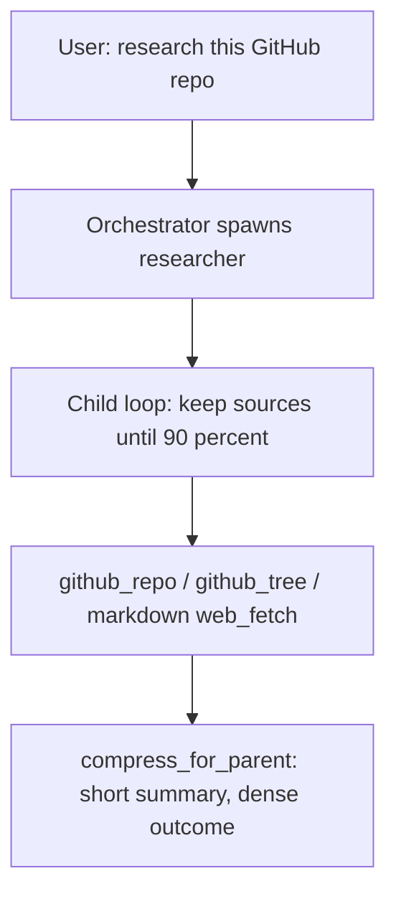

# Fix researcher so it actually surveys a GitHub repo

The last engine session is in gitignored `.engine/session.db`, but the failure mode is visible from the agent itself. `ask` has a real investigation procedure. Researcher does not: its prompt is a three-line tool shopping list, and it literally tells the model to `web_fetch` a known URL. For `https://github.com/owner/repo` that is a JS shell — after HTML stripping it is almost empty. There is also no remote equivalent of `list_files`, so the agent cannot discover README / layout / entry points and has to guess a single path or stop.

Return-to-orch is already aggressive (`compress_for_parent`: 6 short lines, 400-char clip). Children still compact *during* the run at the same 70% / last-3-tool-results settings as the orch, so a researcher that actually fetched several sources would lose them before it could write the briefing.

## What is wrong today

- Prompt in [`agents/profiles/researcher.py`](../../agents/profiles/researcher.py) is “prefer these tools / fetch a URL”. Compare [`agents/profiles/ask.py`](../../agents/profiles/ask.py).
- GitHub surface in [`runtime/tools/github.py`](../../runtime/tools/github.py) can fetch a named file and search code. It cannot view repo metadata or list a directory.
- [`runtime/tools/web.py`](../../runtime/tools/web.py) `web_fetch` regex-strips tags into a word salad (nav, cookies, footers). SPA/GitHub HTML is empty. `web_search` is Brave title/url/snippet only. Neither is shaped for a model. Debugger already has Playwright; Browserbase would duplicate that as a paid cloud browser.
- Orch routing: “For external docs, spawn researcher”; spawn description is “Search the web and fetch URLs”.
- Two compactors: in-loop `compact()` (trigger 0.7 of 120k, `KEEP_FULL_TOOL_RESULTS = 3`) and return `compress_for_parent` (`SUMMARY_CLIP = 400`, “at most 6 short labeled lines”). Children share the orch’s in-loop settings via `replace(self._config, max_turns=...)` in [`agents/orchestrator.py`](../../agents/orchestrator.py).

## 1. Add the missing GitHub survey tools

Add to `GH_READ` in [`agents/profile.py`](../../agents/profile.py) so researcher / debugger / reviewer all get them.

- **`github_repo(repo="")`** — `gh repo view --json` for `nameWithOwner`, description, URL, default branch, language, license, topics, stars, homepage. Empty `repo` uses the workspace remote.
- **`github_tree(repo, path="", ref="", recursive=false)`** — contents API for one directory (name, type, size). Optional recursive git-trees listing, capped (~200), skipping `list_files` junk. Empty `path` is repo root.

In `github_file`, if the API returns a directory listing, return `error: path is a directory; use github_tree`.

Wire in [`tools/github.py`](../../tools/github.py). Tests in [`tests/test_github.py`](../../tests/test_github.py). Assert names in [`tests/test_profiles.py`](../../tests/test_profiles.py) and [`tests/test_orchestrator.py`](../../tests/test_orchestrator.py).

## 2. Rewrite the researcher like `ask`

Keep the existing allowlist (no shell, no LSP, no edits). Procedure:

- **GitHub repo:** `github_repo` → `github_tree` at root → `github_file` README and manifests → tree into dirs that matter → `github_search_code` / more files. Do **not** `web_fetch` `github.com` HTML (the tool will also refuse those URLs — see §5).
- **Library / API / error:** `docs_lookup`, `pkg_info`, `openapi_ops`, `osv_query` before Brave.
- **Generic web:** `web_search` then `web_fetch` two or three sources; quote version/API/error text; cite URLs.
- Relate to this workspace with `search` / `read_file` only after external facts exist.
- Do not stop after one page. Finish with labeled `what / paths / facts / verdict / leftover`.

Fix the truncated leftover sentence. Update the spawn `description`. In orch: spawn researcher for libraries, APIs, GitHub repos, and anything not in this workspace.

## 3. Loosen in-loop compaction for children only

Return-to-orch stays the crush path. Children should keep fetched sources until they write the briefing.

Today both loops use module constants in [`agents/compactor.py`](../../agents/compactor.py): `TRIGGER_RATIO = 0.7`, `KEEP_FULL_TOOL_RESULTS = 3`. [`AgentLoop._maybe_compact`](../../agents/agent_loop.py) imports that trigger. Children copy orch config and only override `max_turns`.

- Add `compact_trigger` (default `0.7`) and `keep_full_tools` (default `3`) on [`EngineConfig`](../../runtime/config.py). Pass them into `compact()` / `trim_tool_results` / `_over_budget` instead of the globals (keep the constants as orch defaults).
- In `_make_subagent`, `replace(...)` children to `compact_trigger=0.9` and `keep_full_tools=10`. Orch unchanged.
- `_maybe_compact` uses `self._config.compact_trigger`, not the imported constant.

Do not raise the 120k `context_budget` for children — later trigger + keeping more full tool results is the threshold change. Overflow retry still halves budget as today.

Tests in [`tests/test_compaction.py`](../../tests/test_compaction.py): compact with trigger 0.9 is a noop at 80% of budget; `trim_tool_results(..., keep=10)` keeps ten full tails. Optionally assert `_make_subagent` config differs from orch.

## 4. Stop compress_for_parent from deleting the survey

Keep `summary` short for UI (`AgentFinished`, `context.md`). Let **`outcome`** survive.

- `SUMMARY_CLIP = 400` for `summary`; new `OUTCOME_CLIP` (~2000) for `outcome`.
- Compress prompt: keep `facts:` specific. Drop “at most 6 short labeled lines”.
- Test: a long `facts:` closer is not truncated to 400 in `outcome`.

## 5. Make web_fetch / web_search LLM readers (not Browserbase)

**Browserbase:** cloud headless browsers (Stagehand extracts a readable tree). We already have Playwright for that job on **debugger** (`browser_open` / console / screenshot). Wiring Browserbase would add a paid API, a second browser stack, and still be the wrong tool for GitHub source (use `gh`). Do **not** add a Browserbase SDK or API key. Steal the product idea: the model should receive a **document**, not a DOM dump or a live browser session.

**`web_fetch`** in [`runtime/tools/web.py`](../../runtime/tools/web.py):

- Route through [`runtime/tools/httpx.py`](../../runtime/tools/httpx.py) (`blocked_host`, redirects) instead of raw `urlopen`. Browser-like User-Agent.
- **GitHub URL fast-path:** `github.com/owner/repo` (and `/blob|/tree|/issues|/pull`) returns `error: use github_repo / github_tree / github_file for …` with the parsed owner/repo/path — do not GET the SPA.
- HTML → markdown with stdlib `html.parser` (no new dependency): drop `script`/`style`/`nav`/`footer`/`header`/`aside`/`form`; prefer `article`/`main`; emit headings, lists, links, fenced code. Prefix `title:` and `url:`. Cap the **extracted** markdown (~20k), not 50k of nav soup. Read a larger raw HTML window so extraction has enough source.
- JSON / markdown / plain text: return as-is, clipped.
- **SPA hint:** if extracted text is tiny vs HTML size, `error: page looks client-rendered. For GitHub use github_*. For a live UI spawn debugger (browser_open).`
- Tests: reject `file://` (keep); GitHub URL does not fetch; fixture HTML becomes markdown with the heading and without nav; SPA-ish HTML hits the hint.

**`web_search`:** keep Brave + `BRAVE_API_KEY`. Number results (`[1] title`, `url:`, snippet). Include Brave `extra_snippets` when present. Still error if the key is missing (no second search vendor).

Do not give researcher Playwright. Do not add Jina/Firecrawl/Browserbase env backends in this pass.

## 6. Docs

[`README.md`](../../README.md): GitHub table (`github_repo`, `github_tree`); Web table (markdown extract, GitHub URLs refused); operational limits (child compact trigger 0.9 / keep 10 vs orch 0.7 / 3; outcome clip).

No new personality, no shell on researcher, no `GH_WRITE` change, no Browserbase.
