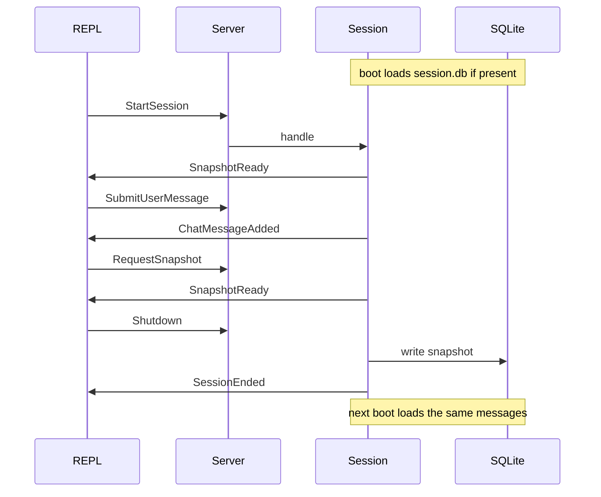

# IPC, session, and snapshot (first slice)

This slice is the original plan’s steps 1–2, plus snapshot persistence. It is intentionally small: **JSON in, JSON out, in-memory session, SQLite write on shutdown**.

Out of scope: `agents/`, `tools/`, `llm/`, git/file/agent panels. Those files are already deleted in the working tree; this slice does not recreate them.

No event-sourcing / fold. Live state is a normal object. SQLite is a checkpoint of `EngineSnapshot` written when the session shuts down, read when the next process starts.

## What you will be able to do



1. `python app.py /path/to/workspace` listens on `{workspace}/.engine/engine.sock`
2. REPL client connects; you type commands and see events print live
3. `/shutdown`, restart the server, `/start` — chat messages are back (loaded from SQLite)

Crash without `Shutdown` (or SIGINT) does not write the DB. Graceful stop does.

## Protocol (minimal, not the full TUI catalog)

Only the types this slice actually uses. Later slices add file/git/agent types without changing the codec.

[`protocol/commands.py`](../../protocol/commands.py) — dataclasses with `to_json()` / `from_json()`, each tagged with `"type"`:

- `StartSession(workspace: str)`
- `SubmitUserMessage(text: str)`
- `RequestSnapshot()`
- `Shutdown()`

[`protocol/events.py`](../../protocol/events.py):

- `ChatMessageAdded(id, role, text, ts)` — `role` is `"user"` or `"engine"`
- `SnapshotReady(snapshot)` — full reconnect payload
- `ErrorOccurred(message)`
- `SessionEnded(reason)`

[`protocol/snapshot.py`](../../protocol/snapshot.py) — only what this slice can populate:

```python
@dataclass
class EngineSnapshot:
    workspace: str
    messages: list[ChatMessage]  # {id, role, text, ts}
    ended: bool
```

File/git/agent fields wait until those slices exist.

[`protocol/codec.py`](../../protocol/codec.py) — one JSON object per line (NDJSON):

- `encode(msg) -> bytes` (`json` + `\n`)
- `decode_command(line) -> Command`
- `decode_event(line) -> Event`

A `type` → class map is the only dispatch. No extra envelope.

## Runtime

### `SessionState` — [`runtime/state.py`](../../runtime/state.py)

Plain mutable source of truth (not an event log):

- `messages: list[ChatMessage]`
- `ended: bool`
- `snapshot() -> EngineSnapshot`

### Persistence — [`runtime/store.py`](../../runtime/store.py)

Stdlib `sqlite3`. Path: `{workspace}/.engine/session.db`.

One-row checkpoint, not an event table. Schema:

```sql
CREATE TABLE IF NOT EXISTS snapshot (
  id INTEGER PRIMARY KEY CHECK (id = 1),
  json TEXT NOT NULL,
  saved_at TEXT NOT NULL
);
```

- `load(path) -> EngineSnapshot | None` — used at process start
- `save(path, snapshot)` — used only in `shutdown()`

`json` is `EngineSnapshot.to_json()` dumped as a string. Later slices can add columns or extra tables; this slice does not migrate.

### `EngineSession` — [`runtime/session.py`](../../runtime/session.py)

No `LLMProvider`. Workspace comes from `app.py`.

```python
class EngineSession:
    def __init__(self, workspace: Path, db_path: Path): ...
    async def start(self) -> EngineSnapshot: ...
    async def handle(self, command: Command) -> None: ...
    def subscribe(self) -> asyncio.Queue[Event]: ...
    def snapshot(self) -> EngineSnapshot: ...
    async def shutdown(self) -> None: ...
```

`start()`: if `session.db` has a row, load it into `SessionState` (and set `ended=False` so the new process is live). If not, empty state.

`handle` routing (only these four):

- `StartSession` — if workspace mismatches the process root, emit `ErrorOccurred`; otherwise emit `SnapshotReady`
- `SubmitUserMessage` — append `ChatMessageAdded(role="user")`, then `ChatMessageAdded(role="engine", text="ack: …")` so the round trip is visible without an LLM
- `RequestSnapshot` — emit `SnapshotReady(self.snapshot())`
- `Shutdown` — persist snapshot to SQLite, emit `SessionEnded`, stop the server

`subscribe()` returns a new `asyncio.Queue` per client. Each emitted event is put on every queue (fan-out).

SIGINT/SIGTERM in `app.py` should call the same `shutdown()` path so a Ctrl-C still writes SQLite.

### `EngineServer` — [`runtime/server.py`](../../runtime/server.py)

```python
class EngineServer:
    def __init__(self, session: EngineSession, socket_path: Path): ...
    async def serve(self) -> None: ...   # asyncio.start_unix_server
    async def _on_client(self, reader, writer) -> None: ...
```

One process, one session, many clients. Each client:

1. `subscribe()`
2. Concurrently: read lines → `decode_command` → `session.handle`; write events from its queue
3. On disconnect, drop that queue

Stdlib only (`asyncio`, `json`, `dataclasses`, `pathlib`, `sqlite3`). Unix socket is fine on macOS; no TCP for this slice.

## Entry points

- [`app.py`](../../app.py) — `python app.py [workspace]` (default: cwd). Create `.engine/` if needed, load SQLite, bind `EngineSession`, `EngineServer.serve()` until `Shutdown` or signal.

### REPL dummy client — [`dummy_client.py`](../../dummy_client.py)

This is the test harness we keep extending. Interactive, not a scripted send-four-commands-and-exit.

- `python dummy_client.py [workspace]` (same default as `app.py`; derives `{workspace}/.engine/engine.sock`)
- Connects to the Unix socket
- Background task prints every incoming event (pretty JSON is fine)
- Foreground readline loop:

```
engine> /start
engine> hello there
engine> /snapshot
engine> /shutdown
engine> /help
```

- `/start` → `StartSession` (workspace from argv/cwd)
- `/snapshot` → `RequestSnapshot`
- `/shutdown` → `Shutdown`
- `/help` → print local help (no engine round trip)
- anything else → `SubmitUserMessage(text)`

Unknown `/foo` prints a local error and does not send. Later slices add `/open`, `/abort`, etc. to this same file.

No `requirements.txt` extras; this slice is stdlib.

## What we are not building yet

- Orchestrator, subagents, profiles, compressor
- Tools, git, LSP, tree-sitter
- `OpenFile` / `AbortAgent` / `AnswerPrompt` and their events
- Full `EngineSnapshot` fields (`file_tree`, `agents`, `git`, `stats`)
- Event log / fold / `events.jsonl`

Those stay on the original design doc for later slices, each as its own follow-along step.
