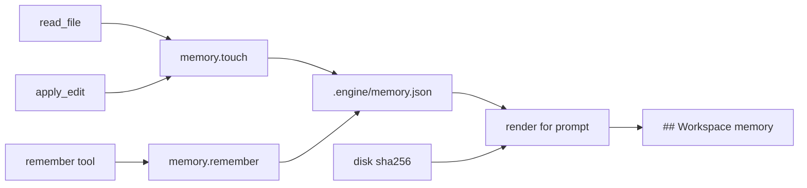

# Structured workspace memory

The current blob is the wrong shape. [`write_context_md`](agents/compactor.py) appends freeform lines (including every subagent finish), then [`read_context_md`](agents/compactor.py) dumps the newest 4000 chars into every agent’s system prompt. That is why a new session still “knows” prior chats, and why most of [`.engine/context.md`](.engine/context.md) is unusable.

Replace it with a structured store, hybrid writes (as you chose), and hash-checked file notes.



## Store

New module [`runtime/store/memory.py`](runtime/store/memory.py). Canonical file: `{workspace}/.engine/memory.json`.

```json
{
  "files": {
    "runtime/session.py": {
      "seen_sha": "<sha256 of last read/edit>",
      "note_sha": "<sha256 when the note was written, or null>",
      "action": "read|edit",
      "updated_at": "ISO-8601",
      "note": "optional: what this file is / how it works"
    }
  },
  "engineering": [{"text": "...", "updated_at": "..."}],
  "product": [],
  "cicd": [],
  "other": []
}
```

- File entries **upsert by path**. Auto-touch updates `seen_sha`, `action`, `updated_at` and **must not** overwrite or clear `note` / `note_sha`.
- Decision sections **append** dated bullets; cap ~12 newest per section.
- File notes cap ~40 (drop oldest by `updated_at` among noted files; touch-only entries can be dropped more aggressively, keep ~80 recent).
- Same `threading.Lock` pattern as today’s context.md writer.
- **Do not migrate** the existing `context.md` blob. Stop reading and writing it. Leave the file on disk; you can delete it.

Reuse [`sha256_bytes`](runtime/tools/fileid.py) / `FileSource.raw_sha256` — the same hash `FileTracker` already stores on read and write.

## Hybrid writes

**Automatic (no model call)** — `touch(workspace, path, sha, action)`:

- [`tools/read_file.py`](tools/read_file.py) after `ctx.files.mark(...)` → `action="read"`
- [`runtime/tools/edits.py`](runtime/tools/edits.py) after the successful `mark` in `apply_edit` (~line 561) → `action="edit"`

Do not touch on search hits, `list_files`, or LSP reads. That would flood the index.

**Explicit** — replace orch-only `write_context(note)` with `remember(section, note, path="")`:

- `section`: `files` | `engineering` | `product` | `cicd` | `other`
- `files` requires `path`; set `note` + `note_sha` from current disk (or tracker SHA if already marked)
- Other sections ignore `path` and append a bullet

Give the tool to the **orchestrator and every profile** (new `MEMORY = ["remember"]` group in [`agents/profile.py`](agents/profile.py), same pattern as `SKILLS`). Ask/coder are the ones who understand files; orch writes decisions.

**Stop** the auto-append on subagent finish in [`agents/orchestrator.py`](agents/orchestrator.py) (~lines 475–484). That is the main junk source.

Remove `_write_context_tool` / `write_context_md` / `read_context_md` once callers are switched (tests included).

## Staleness at injection time

Render compares **disk SHA now** to `note_sha` (not `seen_sha`). Updating `seen_sha` on every read must not silently mark a note fresh.

In [`AgentLoop._build_messages`](agents/agent_loop.py), replace `read_context_md` with `render_memory(workspace)`:

```
## Workspace memory
### Engineering
- ...
### Product
- ...
### CI/CD
- ...
### Files
- runtime/session.py [fresh] sha=abc1234 read  EngineSession binds orch...
- tools/git.py [STALE] sha=old≠disk  previous note...
```

- Always include decision sections first (they are the durable knowledge).
- Include file **notes** (fresh and stale). Stale stays visible so the orch knows to re-survey instead of trusting the blurb.
- Touch-only files (no note): include at most the ~10 most recent as path + action + short hash, no prose.
- Total render cap ~8000 chars (decisions first, then noted files, then touch index). Truncate with a one-line marker.

Missing files: drop the entry (or mark `missing` once, then drop on next save).

Worktrees: hash the file in that agent’s `ctx.workspace`. Orch injection uses the main tree, so a worktree-only edit can show `STALE` until merge — that is correct.

## Prompts and docs

- [`ORCH_SYSTEM`](agents/orchestrator.py): answer from **workspace memory** when fresh; if a file is `STALE`, spawn ask rather than quoting the note. Use `remember` for lasting engineering/product/CI decisions, not play-by-play.
- Ask/coder prompts: after understanding or changing a file, `remember(section=files, path=..., note=...)` with a short factual blurb (purpose, entry points, constraints) — not a transcript.
- README Persistence table: `memory.json` replaces `context.md`.
- [`docs/adding-a-profile.md`](docs/adding-a-profile.md): workspace notes come from rendered memory, not context.md.

## Tests

New [`tests/test_memory.py`](tests/test_memory.py):

- touch does not clobber an existing note
- remember on `files` sets `note_sha`; changing the file on disk makes render say `STALE`; remembering again clears stale
- decision sections cap to newest N
- concurrent remember/touch both survive (lock)
- render prefers decisions over a huge file index and stays under the cap

Update existing tests that assume the old blob:

- [`tests/test_compaction.py`](tests/test_compaction.py) `test_context_md` / `test_write_context_*`
- [`tests/test_profiles.py`](tests/test_profiles.py) `test_write_context_trims`
- [`tests/test_orchestrator.py`](tests/test_orchestrator.py) `write_context` in orch tool list → `remember`

No protocol/event changes. `RequestOrchContext` already dumps `_build_messages()`, so the TUI context popup will show the new block.