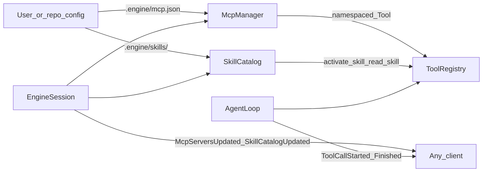
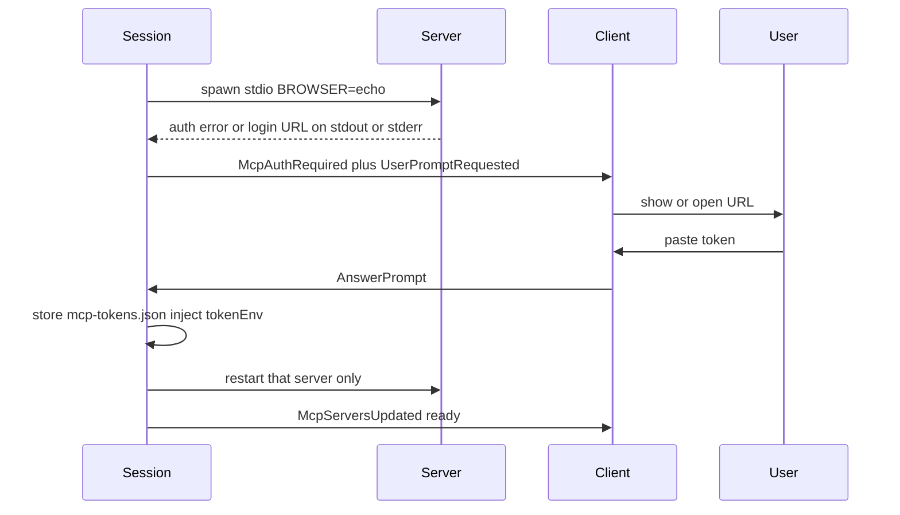

# MCP and skills (engine-owned)

The engine already has the right split: clients send JSON commands, agents call `Tool` objects, events fan out. MCP and skills plug into that. Users add servers and skill folders on disk; `StartSession` loads them; the model sees extra tools and a skill catalog. A TUI, web UI, or `dummy_client` that ignores the new event types keeps working.



## Client-agnostic contract

Do **not** put MCP JSON-RPC or SKILL.md parsing in any client.

- **Config is files**, not protocol. The user (or a future settings UI that writes files) edits `.engine/mcp.json` and drops skill directories. `StartSession` is enough to pick them up.
- **Execution is tools.** MCP calls become normal `Tool` entries. Skill bodies load through `activate_skill` / `read_skill`. Existing `ToolCallStarted` / `ToolCallFinished` already show that to every client.
- **Catalogs are snapshot + events.** Clients that care render a list. Clients that do not still decode unknown types as raw JSON (current codec behavior).
- **Approvals reuse `PromptBroker`.** MCP elicitation and destructive MCP tools go through `UserPromptRequested` / `AnswerPrompt`, same as `run_command`.

Optional commands exist only for live reload and toggles. They are not required to use the feature.

## Skills

Match the Agent Skills / Cursor `SKILL.md` format so existing project skills work.

**Discovery (first match wins on name):**

- `{workspace}/.engine/skills/<name>/SKILL.md` — canonical
- `{workspace}/.cursor/skills/<name>/SKILL.md` — compatible
- `~/.engine/skills/<name>/SKILL.md` — user-global

Skip `~/.cursor/skills-cursor/` (Cursor built-ins).

**`SKILL.md` frontmatter:** `name`, `description`, optional `disable-model-invocation`. Body is markdown. Sibling files (`reference.md`, `scripts/`) stay on disk.

**Progressive disclosure (do not dump every skill into the system prompt):**

1. Inject a short catalog into `_build_messages()`: name + description only, same place as workspace notes in [`agents/agent_loop.py`](../../agents/agent_loop.py).
2. `activate_skill(name)` returns the SKILL.md body and a list of sibling paths.
3. `read_skill(name, path)` reads one file **inside that skill directory only** (no workspace escape).

**Two activation lifetimes — do not collapse them.** Neither is written to disk.

- **`activate_skill` (tool):** attaches the **body** to **that** `AgentLoop` until the loop dies. Child: end of the child run (finish/abort). Orch: end of the session (`Shutdown` / new `StartSession` rebuilds the orch). Not “this user turn only” — the orch loop lives across turns, so an orch `activate_skill` stays in orch `_build_messages()` for the rest of the session. A child activating a skill never appears in the orch catalog, and orch activation never appears in a child.
- **`ActivateSkill` (command):** session-lifetime **catalog unlock** on the orch only. It puts a `disable-model-invocation` skill into the orch name list (and thus description ranking) for this session. It does **not** attach the body and does **not** push anything into live children. Orch still calls `activate_skill` if it wants the body.

`SkillActivated(name, agent_id)` is the event; empty `agent_id` means orch. Snapshot `SkillRow.auto` stays false for `disable-model-invocation` skills even after `ActivateSkill` — the command is an in-memory unlock, not a rewrite of the file.

`disable-model-invocation: true` skills appear in the snapshot for the user/client but are omitted from the **model** name list until `ActivateSkill` (orch catalog) or that agent calls `activate_skill` (body + that agent’s list).

**Catalog: the agent must always know every skill exists.** A hard cap of 32 name+description lines with `…and N more; call activate_skill by name` is broken — overflow skills have no names, so the model cannot activate them. Do not ship that.

Rejected for v1: a Haiku (or other small-model) router on every message. It still needs the full catalog as input, adds a network hop before the real turn, can silently drop the relevant skill, is flaky under test, and fires too often (user turns, child reports, `AnswerPrompt`). The orch is already a planner; a second model that only picks skills is a second planner. Revisit only if a workspace actually has 100+ skills and lexical ranking misses in practice.

v1 catalog in `_build_messages()`:

1. **All names, always** (auto-invoke skills only). Cheap — `name` is a few tokens each. This is the index; `activate_skill` stays callable for anything listed.
2. **Descriptions for top-k** (default 8) ranked by cheap lexical overlap of the current task/user text against `name + description`. No extra LLM. Deterministic. Works without an API key.
3. **Sticky descriptions.** Re-ranking every `_build_messages()` would otherwise flicker a near-tie in and out as the user rephrases. Intended behavior, not a bug to “fix” by freezing the catalog: union of (current top-k) and (names whose description was already injected on **this** `AgentLoop`), capped at 12. A name can leave the description set only if it is outside the new top-k **and** the sticky set is at the cap (drop the lowest current score among sticky-only names). Names stay listed either way; `activate_skill` still works without a description.
4. Already-activated skills keep their **full body** on that agent (per-agent state), independent of ranking.

Re-rank on each `_build_messages()` from that agent's current task string (orch: latest user message; child: spawn task). Do not re-rank on every token. Child reports should not reshuffle the orch catalog.

Hard ceiling later if needed: all names + at most ~8k tokens of descriptions. Not a "hide the rest" cap.

Skill scripts: v1 does not add a new runner. If the skill lives in the workspace and the profile has `run_command`, the agent can run `scripts/`. User-global skills expose scripts only via `read_skill` text. A dedicated `run_skill_script` can wait.

**Who gets skill tools:** add a `SKILLS = ["activate_skill", "read_skill"]` group in [`agents/profile.py`](../../agents/profile.py). Give it to the orchestrator and every profile. Cheap (two tools) and the orch can name a skill in a child task.

## MCP

Engine is an **MCP client**. Users add servers; agents call their tools. Do not expose the engine as an MCP server in this work.

**Config** — Cursor-compatible `mcpServers` object, canonical path `.engine/mcp.json`. Also merge `.cursor/mcp.json` if present (engine file wins on name clash). That merge is a **trust expansion**: emit `WarningOccurred` listing every imported server name, and on the first session that sees a not-yet-trusted Cursor import, ask via `PromptBroker` (`kind=confirm`, choices yes/no). Persist the answer in `.engine/mcp-trust.json` (`{"cursor": ["github", ...]}`) so the next `StartSession` does not re-prompt. A "no" leaves those servers `disabled`. Support `${env:NAME}`, `${workspaceFolder}`, `${userHome}`. Secrets stay in `env.sh` / the process environment, never in events.

**Missing `${env:NAME}` is fail-loud.** Do not substitute `""`. That server is `status=error` with `unresolved ${env:NAME}` and is not started. A blank secret connecting to the wrong endpoint is worse than a load-time error.

```json
{
  "mcpServers": {
    "github": {
      "command": "npx",
      "args": ["-y", "@modelcontextprotocol/server-github"],
      "env": { "GITHUB_TOKEN": "${env:GITHUB_TOKEN}" },
      "profiles": ["researcher", "debugger"]
    }
  }
}
```

v1 transport: **stdio** (`command` / `args` / `env` / `cwd`). HTTP/SSE is v2. Use the official `mcp` Python package.

**Bridge:** [`runtime/session.py`](../../runtime/session.py) `_bind_loop` becomes async. After `discover_tools()`, `McpManager.start()` connects each enabled server, `list_tools()`, and registers a `Tool` per remote tool:

- Wire name: `mcp_{server}_{tool}` (sanitize to `[a-zA-Z0-9_]`). If two remote names collapse to the same wire name, **do not register the second** — `WarningOccurred` + skip. No silent shadowing.
- `Tool.family = "mcp"` so `ToolRegistry.subset` can expand a `mcp` sentinel in `profile.tool_names` to every live MCP tool allowed for that profile.
- `execute` → `session.call_tool`. **v1 is text-only.** Concatenate `text` content blocks, 80k cap. Image / audio / blob blocks become a one-line stub (`omitted: image/png N bytes; v1 is text-only`) rather than base64 stuffed into the prompt. Multimodal tool results need `agent_loop` / provider support that does not exist yet — out of scope.

One failed server at start is a `WarningOccurred` + snapshot row `status=error`. It must not block the session (same as a missing language server).

**Mid-session death.** No background watchdog. On the next `call_tool` / resource read, if the transport is dead: mark `status=error`, emit `McpServersUpdated`, then retry that server with bounded backoff (3 attempts, 2s / 4s / 8s). If still dead, open a **30s circuit-breaker window** (`status=error`, cooling). Calls during that window **fail fast** with the same error (`mcp server {name} is down; cooling, retry in Ns or ReloadIntegrations`) — do not re-run 14s of backoff on every tool call of a multi-step task. After 30s the next call may run backoff again. Auth-shaped failures skip this path and go to `needs_auth` (below). `ReloadIntegrations` clears cooling and reconnects.

**Resources (v1, two tools, not one tool per URI):** `mcp_list_resources`, `mcp_read_resource(uri)`. Avoid schema blow-up.

**URI scoping on `mcp_read_resource`.** The bridge does **not** fetch arbitrary URIs. Allow `https`, `http`, and non-`file` MCP schemes the server advertised in `list_resources`. Reject `file://` (and `ftp://`, `sftp://`, `unix:`) even if the server returns them — workspace files go through `read_file`. Unknown schemes are an error string, not a fetch.

**Prompts:** skip in v1, or list names in the skill-style catalog later. Not required to consume GitHub/Linear-class servers.

**Elicitation:** if a server asks the user, call `ctx.ask_user` so the existing prompt modal path works.

**Browser / OAuth login (`McpAuthRequired`).** Many hosted MCP servers want a browser login. The engine is headless and may not share a display with the user. Opening a browser on the **engine host** is rejected (not client-agnostic). This plan still implements the **client-facing auth channel** so a TUI or web UI can finish login without speaking MCP.

Still rejected: engine-side `webbrowser.open`, PKCE + loopback, scraping Cursor cookie stores. HTTP MCP OAuth discovery stays later. Env tokens already in `env.sh` still work and skip this path.

Flow (do not hang `StartSession`):



1. Spawn stdio with `BROWSER=echo` so the subprocess cannot `open` / `xdg-open` the host.
2. If initialize/list_tools fails in an auth-shaped way, or **stdout or stderr** contains an `https://` login URL: `status=needs_auth`, emit `McpAuthRequired(server, url, prompt_id)` (`url` may be empty if we only know it is auth). Scan both streams — many CLI servers do not keep JSON-RPC on stdout and humans on stderr. **Continue starting other servers.**

**Never-authed vs was-authed-now-rejected.** Token refresh is out of scope (no PKCE; `mcp-tokens.json` is a static paste). If a server that **already had** a stored token or a prior `ready` state later fails in an auth-shaped way (401, `invalid_token`, `unauthorized`), do **not** treat it as dead-transport cooling. Re-enter `needs_auth`, emit `McpAuthRequired` again, and tell the user to `CompleteMcpAuth` / paste a new token — not `ReloadIntegrations`. First-time auth (no stored token, never `ready`) keeps the “never authed” wording.
3. Also `PromptBroker.ask` (`kind=mcp_auth`) so existing clients that already handle `UserPromptRequested` / `AnswerPrompt` work with no new UI. Question includes the URL and server name. `prompt_id` on the event matches the broker id.
4. On `AnswerPrompt`: persist `{server, tokenEnv, token}` in `.engine/mcp-tokens.json` (gitignored, `0600`). Never put the token in events, snapshots, chat, or the protocol log (redact if a client echoes the command).
5. Inject the token into that server's env as `tokenEnv` (required in `mcp.json` for paste-to-restart). Restart **only that server**, register its tools, emit `McpServersUpdated`.
6. If `tokenEnv` is missing: still emit `McpAuthRequired` + `WarningOccurred` (`add tokenEnv to mcp.json or set the secret in env.sh and ReloadIntegrations`). Do not prompt for a paste we cannot apply.
7. Next `StartSession` / `ReloadIntegrations` reloads `mcp-tokens.json` into env before spawn. A `SetMcpEnabled(name, false)` does not delete the token; a later enable reuses it.

```json
"slack": {
  "command": "npx",
  "args": ["-y", "mcp-server-slack"],
  "tokenEnv": "SLACK_BOT_TOKEN"
}
```

`CompleteMcpAuth(server, token)` is an optional alias for clients that do not want to go through `PromptBroker` (e.g. a settings form). Same store + restart path. No `dummy_client` change in this plan — UTs call `session.handle(CompleteMcpAuth(...))` / `AnswerPrompt` directly.

**Who gets MCP tools:** keep the orch a planner (no MCP tools on orch). Default `MCP` group on `researcher` and `debugger` only. `ask` / `coder` / `tester` / `reviewer` stay off unless `mcp.json` sets `profiles`. Per-server `profiles` overrides the default. This keeps filesystem-like MCP servers off the write funnel and off writer worktrees unless the user opts in.

**Lifecycle:** start on `StartSession`, shut down on `Shutdown` / `aclose` (close sessions, kill stdio process groups). `ReloadIntegrations` reconnects without a process restart. Live-session crash behavior is the backoff policy above, not a silent hang.

## Protocol additions

Old clients ignore unknown types and missing snapshot keys.

**Snapshot rows** (optional lists on [`EngineSnapshot`](../../protocol/snapshot.py)):

- `McpServerRow`: `name`, `status` (`starting` / `ready` / `error` / `disabled` / `needs_auth`), `transport`, `tool_count`, `error`
- `SkillRow`: `name`, `description`, `source`, `auto` (false when `disable-model-invocation`)

**Events:** `McpServersUpdated(servers)`, `SkillCatalogUpdated(skills)`, `SkillActivated(name, agent_id)`, `McpAuthRequired(server, url, prompt_id)` (`url` may be `""`; `prompt_id` ties to `AnswerPrompt`).

**Commands (optional):**

- `ReloadIntegrations` — rediscover skills + reconnect MCP
- `SetMcpEnabled(name, enabled)` — persist into `.engine/mcp.json` (`enabled: false`)
- `ActivateSkill(name)` — session-lifetime **orch catalog unlock** for a `disable-model-invocation` skill (name list + ranking only). Does not attach the body and does not affect children. See activation lifetimes above.
- `CompleteMcpAuth(server, token)` — paste path without going through `UserPromptRequested` (same store + restart as `AnswerPrompt` on an `mcp_auth` prompt)

No client must implement these. Editing the JSON and restarting a session is enough.

## Security

- MCP stdio is an arbitrary subprocess. Treat it like `run_command`: bounded lifetime, killed on session end.
- **Unannotated MCP tools are destructive.** Approval via `PromptBroker` + `ENGINE_EXEC_APPROVAL` (`auto` / `always` / `never`) unless the tool sets `readOnlyHint: true`. `destructiveHint` alone is not required. Many real servers omit annotations; treating those as safe would let delete/send-email through. Per-server override in `.engine/mcp.json`: `"safeTools": ["search_issues"]` (remote names, not wire names) for tools you have vetted as read-only.
- Namespaced names so a server cannot override `read_file` or `run_command`. Registration-time uniqueness check; collision skips the duplicate.
- MCP workspace writes **bypass the write funnel**. Document that. Default profile allowlist avoids attaching filesystem MCP servers to `coder`.
- `mcp_read_resource` is scheme-jailed (no `file://`).
- Do not echo MCP `env` values or pasted auth tokens in events, snapshots, or logs.
- `.engine/mcp-tokens.json` is gitignored and `0600`. It is not part of the protocol.
- Missing `${env:NAME}` fails that server at load; no blank substitution.
- `.cursor/mcp.json` imports require one-time confirm + `WarningOccurred`.
- `read_skill` is jailed to the skill directory.

## Implementation order

1. **Skills** (no subprocess): discover + catalog inject + `activate_skill` / `read_skill` + snapshot/events + tests.
2. **MCP stdio + tool bridge**: `McpManager`, dynamic `Tool` registration, `mcp` group expansion, start/stop in session lifecycle, fake-session tests (no real npx).
3. **`McpAuthRequired`:** detect auth, emit event + `PromptBroker`, `AnswerPrompt` / `CompleteMcpAuth`, token store, `tokenEnv` restart. Still no host browser and no PKCE.
4. **Resources + elicitation + who-can-this-subprocess-touch:** URI scheme allowlist on `mcp_read_resource`, unannotated-as-destructive approval, `safeTools` overrides. Same review pass — do not bolt these on after.
5. **Protocol commands** (`ReloadIntegrations`, enable/disable, `ActivateSkill`) and docs.
6. Later (out of this plan): HTTP/SSE MCP, PKCE / loopback OAuth, engine-as-MCP-server transport, `run_skill_script`, TUI / dummy_client panels for catalogs and `McpAuthRequired`.

## Files

New:

- [`runtime/skills/`](../../runtime/skills/) — `discover.py`, `catalog.py`
- [`runtime/mcp/`](../../runtime/mcp/) — `config.py`, `manager.py`, `bridge.py`, `tokens.py` (load/save `mcp-tokens.json`)
- [`.gitignore`](../../.gitignore) — `.engine/mcp-tokens.json`
- [`tools/skills.py`](../../tools/skills.py)
- MCP tools registered in code by the manager (not a static `tools/mcp.py` module list)
- [`docs/adding-a-skill.md`](../adding-a-skill.md), [`docs/adding-an-mcp-server.md`](../adding-an-mcp-server.md)
- [`tests/test_skills.py`](../../tests/test_skills.py), [`tests/test_mcp.py`](../../tests/test_mcp.py)
- [`tests/fakes.py`](../../tests/fakes.py) — `FakeMcpSession` / `FakeMcpManager` (no real MCP SDK process)

Change:

- [`tools/base.py`](../../tools/base.py) / [`tools/registry.py`](../../tools/registry.py) — optional `family`; `subset()` expands `mcp`
- [`agents/profile.py`](../../agents/profile.py) — `SKILLS`, `MCP` groups; researcher + debugger gain `MCP`
- [`agents/agent_loop.py`](../../agents/agent_loop.py) — catalog section in `_build_messages`
- [`agents/orchestrator.py`](../../agents/orchestrator.py) — orch gets `SKILLS` only
- [`runtime/session.py`](../../runtime/session.py) + [`runtime/commands/lifecycle.py`](../../runtime/commands/lifecycle.py) — async bind, start/stop MCP
- [`protocol/snapshot.py`](../../protocol/snapshot.py), [`protocol/events.py`](../../protocol/events.py), [`protocol/commands.py`](../../protocol/commands.py)
- [`requirements.txt`](../../requirements.txt) — `mcp`
- [`README.md`](../../README.md) — Extending + Tools catalogue

## Test plan

No `dummy_client` / TUI / live `npx` MCP server. This feature is file config + `Tool` + `session.handle` + events — the same surfaces [`tests/test_orchestrator.py`](../../tests/test_orchestrator.py) and [`tests/test_protocol.py`](../../tests/test_protocol.py) already drive. A reference client that ignores unknown events does not need updates to prove the engine.

**How.** `tmp_path` workspaces, skill folders and `mcp.json` written in the test. `FakeMcpSession` in [`tests/fakes.py`](../../tests/fakes.py) implements `initialize` / `list_tools` / `call_tool` / `list_resources` / `read_resource` and can die, return 401, or emit a login URL on a fake stdout/stderr buffer. `McpManager` accepts an injected connect function so tests never spawn a subprocess. Backoff/cool-down times are constructor overrides (`backoff_s=(0, 0, 0)`, `cool_s=0.05`) so CI does not sleep 14s or 30s. Session tests: `EngineSession(tmp_path, db)`, `await session.handle(StartSession(...))`, subscribe and assert event types. Protocol tests stay codec-only.

**Out of scope for this plan's tests:** opening a browser, real Slack/GitHub servers, dummy_client `auth` command, HTTP/SSE transport, PKCE.

### [`tests/test_skills.py`](../../tests/test_skills.py)

Discovery and jail (no session):

- First-match order: `.engine/skills` wins over `.cursor/skills` wins over `~/.engine/skills` (patch home).
- Duplicate name in a later root is ignored, not an error.
- `read_skill` refuses `../` and absolute paths outside the skill dir.
- `disable-model-invocation` omitted from the **model** name list; still in the snapshot `SkillRow` list.

Catalog (pure function on a `SkillCatalog` / `AgentLoop` helper — do not need an LLM):

- Every auto skill name is present; only top-k plus sticky get descriptions.
- Near-tie: a description shown on pass 1 is still shown on pass 2 when the query flips; a never-shown name can lose its description.
- Sticky set capped at 12; lowest current score among sticky-only names is the one that drops.
- Name listed without a description can still `activate_skill`.

Activation lifetimes (session + `FakeProvider`, no dummy client):

- Child `activate_skill`: body in that child's `context_dump()`, absent from orch `context_dump()`.
- Orch `activate_skill`: body still in orch `context_dump()` after a second `SubmitUserMessage` on the same session.
- `ActivateSkill` command: unlocks a `disable-model-invocation` **name** on orch for the rest of the session; body not injected; child `context_dump()` unchanged.
- New `StartSession` (new orch): prior `ActivateSkill` unlock and orch `activate_skill` body are gone.

### [`tests/test_mcp.py`](../../tests/test_mcp.py)

Config / naming (no process):

- Missing `${env:MISSING}` → that server `status=error`, others start.
- Sanitized collision: second tool not registered; a warning string is recorded.
- `subset(["mcp", "read_file"])` expands only MCP tools allowed for that profile (`researcher` yes, `coder` no unless `profiles` set).
- Image/blob tool result → `omitted:` stub, not a large base64 payload.

Manager (fake session):

- One server `initialize` raises: that row is `error`, `StartSession` still emits `SnapshotReady` / finishes.
- `call_tool` after injected disconnect: first call uses backoff (counts attempts), then cooling; second call returns immediately (`cool_s` not yet elapsed) without incrementing attempts; after `cool_s`, attempts increment again.
- `ReloadIntegrations` clears cooling and reconnects (fake connect call count goes up).
- `aclose` / shutdown invokes the fake session close (stand-in for process kill).
- `mcp_read_resource("file:///etc/passwd")` rejected; `https://` URI that `list_resources` advertised is allowed; unknown scheme rejected.

Cursor import trust:

- First `StartSession` with only `.cursor/mcp.json`: `UserPromptRequested` (`kind=confirm`) + `WarningOccurred` listing names. Answer `yes` writes `.engine/mcp-trust.json`.
- Second `StartSession` on the same workspace: **no** second confirm prompt.
- Answer `no`: imported servers `disabled`, file records the refusal.

Auth (fake stdout/stderr + `handle`):

- Login URL on **stderr** or **stdout** → `needs_auth`, `McpAuthRequired` + `UserPromptRequested` (`kind=mcp_auth`); other servers still `ready`.
- No `tokenEnv`: `McpAuthRequired` + `WarningOccurred`, **no** `mcp_auth` prompt.
- `AnswerPrompt` / `handle(CompleteMcpAuth(...))` with `tokenEnv`: fake reconnect, `status=ready`, token in `mcp-tokens.json` (`0o600`), token absent from snapshot JSON and from `McpServersUpdated.error`.
- Prior `ready` (or stored token) then fake `401` / `unauthorized`: `needs_auth` again; error / prompt text names `CompleteMcpAuth`, not cooling or `ReloadIntegrations`.

Approval:

- Unannotated tool + `exec_approval=always` → `UserPromptRequested`; `readOnlyHint: true` and `safeTools` do not.

### [`tests/test_protocol.py`](../../tests/test_protocol.py)

- Round-trip: `ReloadIntegrations`, `SetMcpEnabled`, `ActivateSkill`, `CompleteMcpAuth`, `McpServersUpdated`, `SkillCatalogUpdated`, `SkillActivated`, `McpAuthRequired`.
- `EngineSnapshot` with empty/missing `mcp_servers` / `skills` still `from_json` (old clients).
- `CompleteMcpAuth.to_json()` contains the token (it is a command) but a helper used by any logger redacts it — assert the redact helper, not that the dataclass drops the field.

Do not add a dummy_client test module for this work.
