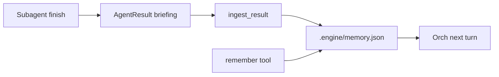

# Memory that models actually use

The store shape in [`runtime/store/memory.py`](../../runtime/store/memory.py) stayed. The loop was the gap: `remember` was optional, empty `touch` entries dominated `.engine/memory.json`, and the orch was told to spawn `ask` for every code question.

No extra LLM. Distill from the labeled briefing `compress_for_parent` already produces (`what` / `paths` / `facts` / `verdict` / `leftover`).



## Ingest

[`ingest_result`](../../runtime/store/memory.py) runs from [`Orchestrator._run_child`](../../agents/orchestrator.py) after `child.finish()`. Hashes use the **child** workspace (worktree bytes are the new truth). `memory.json` is written to the **main** workspace so orch can render it. Until merge, main-tree render shows `STALE` — that is correct.

Who: `ask`, `coder`, `researcher`. Skip tester / reviewer / debugger. Skip `aborted` / `failed`. Ingest `ok` and `max_turns` when the briefing has `what` or `verdict`.

- One decision bullet: `verdict` (else `what`) plus shared `facts`. Ask/coder → `engineering`; researcher → `other`. Duplicate of the newest bullet is skipped.
- File notes for at most 8 paths: coder uses `files_touched`; ask/researcher use `paths:` plus `FileTracker.paths()`. Fresh notes (`note_sha` matches disk) are left alone. Empty or STALE notes are rewritten from the briefing.

`remember` stays optional. It is not a `required_tool`. File `remember` merges: omitted `purpose` / `entry_points` / `constraints` keep their previous values.

## Structured notes

File entries gained `purpose`, `entry_points`, `constraints`. A lone `note` is still accepted (treated as `purpose`) so old JSON renders. Render:

```
- runtime/session.py [fresh] sha=abc1234 read
  purpose: EngineSession binds orch
  entry: EngineSession, _bind_loop
  constraints: no TUI imports
```

## Empty touches

`touch()` updates `seen_sha` / `action` only on already-noted files. It does not insert empty entries. `### Recently touched` is gone. Load/prune drops touch-only keys.

## Orch

[`ORCH_SYSTEM`](../../agents/orchestrator.py) checks memory first: answer from fresh notes; spawn ask on `STALE` / miss; deep surveys still spawn ask but start from the notes.
