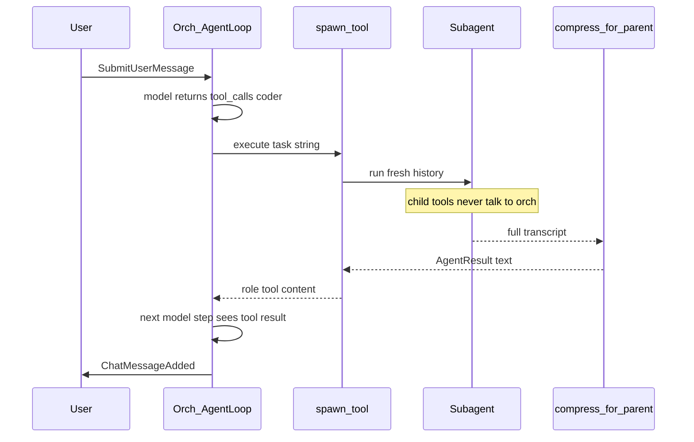

# Orchestrator and subagent personalities

The original class-design plan already specified this layer ([`.cursor/plans/engine_class_design_9b10c713.plan.md`](engine-class-design.md) step 5). The engine today still has one [`AgentLoop`](../../agents/agent_loop.py) bound in [`EngineSession._bind_loop`](../../runtime/session.py) with **all 24 tools**, and [`AbortAgent(agent_id=...)`](../../runtime/commands/agent.py) still returns `"subagents are not implemented"`. This slice implements that missing layer, with updated personalities and a tool-like extension model.

## Design decisions

**User talks only to the orchestrator.** `SubmitUserMessage` always runs the orch loop. Subagent tokens never become `ChatMessageAdded` / `ChatMessageDelta` in the user chat. Clients see subagents via `AgentStarted` / `AgentStateChanged(agent_id=...)` / `AgentFinished` plus tool events tagged with `agent_id`.

**The orch does not do the work.** It never writes files and never runs shell. It may:

- Answer directly when the reply is already in chat / `.engine/context.md`, or is a meta question (status, what just happened).
- Use a **small read set** (`list_files`, `search`, `read_file`, `list_symbols`) only to write a better spawn prompt — not to investigate a whole question itself.
- Spawn one or more personalities with a task string (“writer prompt”).
- After compacted results return, synthesize the user-facing answer, or `request_user_input` / respawn.

**Personalities are discovered like tools.** Drop a module under `agents/profiles/`, export a profile object. No registry file to edit. The orch sees each personality as a **callable tool named after the profile** (`ask`, `coder`, …), not one generic `spawn_agent` enum. That matches “agents designed like tools.”

**Subagents compact, then return.** On finish (or abort / max-turns), the subagent transcript is summarized into a structured `AgentResult`. That string is the orch’s tool result. Full subagent history is dropped. A short note is appended to `.engine/context.md` (already injected into `_build_messages()` via [`read_context_md`](../../agents/compactor.py)).

**One user turn, many workers.** The session still refuses a second `SubmitUserMessage` while the orch turn is running. The orch may emit several personality tool calls in one model turn; those children run concurrently. That is **mechanical** concurrency, not a license to overlap dependent work — see spawn ordering below.

**Write lock lands with the loop, not with browser/web tools.** [`apply_edit`](../../runtime/tools/edits.py) / `apply_workspace_edit` take a session `asyncio.Lock` for the **whole** function (including the existing LSP `await`). `_prepare` / `_commit` / `_apply_sync` stay await-free. This ships in implementation step 2, before `coder`/`tester` exist. The lock serializes the edit *operation* only; it does not order two agents' tasks.

---

## Agent to orch communication

There is **no second chat, mailbox, or event bus between the two models**. A subagent is a **blocking tool call** on the orchestrator loop — the same OpenAI-style `tool_calls` / `role: tool` protocol [`AgentLoop._dispatch`](../../agents/agent_loop.py) already uses for `list_files`. The orch model never sees the child’s tokens, tool trace, or live state. It sees one string when the child exits.

### Downward (orch → agent)

1. The orch model emits a function call, e.g. `coder` with `{ "task": "Add retries to runtime/server.py and run the tests" }`.
2. That `Tool.execute` is `Orchestrator.spawn("coder", task)`, not a workspace tool.
3. `spawn` builds a `Subagent` with the profile’s system prompt and tool allowlist. The task string is the **only** user message in the child’s fresh history. The child does not inherit orch chat, and does not get personality tools of its own.

While the child runs, the orch turn is waiting on that tool (or on `asyncio.gather` of several). It does not take another model step until every tool in the current batch has returned. Abort is the exception: `AbortAgent(agent_id)` cancels the child task; `spawn` then returns an `aborted` result so the orch can continue.

### Upward (agent → orch)

On child exit (`ok`, `incomplete`, `max_turns`, `failed`, or `aborted`):

1. `compress_for_parent` turns the child’s transcript into an `AgentResult` (always, not only when over budget).
2. That object is formatted as text and returned from `Tool.execute` — this is the **only** payload the orch model receives.
3. `_dispatch` appends the usual history row: `{ role: "tool", tool_call_id, content: <compacted AgentResult> }`.
4. A short note is also appended to `.engine/context.md` so later orch turns (after the orch itself is compacted) still have the outcome.
5. The child’s message list is dropped. It is not persisted and not merged into orch history.

`AgentResult` text the orch reads:

- `status`: `ok` | `incomplete` | `aborted` | `failed` | `max_turns`
- `summary`: what was learned or done
- `outcome`: the answer, verdict, or “done/not done”
- `files_touched`: paths (empty for ask/researcher)
- `leftover_questions`: anything the child could not resolve
- `missing_checks`: profile `required_tools` that never appeared in the child’s tool trace (empty when none)

The orch’s next `_invoke_model` then either replies to the user, asks the human via `PromptBroker`, or spawns another personality (e.g. `reviewer` after `coder`). Spawn is bounded — see spawn budget below.



### What is not a channel to the orch model

- **Client events** (`AgentStarted`, `ToolCallStarted(agent_id=...)`, `AgentFinished`) are session → TUI only. They do not enter orch context.
- **Shell approval** (`UserPromptRequested`) goes to the human. The child gets `"yes"` / `"no"` as its own tool result; the orch is still blocked on `spawn`.
- **Live streaming** of child thoughts into the orch is out of scope. If the child is stuck, the user aborts that `agent_id` or waits for `max_turns`.
- **Mid-run questions to the orch** do not exist. A child that needs a decision puts it in `leftover_questions` and exits. The orch then asks the user or respawns with a better task.

This is intentional: the orch context stays small (user turns + compacted reports), each child starts clean, and adding a personality is the same shape as adding a tool.

---

## Hard vs soft constraints

Privilege is **not** “please don’t” in a system prompt. Anything that would be a security or correctness boundary is checked in code. Prompt text restates the same rules so the model tries the legal path first.

**Hard (tool / funnel / spawn):**

- **Tool allowlist** — `ToolRegistry.subset(profile.tool_names)`. Ask has no edit/shell tools; debugger has no edit tools; orch has no write/shell. A model that names `str_replace` anyway gets `error: unknown tool`.
- **Write path globs** — `AgentProfile.write_globs`. `None` means any workspace path the existing [`guard_write_path`](../../runtime/tools/fileid.py) already allows. A non-empty list is enforced in `apply_edit` / `apply_workspace_edit`: if the relative path matches none of the globs, return `error: profile {name} cannot write {path}`. Tester gets test-path globs (`**/test_*.py`, `**/*_test.py`, `**/tests/**`, `**/__tests__/**`, `**/*.spec.*`, `**/*.test.*`, `**/cypress/**`, `**/e2e/**`). Ask/researcher/debugger/reviewer omit edit tools **and** set `write_globs=[]` so a mis-wired registry still cannot write.
- **Spawn budget** — `EngineConfig.max_spawns_per_turn` (default 8). `Orchestrator.spawn` increments a counter for the current user turn (reset in `submit_user_message`). Over budget returns `error: spawn budget exhausted` as the tool result and does **not** start a child. Parallel calls in one model step each count. `max_turns` still bounds a single child; this bounds ping-pong (`coder` → `tester` → `coder` …) inside one user turn. **Flat on purpose for v1:** eight independent parallel spawns and an eight-step sequential chain cost the same. If respawn-storms become the common failure, a later split (fan-out vs chain) can replace this; do not invent that now.
- **Child crash** — `spawn()` wraps `Subagent.run`. `CancelledError` → `status=aborted`. Any other exception is caught, compacted if history exists, and returned as `status=failed` with `outcome` starting `error:`. It must **not** propagate into orch `_dispatch` (that would truncate orch history). If `compress_for_parent` itself throws, return a minimal `failed` result with the exception text.
- **Write lock** — session `asyncio.Lock` held for the full `apply_edit` / `apply_workspace_edit` (including the LSP await). Prevents interleaved funnel races. Does not make `tester` wait until `coder`’s *task* is done.

**Reported, not blocking (exit still happens):**

- **`required_tools`** — after the child stops, missing names from the tool trace set `status=incomplete` (unless already `aborted`/`failed`) and fill `missing_checks`. The loop does **not** refuse to exit or spend extra turns. The orch prompt treats `incomplete` as “respawn once or tell the user,” still subject to the spawn budget.
  - **coder:** `["get_diagnostics"]`. Catches “edited and left.”
  - **tester:** `["run_command"]`. Intentional floor, not an oversight: we will not parse pytest vs cypress vs curl, but a tester that never executed anything silently going `ok` is exactly the no-op `incomplete` exists to catch. Which command to run stays prompt-only.
  - Other personalities: `[]` (ask/researcher/debugger/reviewer can legitimately finish after reads only).
- **Which test/compile command** — prompt-only for both coder and tester. Requiring *a* `run_command` on tester is not the same as requiring a specific runner.

**Prompt-only (called out so nobody mistakes them for gates):**

- Tester “don’t delete assertions to go green.”
- Debugger “report, don’t patch.” (backed by no edit tools, but the *intent* is prompt.)
- Orch spawn ordering (next section).

---

## Spawn ordering (parallel vs sequence)

`asyncio.gather` on orch tool calls is for **independent** children. The orch system prompt must say, in substance:

- Sequence when one result feeds the next: `coder` then `tester` then `reviewer`. Do that as **separate model turns** (call one personality, wait for the tool result, then call the next).
- Parallelize only for work that does not share files or depend on each other’s output (e.g. `ask` on module A and `researcher` on an API doc).
- Never spawn two writers against overlapping paths in the same tool-call batch. The write lock will not save you from a tester reading a half-finished change.

Orch `_dispatch` runs its tool batch concurrently so multiple spawns in one step actually overlap. **Subagent `_dispatch` stays sequential** so a child’s own `read_file` then `str_replace` in one model step cannot race the read-before-write check.

---

## Concurrent approval prompts

[`PromptBroker`](../../runtime/prompts.py) already keys futures by `prompt_id`, but `_current` / snapshot `pending_prompt` is a single slot — a second overlapping `ask()` overwrites it. Two parallel `run_command` approvals would collide.

**Serialize `ask()` with an asyncio.Lock** so only one prompt is `_current` at a time; the other child waits. Prefix/tag the question with `agent_id` and profile. Add `agent_id` to `UserPromptRequested` and `PendingPrompt` (empty string = orch). Snapshot stays one pending prompt because only one is shown. `answer(prompt_id)` is unchanged. `cancel_all` still cancels every waiter.

Queued wait is **not** a new `AgentStateChanged` state. The child blocked on the PromptBroker lock stays `calling_tool`. `waiting_for_user` fires only when that child’s prompt is `_current`. README / dummy_client: a worker that looks busy may be queued behind another agent’s approval prompt, not hung. Do not file that as a bug.

---

## Personalities (updated from the original ask / linter / editor / reviewer)

Drop standalone **linter**. Keep a cheap **reviewer** for post-change verdicts.

- `ask` — read-only Q&A (nav + sitter + LSP). Hard: no write/shell/web/browser; `write_globs=[]`.
- `coder` — implement the change (nav + sitter + LSP + edit tools + `run_command` + read-only git). Hard: write anywhere the funnel allows. Reported: must have called `get_diagnostics` or status is `incomplete`. Soft: run compile/tests via `run_command`.
- `tester` — prove behavior (nav + edit + `run_command`). Hard: `write_globs` limited to test paths. Reported: `required_tools=["run_command"]` so a no-op cannot return `ok`. Soft: don’t gut assertions; which runner to invoke.
- `researcher` — external facts (`web_search`, `web_fetch`, read-only nav). Hard: no write/shell/LSP; `write_globs=[]`.
- `debugger` — find the bug, do not fix (nav + sitter + LSP + `run_command` + git + browser). Hard: no edit tools; `write_globs=[]`.
- `reviewer` — verdict on the current diff (nav + sitter + LSP + read-only git). Hard: no write/shell; `write_globs=[]`.

**Tester vs coder:** coder may run the targeted unit test for files it touched (soft). Tester owns broader verification, writing **test** files, `curl`, and invoking whatever the **project** already has (`pytest`, `cypress`, `npx playwright`) via `run_command`. The engine does not vendor Cypress.

**Debugger vs ask:** ask explains how code works. Debugger produces a bug report (repro, failing signal, suspected locus) and stops.

```python
# agents/profiles/tester.py
PROFILE = AgentProfile(
    name="tester",
    description="Write and run tests (unit, curl, project E2E). Cannot edit production code.",
    system_prompt=TESTER_SYSTEM,
    tool_names=[...],          # includes edit tools
    write_globs=TEST_GLOBS,    # hard path gate
    required_tools=["run_command"],  # executed *something*; not which runner
    max_turns=16,
)
```

Orchestrator system prompt: coordinator only; spawn personalities; do not implement; sequence dependent work; parallelize only independent non-overlapping work; on `incomplete` respawn once or tell the user; stop when the spawn budget errors.

---

## Classes and files

Keep [`AgentLoop`](../../agents/agent_loop.py) as the shared turn cycle. Add identity fields (`agent_id`, `role` = `"orchestrator"` | `"subagent"`, `parent_id`, `profile`) and pass a **filtered** `ToolRegistry`. Split today’s `DEFAULT_SYSTEM` so the all-tools coding prompt lives on `coder`, not on the orch.

**[`agents/profile.py`](../../agents/profile.py)** — `AgentProfile` + `ProfileRegistry` with `register` / `get` / `list` / `discover_profiles()` (same `pkgutil` + reload pattern as [`discover_tools`](../../tools/registry.py)). `as_tools(spawn)` builds one `Tool` per profile (`name=profile.name`, `parameters={task}`) whose `execute` calls `spawn(name, task)`.

**[`agents/orchestrator.py`](../../agents/orchestrator.py)** — `Orchestrator(AgentLoop)`:

- Tools = read subset + generated personality tools + `write_context`.
- Concurrent `_dispatch` for orch tool batches; subagents keep sequential dispatch.
- `spawn(profile_name, task) -> str` checks spawn budget, creates a `Subagent`, emits `AgentStarted`, runs it inside try/except (crash → `failed`, cancel → `aborted`), always compresses, `write_context` (trimmed), emits `AgentFinished`, returns the compacted text.
- `request_user_input` stays session `PromptBroker`. Subagents do not get a task-clarification tool. Exec approval still uses `ctx.ask_user`, now serialized and tagged with `agent_id`.

**[`agents/subagent.py`](../../agents/subagent.py)** — `Subagent(AgentLoop)`: fresh history, profile prompt + tools + `write_globs` on `ToolContext`, no personality tools. Sequential `_dispatch`. `run()` returns `AgentResult`.

**[`agents/compactor.py`](../../agents/compactor.py)** — `compress_for_parent(...) -> AgentResult` always on exit. Sets `incomplete` when `required_tools` are missing. Mid-loop `compact()` unchanged.

**`write_context` pruning.** [`read_context_md`](../../agents/compactor.py) already caps what the orch sees (`CONTEXT_MD_CAP` = 4000). On append, trim the file to that cap (keep the newest tail) so disk does not grow unbounded.

**[`tools/registry.py`](../../tools/registry.py)** — `subset(names) -> ToolRegistry`. Personality tools are attached only on the orch.

**[`tools/base.py`](../../tools/base.py)** — `ToolContext.agent_id`, `role`, `write_globs`, `write_lock`. Session hooks stamp `agent_id` on outbound events.

---

## Protocol and session

Add events (original plan names):

- `AgentStarted(agent_id, profile, parent_id, task)`
- `AgentFinished(agent_id, profile, status, summary)`

Add optional `agent_id: str = ""` (empty = orchestrator) to existing `AgentStateChanged`, `ToolCallStarted`, `ToolCallFinished`, `CommandOutputChunk`, `ContextCompacted`, `UserPromptRequested`, and `PendingPrompt` so old clients keep working.

Snapshot: `EngineSnapshot.agents: list[AgentRow]` with `id, role, profile, status, current_tool, parent_id`. [`SessionState`](../../runtime/store/state.py) holds the live map.

[`AbortAgent`](../../runtime/commands/agent.py):

- no `agent_id` → cancel orch turn **and** all children (today’s `abort_turn`)
- with `agent_id` → cancel that subagent; its spawn tool returns an aborted `AgentResult`; orch continues

Do not persist full subagent transcripts. Session hydration stays orch-only (current `hydrate()` behavior).

---

## New tool families (after the loop works)

These personalities are hollow without them; implement after ask/coder spawn is green, still in this effort.

**Read-only git (small, needed by reviewer/coder/debugger):** thin wrappers over existing [`runtime/tools/git.py`](../../runtime/tools/git.py) — `git_status`, `git_diff`. Git remains protocol-driven for the TUI panel; these are LLM-facing.

**Researcher:** [`runtime/tools/web.py`](../../runtime/tools/web.py) + [`tools/web.py`](../../tools/web.py)

- `web_fetch(url)` — size-capped HTTP GET, text/html stripped to text, workspace-external. No file writes.
- `web_search(query)` — optional API key (e.g. Brave); if missing, return a clear `error:` so the orch can fall back to URLs + `web_fetch`. No scraping-fragile HTML search as the primary path.

**Debugger browser:** [`runtime/tools/browser.py`](../../runtime/tools/browser.py) + [`tools/browser.py`](../../tools/browser.py) via **Playwright** (Python, CDP under the hood — prefer this over Puppeteer). Tools: `browser_open`, `browser_console`, `browser_screenshot`, `browser_network` (status/failed requests). Screenshots land under `.engine/debug/` and the tool returns console text + path; if the provider can take images later, that is a follow-on, not required to ship. If Playwright is not installed, tools return `error: browser tools unavailable`.

Write lock, PromptBroker serialization, spawn budget, and crash→`failed` are **not** in this section; they ship in step 2 with the loop.

---

## What this does not change

- Unix socket, command/event codec, write funnel, LSP, tree-sitter, compaction-while-running.
- Clients still never import `Orchestrator` or profiles.
- TUI work stays display-only: [`dummy_client.py`](../../dummy_client.py) / [`client_tui.py`](../../client_tui.py) print the new agent events. No new widgets required to ship the engine.

---

## Tests (no live LLM)

- Profile discovery: built-ins present, duplicate name recorded as error, extra module picked up without code edits.
- Orch registry has personality tools + read tools and **not** `str_replace` / `run_command`.
- `ask` registry has no write/shell; `coder` has writes; neither has other personalities as tools.
- Tester `write_globs`: editing `runtime/session.py` returns `error:`; editing `tests/test_foo.py` succeeds.
- Coder that never calls `get_diagnostics` returns `status=incomplete` with that name in `missing_checks`.
- Tester that never calls `run_command` returns `status=incomplete`; one `run_command` is enough regardless of the argv.
- Fake LLM: user message → orch calls `ask` → compacted summary is the tool result → orch final text is the only `ChatMessageAdded`.
- Parallel: one orch turn with two personality tool_calls → both `AgentStarted` before either `AgentFinished`.
- Write lock: two overlapping `apply_edit` calls; the second does not enter `_apply_sync` until the first’s `apply_edit` has fully returned (including the LSP await).
- `AbortAgent(agent_id=...)` cancels one child; `AbortAgent()` cancels all.
- Child `raise RuntimeError` inside `run` → orch gets `status=failed` and continues; orch history is not truncated.
- Ninth `spawn` in one user turn (default budget 8) returns budget-exhausted and starts no child.
- Two parallel `ask_user` calls: second `UserPromptRequested` is not emitted until the first is answered; both events carry `agent_id`.
- `compress_for_parent` drops tool transcripts and keeps paths / leftover questions.
- `write_context` trims `.engine/context.md` to `CONTEXT_MD_CAP`.

Docs: [`docs/adding-a-profile.md`](../adding-a-profile.md) mirroring [`docs/adding-a-tool.md`](../adding-a-tool.md); README agent-loop section updated from “one loop, 24 tools” to orch + personalities. README notes that `waiting_for_user` means this child’s prompt is on screen; another child queued on PromptBroker still shows `calling_tool`.

## Implementation order

1. Profile dataclass (`write_globs`, `required_tools`), discovery, `ToolRegistry.subset`, protocol `agent_id` + snapshot rows.
2. Loop plumbing, **before any writer profile**: `Orchestrator` / `Subagent` / `compress_for_parent`; session spawn+abort; **write lock in `apply_edit` / `apply_workspace_edit`**; PromptBroker lock + `agent_id`; spawn budget; crash → `failed`; bind orch in `_bind_loop`.
3. Built-in profiles on existing tools: `ask`, `coder`, `tester`, `reviewer` (+ read-only git tools + tester path gate + coder `get_diagnostics` / tester `run_command` required_tools).
4. `researcher` + `web_fetch` / `web_search`.
5. `debugger` + Playwright browser tools (graceful if missing).
