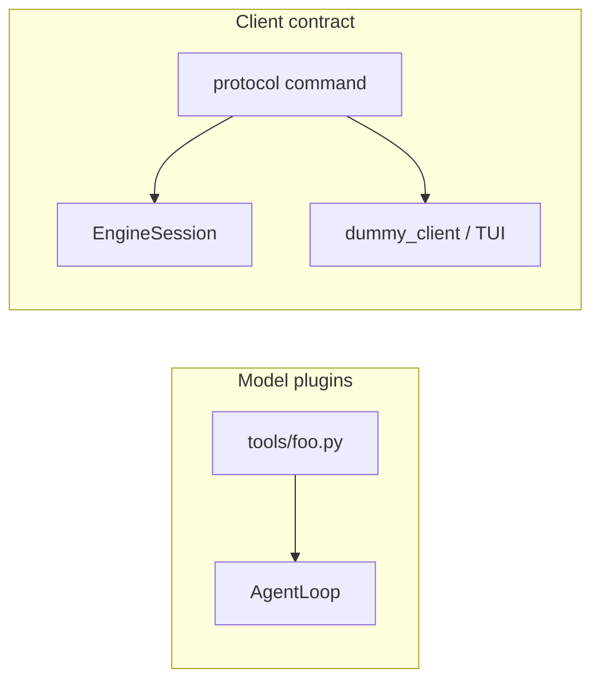

# Make protocol easier to extend (without copying tools)

## Honest answer: it is not as extendable as tools

Tools are **engine plugins**. The model is the only consumer. Drop a file under [`tools/`](../../tools/), decorate, done.

Files/git **UI** commands are a **wire contract**. A TUI (or another language) has to know the JSON `type` names. Copying the tools pattern into `protocol/commands/*.py` would scatter the contract and would not help a non-Python client.

Those are two different extension paths:



- Want the **model** to read git? Add [`tools/git_status.py`](../../tools/) — no new command.
- Want the **UI** to show git without asking the LLM? That is `RequestGit` + `GitStateUpdated` — protocol.

Adding `RequestGit` today is not “dataclass + implement.” You also:

1. Write `to_json` / `from_json` by hand
2. Add the class to `Command`/`Event` unions
3. Add it to `COMMANDS`/`EVENTS` dicts
4. Re-export in [`protocol/__init__.py`](../../protocol/__init__.py)
5. Add an `isinstance` branch in [`runtime/session.py`](../../runtime/session.py) `handle()`
6. Teach [`dummy_client.py`](../../dummy_client.py) a REPL name + HELP (+ sometimes `format_event`)

Codec is already the good part: [`protocol/codec.py`](../../protocol/codec.py) only looks up `COMMANDS`/`EVENTS`. The unions and `__init__` lists are duplicate catalogs.

## What we should not do

- Do not auto-discover protocol types from a folder the way we do tools.
- Do not merge tools and UI commands into one registry. `OpenFile` is tab state; `read_file` is for the model.

## What we should do

Keep one file for commands and one for events so the contract is readable. Make **adding a type** mean: dataclass + one handler. The dummy client is a harness, not a second catalog.

### 1. Shared message serde

Add [`protocol/message.py`](../../protocol/message.py): a small `ProtocolMessage` base (or mixin) that:

- `to_json()`: `{"type": ClassName, ...fields}`
- `from_json()`: fill dataclass fields; if a nested value has `from_json` / `to_json`, use it (so `SnapshotReady.snapshot` and `GitStateUpdated.git` keep working)
- Skip `None` optionals (same as `StartSession.session_id` today)

Then [`protocol/commands.py`](../../protocol/commands.py) and [`protocol/events.py`](../../protocol/events.py) become declarations, not copy-pasted serde. Leave [`protocol/snapshot.py`](../../protocol/snapshot.py) as-is (recursive `FileTreeNode`, `GitState.empty()`).

### 2. `@command` / `@event` registries

Decorators append to `COMMANDS` / `EVENTS`. Delete the hand-maintained `Union` + dict. Codec stays unchanged.

```python
@command
@dataclass
class OpenFile(ProtocolMessage):
    path: str
```

`protocol/__init__.py` exports whatever is in those dicts so that file stops being a third checklist.

### 3. Handler lookup instead of `if isinstance`

In [`runtime/session.py`](../../runtime/session.py), replace the `handle()` ladder with a map filled by `@handles(OpenFile)` on the existing methods. Unknown command still emits `ErrorOccurred`.

Special cases stay special and stay on the session: `StartSession` (workspace check), `SubmitUserMessage` (agent loop), `Shutdown`.

### 4. Dummy client uses protocol type names (no `cli=`)

Do **not** put REPL aliases on command classes. That would mix a throwaway harness into the wire contract — the same mistake as folding tools and UI commands together.

[`dummy_client.py`](../../dummy_client.py) already lowercases the first token. It can look up `COMMANDS` case-insensitively (`openfile` → `OpenFile`, `requestgit` → `RequestGit`) and fill fields from the rest of the line (zero-field commands take no args; one string field takes `rest`). HELP can list `COMMANDS` keys.

Client-only leftovers, not protocol:

- `help`, `exit` / `quit`
- `start` — convenience wrapper: injects this process's workspace into `StartSession` (you cannot type the workspace path every time)
- bare text that is not a known command type → `SubmitUserMessage`

`format_event` stays explicit for snapshots/git/files — those are display, not protocol.

## After this, the real checklist

**New UI command**

- Dataclass in `commands.py` with `@command` (REPL sees the type name automatically)
- `@handles` method on `EngineSession`
- Runtime helper in `runtime/fs.py` / `runtime/git.py` if the logic is new

**New UI event**

- Dataclass in `events.py` with `@event`
- `self._emit(...)` from the handler
- Optional `format_event` branch if the REPL dump is noisy

**New model capability**

- One file under `tools/` — protocol unchanged
