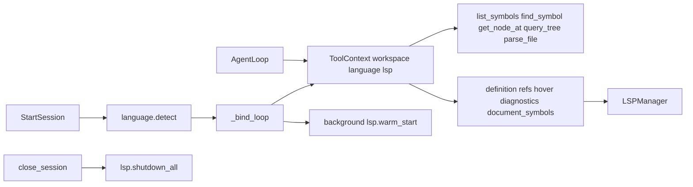

# Tree-sitter and LSP tools

Add code-intelligence tools to this engine. [`temp.py`](../../temp.py) is an earlier experiment, not a hard spec — keep its LSP client, coordinate convention, and `find_symbol` walker, but also take the extra sitter/LSP tools from the original engine design wherever they help the agent. Do **not** copy `clone_repo`, grep, or the Anthropic loop. Follow the split in [`runtime/tools/__init__.py`](../../runtime/tools/__init__.py): **model-facing `@tool` wrappers in `tools/`**, **implementation in `runtime/tools/`**.

## What already exists

- Tool framework: [`tools/base.py`](../../tools/base.py) `@tool` decorator, [`tools/registry.py`](../../tools/registry.py) `discover_tools()` (walks `tools/`, no manual registry edit).
- Live tools: `search`, `read_file`, `list_files`.
- Language detection: [`runtime/language.py`](../../runtime/language.py) (`python` / `go` / `javascript` including TS). Snapshot + `WarningOccurred` already tell the client whether tree-sitter/LSP are available.
- [`ToolContext`](../../tools/base.py) is currently only `workspace: Path`. [`AgentLoop`](../../agents/agent_loop.py) builds it in `_bind_loop`.

`tools/sitter/` and `tools/lsp/` are **not** on disk (only mentioned in the old design plan). `requirements.txt` has no tree-sitter packages.

## Tool surface

Keep temp.py's 1-based tool coordinates (LSP wire protocol stays 0-based). Infer language from extension (`.py` / `.go` / `.js|.jsx` / `.ts` / `.tsx`); optional `language` override if the model passes it. Path checks go through [`resolve_in_workspace`](../../runtime/tools/fs.py).

### Why the extra tools (not skipped)

temp.py only had `find_symbol`, which requires already knowing the name. The original design's extras fill the gaps around that:

- **`list_symbols`** — file outline without reading the whole file. Discovers names so `find_symbol` / LSP have something to target. Highest-value sitter tool.
- **`get_node_at`** — "what syntax is at this line/col?" (node type, name, parent, enclosing def, named children). Complements `hover` (types/docs) with local CST structure; no server wait.
- **`query_tree`** — "all imports / functions / calls in this file." Raw tree-sitter S-expressions are easy for the model to get wrong, so expose **presets** (`imports`, `functions`, `classes`, `methods`, `calls`) plus an optional raw `query` for power use. Cap captures.
- **`parse_file`** — a full CST dump blows the context window. Keep it as a **compact named-node tree** (named nodes only, line ranges, depth/count caps). Use when nesting matters (class → method → nested def) and `list_symbols` is too flat. Skip dumping anonymous tokens.
- **`document_symbols`** — LSP `textDocument/documentSymbol`. Overlaps `list_symbols` but adds SymbolKind and types the CST often misses (TS interfaces, enums, type aliases). Prefer sitter `list_symbols` first (instant); use this when the outline looks incomplete or you need LSP kinds.

### Sitter

| Tool | Inputs | Output |
|------|--------|--------|
| `list_symbols` | `path` | outline of defs/imports: name, kind, 1-based line/col (hierarchical if nested) |
| `find_symbol` | `path`, `symbol` | that symbol's source + 1-based name position (chain into LSP) |
| `get_node_at` | `path`, `line`, `character` | node type, text snippet, parent, enclosing definition, named children |
| `query_tree` | `path`, `preset` or `query` | capped captures: `path:line:col  type  text` |
| `parse_file` | `path` | compact named-node tree with line ranges (capped) |

### LSP

| Tool | Inputs | Output |
|------|--------|--------|
| `goto_definition` | `path`, `line`, `character` | locations + source-line preview |
| `find_references` | same | locations (cap 50) |
| `hover` | same | type/docs text |
| `get_diagnostics` | `path` | `path:line:col Severity: message` |
| `document_symbols` | `path` | hierarchical LSP outline with kinds |

## Layout

```
runtime/tools/sitter.py   # parsers, walk, presets, list/find/node/query/parse
runtime/tools/lsp.py      # LSPClient + LSPManager + formatters (from temp.py)
tools/sitter.py           # @tool list_symbols, find_symbol, get_node_at, query_tree, parse_file
tools/lsp.py              # @tool goto_definition, find_references, hover, get_diagnostics, document_symbols
```

`discover_tools()` will pick up the new modules automatically.

Port the walker and LSP stack from temp.py with these engine-specific changes:

- Reuse [`runtime.tools.fs.SKIP_NAMES`](../../runtime/tools/fs.py) instead of temp.py's `IGNORE_DIRS` for workspace walks.
- Key LSP clients by `tuple(cmd)` so JS and TS share one `typescript-language-server` process (temp.py already does this).
- When detected project language is `javascript`, **warm-start both JS and TS extensions** (language.py folds them; temp.py's `warm_start("javascript")` would miss `.ts`).
- Wrap blocking `LSPClient.request` in `asyncio.to_thread` so the asyncio session is not stalled.
- Return agent-facing error strings (same as temp.py / `read_file`), not raw exceptions, for not-found / unsupported extension / missing server.

Parsers (same as temp.py): `tree_sitter` + `tree-sitter-python` / `javascript` / `typescript` (incl. TSX) / `go`.

LSP servers (not Python deps; must be on PATH / via npx):

- Python: `npx -y -p pyright pyright-langserver --stdio`
- JS/TS: `npx -y typescript-language-server --stdio`
- Go: `gopls serve`

## Session lifecycle



1. Extend `ToolContext` with optional `language: LanguageInfo | None` and `lsp` (the manager).
2. [`EngineSession`](../../runtime/session.py) owns one `LSPManager` when `language.supported`. Create it in `_bind_loop`, pass into `AgentLoop`, start `warm_start` on a daemon thread (non-fatal, same as temp.py).
3. `AgentLoop.__init__` accepts `language` / `lsp` and puts them on `ToolContext`.
4. `close_session` / `shutdown` call `lsp.shutdown_all()`.
5. If language is unsupported or `ctx.lsp` is None, LSP tools return a clear error (tools still register; discovery is workspace-agnostic). All sitter tools still work whenever the file extension has a grammar — do not gate them on `language.supported`.

## Prompt

Update [`agents/agent_loop.py`](../../agents/agent_loop.py) `DEFAULT_SYSTEM` so the model actually uses the new tools. Keep it short (current style). Cheaper-first chain:

- `search` / `list_files` to locate a file; `list_symbols` to see what is in it; `find_symbol` for one definition's source.
- `get_node_at` / `query_tree` for local syntax (what is at this cursor; all imports/calls) without waiting on LSP.
- `parse_file` only when nesting/shape matters and the outline is not enough.
- Feed a 1-based name position into `goto_definition` / `find_references` / `hover` for cross-file / type questions.
- `document_symbols` when the sitter outline looks incomplete (interfaces, enums) or LSP kinds help.
- `get_diagnostics` for type/lint issues.
- LSP only for python / go / javascript / typescript; fall back to sitter + `read_file` if a server is missing.

## Dependencies

Add to [`requirements.txt`](../../requirements.txt):

- `tree-sitter`
- `tree-sitter-python`
- `tree-sitter-javascript`
- `tree-sitter-typescript`
- `tree-sitter-go`

Match the `Language(tspython.language())` + `Parser(lang)` API used in temp.py (tree-sitter 0.22+).

## Out of scope

- `temp.py` itself stays as the experiment; do not wire the engine to Anthropic or `clone_repo`.
- No tests exist in this repo; smoke sitter tools on this workspace (python files) and LSP helpers if pyright/npx is available.
