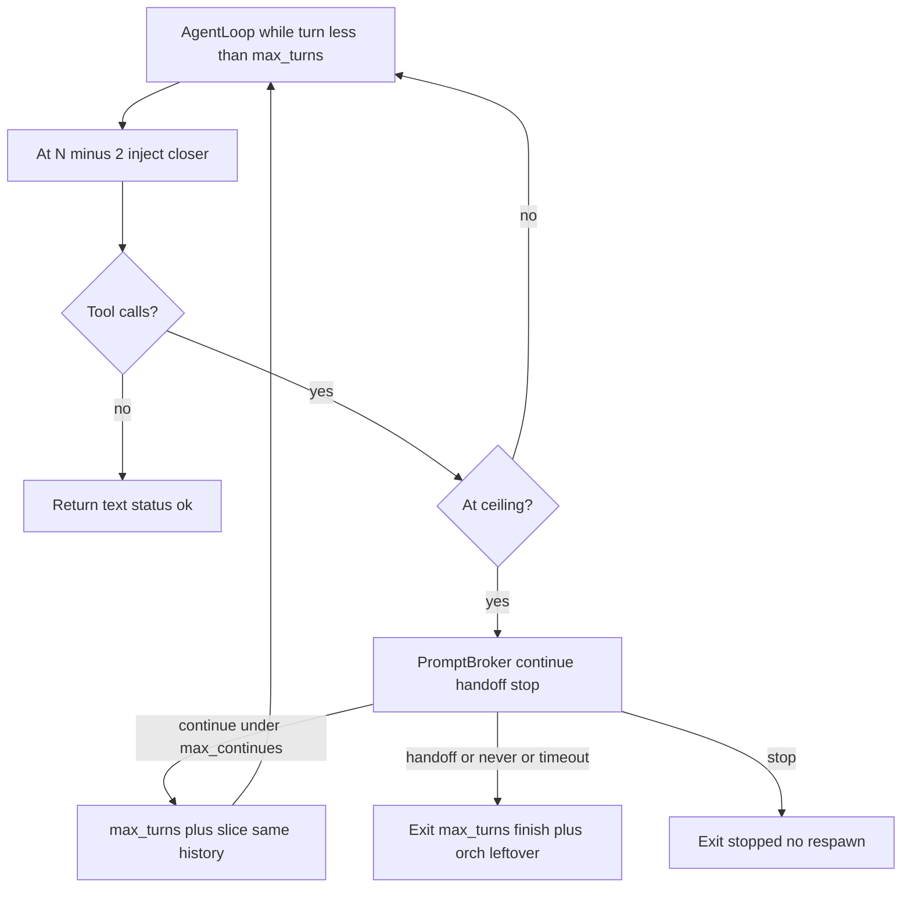

# Turn budget continue

`max_turns` is a cost fuse, not a death. A child still calling tools at the ceiling stays alive: the user can grant another slice on the same `_history`, hand leftover to the orch, or stop. The 32-turn profile cap is unchanged.

## Config

[`EngineConfig`](../../runtime/config.py):

- `turn_slice` (16) — `ENGINE_TURN_SLICE`
- `max_continues` (3) — `ENGINE_MAX_CONTINUES` (32 + 16×3 = 80 absolute)
- `turn_continue` (`prompt` | `never`) — `ENGINE_TURN_CONTINUE`

Invalid `turn_continue` warns and falls back to `prompt`. `never` is for CI. There is no `always` auto-continue.

## Same-child continue

[`AgentLoop.run`](../../agents/agent_loop.py) is a `while turn < max_turns` loop. At the ceiling, if the last step still had tool calls:

- `never` or no `ask_user` → `max_turns` (handoff). Timeout / empty / unknown answers also hand off. Do not spend a slice unattended.
- Else `PromptBroker.ask` `kind=choice` with `continue` / `handoff` / `stop`, default `handoff`.
- **continue** (`continues < max_continues`): `max_turns += turn_slice` for this `run()` only, append a grant line, keep looping. Next `AgentStateChanged` carries the new ceiling. The original cap is restored when `run()` returns so a later orch turn does not inherit the grant.
- **stop** → `_exit_status = stopped`.
- Exhausted continues → forced handoff, no fourth prompt.

`finish()` is not called until `run()` returns. Worktree, LSP, and transcript stay live. `_run_child` reads `child._exit_status` instead of parsing `"stopped after"`.

Abort during the prompt still goes through [`PromptBroker.cancel_agent`](../../runtime/prompts.py).

## Closer at N−2

Before the complete at `turn == max_turns - 2` (skip if `max_turns < 3`), inject:

> You have two tool turns left. Finish the current edit, or write a closer with labeled leftover: (paths, done, next). Do not start new exploration.

Inject again at each **new** ceiling after a continue grant, once per ceiling. That is what makes handoff a real briefing instead of an empty `last_text`.

## Orch

[`_apply_run_status`](../../agents/orchestrator.py): `stopped` replaces `ok` like `max_turns`. `incomplete` still beats both.

[`ORCH_SYSTEM`](../../agents/orchestrator.py):

- `max_turns` → spawn one writer with leftover / paths / files_touched. Do not rediscover.
- `stopped` → tell the user; do not respawn.
- Ask/researcher stay spawn-once on inbox turns.

[`INGEST_STATUSES`](../../runtime/store/memory.py) stays `{ok, max_turns}`. `stopped` is not ingested.

No new event type. TUI/dummy already render `UserPromptRequested` choices.

## Out of scope

Raising profile `max_turns`, `ENGINE_TURN_CONTINUE=always`, and auto-approving worktree-local shell (`pwd` / `ls` / `mkdir`). Those delay the cliff or spend the budget before the cap.
