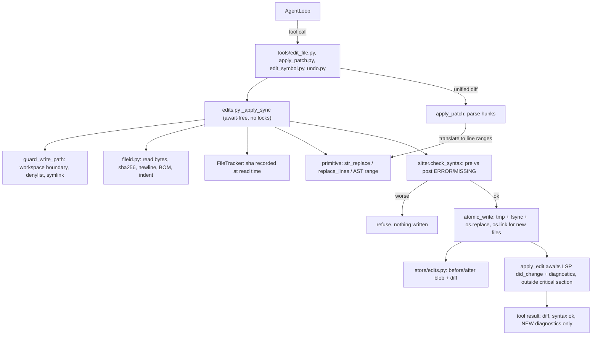

# Write-side edit tools for the engine

## Scope decisions

- Rollback: **journal in `.engine/session.db`** (pre-image blob + diff per edit). No git worktrees, no auto-commits. Worktree-based isolation for parallel agent runs is a separate future plan.
- Item 4 (formatter/linter) is **out of scope** — a dedicated linter agent will own it. LSP code actions (organize imports, quick fixes) are deferred with it.
- Post-edit verification (tree-sitter + LSP) is **in scope and mandatory** on every write.
- Zero new runtime dependencies: `hashlib`, `tempfile`, `difflib`, `os.replace`, `os.link` are all stdlib; tree-sitter and the LSP client already exist. See "Dependencies considered and rejected" below.

## Dependencies considered and rejected

The whole `apply_edit` call is dominated by the `diagnostics_after_change` wait on the language server — hundreds of milliseconds to seconds. Hashing is microseconds and the tree-sitter parse is single-digit milliseconds, so CPU-side swaps optimize well under 1% of the pipeline. Recorded here so these aren't relitigated:

- **pygit2 for patch application** — rejected on API surface, not performance. `git_apply_to_tree` exists in libgit2 but is **not exposed in pygit2**; the public API is only `Repository.apply(diff, location=WORKDIR|INDEX|BOTH)` plus `applies()`. `WORKDIR` writes directly to disk, bypassing the entire funnel (no staleness check, syntax gate, atomic write, journal, or identity preservation). `INDEX` would stage files, which surfaces in the snapshot because `read_state` in [runtime/tools/git.py](../../runtime/tools/git.py) parses `git status --porcelain` into the `staged` list. And `apply` applies relative to HEAD, which is the wrong preimage whenever the file has uncommitted changes — the normal case mid-turn — and impossible for untracked files or non-git workspaces. libgit2's `.gitattributes` CRLF filters would also double-transform line endings against Phase 1.
- **similar-rs / rapidiff instead of difflib** — the packages are real with abi3 wheels, but `similar-rs`'s own README states "on tiny inputs it is a wash," and every diff here is one small file's worth, generated once per edit for display and the journal. `list_edits` reads stored diffs rather than recomputing. Not worth a v0.1.x single-maintainer dep on the write path.
- **xxhash / blake3 instead of hashlib** — the reasoning that staleness needs no collision resistance is correct, but sha256 with SHA-NI runs around a gigabyte per second, so a typical source file hashes in tens of microseconds on a buffer already in memory, and `_apply_sync` has to read that buffer anyway. Revisit only if we later hash the whole tree for a watcher or index, where the per-file read is the cost rather than the hash.
- **rapidfuzz for fuzzy anchoring** — rejected as an *application* mode: near-match application contradicts the "fail loudly, never guess" requirement, and in Python whitespace-tolerant matching can silently move a statement between blocks because indentation is semantics. Deferred as a possible *hint* accelerator, see Phase 1.

## Where this fits

Existing split is preserved: `runtime/tools/*` holds logic, `tools/*` holds thin `@tool` wrappers with explicit JSON schemas (as `tools/read_file.py` and `tools/lsp.py` already do). New modules go in `runtime/tools/`, new tool wrappers in `tools/`.




## Phase 1 — File identity and the apply pipeline

**New `runtime/tools/fileid.py`**

`FileSource` dataclass: `rel`, `resolved`, `text` (newlines normalized to `\n` for matching), `raw_sha256` (hash of on-disk bytes), `newline` (`\n`/`\r\n`/`\r`, dominant wins), `trailing_newline: bool`, `encoding` (`utf-8` vs `utf-8-sig`), `indent` (tabs vs N spaces, inferred from the file).

- `read_source(workspace, path) -> FileSource` — reads **bytes**, not text.
- `render(src: FileSource, new_text: str) -> bytes` — re-applies newline style, trailing-newline presence, and BOM.

This is item 5. Note `read_text` in [runtime/tools/fs.py](../../runtime/tools/fs.py) uses `Path.read_text`, whose universal-newline handling silently converts CRLF to LF, so `read_window` already discards this information. Refactor `read_window` onto `read_source` so read and write agree on the same normalized view.

**New `runtime/tools/edits.py`** — the single funnel every write goes through, split into an await-free core and an async wrapper. The split is a correctness requirement, not organization; see "Concurrency" below.

`_apply_sync(ctx, path, mutate, tool_name)` — **contains no `await`, ever:**

1. `guard_write_path(workspace, path)` (Phase 2). Every entry into the funnel, not just the LSP rename path.
2. `src = read_source(...)`.
3. Staleness check (Phase 2).
4. `new_text = mutate(src)` — raises a descriptive error on ambiguity/mismatch.
5. No-op short circuit if `new_text == src.text`.
6. Syntax gate (Phase 3). On failure, return the error and write nothing.
7. `atomic_write(resolved, render(src, new_text))`: `tempfile.NamedTemporaryFile(dir=resolved.parent, delete=False)`, write, `flush`, `os.fsync`, `os.chmod` to the original mode (temp files are `0600`), `os.replace`. Unlink the temp file on any exception.
8. Journal the edit (Phase 5).
9. `tracker.mark(rel, sha_of_new_bytes)`.

`apply_edit(...)` — `async`, calls `_apply_sync` and then, **outside** the critical section, awaits the LSP resync and fresh diagnostics (Phase 4) and fires `on_edit`.

### Concurrency: no locks, by construction

An earlier draft acquired a per-path `threading.Lock` around the whole thing. With write tools as `async def` on the event loop (Phase 6), that is a **permanent deadlock**, not a slow path:

- Coroutine A acquires the uncontended lock, then hits `await asyncio.to_thread(...)` for the diagnostics wait and suspends.
- The loop picks up coroutine B, which calls `lock.acquire()` and blocks the OS thread.
- The loop thread is now parked inside `acquire()`, so A's continuation can never be scheduled. The worker thread resolves A's future via `call_soon_threadsafe`, which only queues a callback the loop will never reach.
- A never resumes, never releases. The engine hangs until restart.

Swapping in `asyncio.Lock` would fix the hang but treats the symptom. The real problem is holding a lock across an `await`, and removing that removes the need for a lock at all: on a single event loop, **any stretch of code containing no `await` is already atomic**, because nothing can interleave into it. That is what `_apply_sync` is for.

Two consequences to keep in view:

- **The await-free property is load-bearing and invisible if broken.** A future refactor adding one `await` inside `_apply_sync` silently reintroduces the interleaving with no symptom until it corrupts a file. This warrants a comment on the function stating the constraint.
- **This puts blocking disk I/O on the event loop** for the duration of one file read and write — sub-millisecond to a few milliseconds for source files. That is a deliberate trade, since moving it to `to_thread` is precisely what creates the problem.

The multi-file `WorkspaceEdit` rename (Phase 4) follows the same shape: apply every file inside one await-free section under a shared `batch_id`, then sync LSP for all of them afterward. Batch atomicity falls out instead of needing a lock held across N awaits.

**Primitives in `edits.py`** (pure functions over `FileSource.text`, independently testable):

- `str_replace(text, old, new)` — exact match, must be unique. Multiple matches: list the 1-based line number of every match and refuse. This is the highest-leverage guardrail in your notes; failing loudly here is the whole point.
  On **zero matches**, escalate through two diagnostics, neither of which ever applies anything:
  1. Retry the match with per-line trailing whitespace stripped. If that yields exactly one hit, report `found at line N with whitespace differences; re-issue with the exact text`. This covers the most common real drift without whitespace-insensitive *application*, which in Python could silently relocate a statement between blocks.
  2. Otherwise fall back to `difflib.SequenceMatcher` over candidate line windows to name the closest existing block.
  **Pass `autojunk=False` to every `SequenceMatcher` construction in this codebase.** The default heuristic treats any line appearing in more than 1% of a sequence as junk once the input exceeds 200 lines, which on source files discards blank lines, `}`, and `return` from matching and produces visibly wrong results on exactly the files we care about.
  If this hint path proves slow on large files (it is thousands of `ratio()` calls in Python on a few-thousand-line file), `rapidfuzz.process.extractOne` over the same windows is the drop-in fix. Deferred until measured, since it is contained in one function.
- `replace_lines(text, start, end, new_text)` — 1-based inclusive, mirroring the `read_window` header format so the model can address a window it already has open.
- `insert_at_line(text, line, new_text)`.

### The `create_file` branch

`_apply_sync` step 2 calls `read_source`, which assumes the file exists, so creation takes an explicit branch rather than falling out of the funnel. Spelled out because each corner differs from the edit path:

- **Path guard still applies** (step 1, unchanged).
- **No staleness comparison is possible.** The equivalent guard is *refuse if the path already exists*, which is what prevents clobbering.
- **`os.replace` is the wrong primitive here** — it overwrites unconditionally. Use `os.link(tmp, target)`, which fails atomically if the target exists, then unlink the temp. This collapses the exists-check and the write into one race-free operation, closing the TOCTOU against external processes as well as our own loop.
- **File identity has no source to inherit.** Defaulting to LF is wrong in a CRLF repo. Inherit from a sibling file with the same extension in the same directory when one exists; otherwise LF, UTF-8 without BOM, trailing newline present. Reading `.editorconfig` or `.gitattributes` would be more correct and is optional scope.
- **The syntax gate is stricter.** With no pre-image there is no baseline to diff against, so *any* ERROR or MISSING node rejects outright. A brand-new file has no excuse for being unparseable, unlike a pre-broken existing one.
- **Parent directories:** `mkdir(parents=True)` for a path like `a/b/c.py`, with each created directory also passing the path guard. Record which directories were created so undo removes them if still empty — otherwise undo leaves debris.
- Journal entry has `before IS NULL`; undo deletes the file and prunes those directories.

**New `tools/edit_file.py`** — wrappers `str_replace`, `replace_lines`, `insert_at_line`, `create_file`.

## Phase 2 — Path guard and optimistic concurrency

### Write path guard

**New `guard_write_path(workspace, path)`** in `runtime/tools/fileid.py`, called as the first statement of `_apply_sync` so there is one funnel and one guard. `read_source` inherits `resolve_in_workspace` implicitly by being modeled on `read_text`, and "implicitly inherits" is how one code path ends up unguarded.

It runs `resolve_in_workspace` and then hard-denies, with an error naming the reason and no override flag:

- `.git/**` — writes can corrupt the object store or `HEAD`, and the journal only restores file bytes, so undo cannot repair it.
- `.engine/**` — holds `session.db` and the edit journal. An agent editing its own undo log is a self-inflicted footgun.
- `env.sh`, `.env`, `.env.*` — `_load_env_sh(workspace / "env.sh")` in [llm/openrouter.py](../../llm/openrouter.py) reads `OPENROUTER_API_KEY` from there. Write access is both a key-clobbering and an exfiltration path.
- Generated lockfiles: `package-lock.json`, `uv.lock`, `poetry.lock`, `Cargo.lock`, `go.sum`. Hand-edits produce inconsistent states their own tooling then fights.
- `node_modules/**` and the rest of `SKIP_NAMES` in [runtime/tools/fs.py](../../runtime/tools/fs.py). Note `SKIP_NAMES` is a *listing* filter, so reusing it is a starting point rather than the whole answer.

**Symlinks need their own rule.** `resolve_in_workspace` calls `.resolve()`, which follows symlinks. A symlink pointing outside the workspace resolves outside and is correctly rejected. But a symlink pointing at another file *inside* the workspace resolves to a valid in-workspace path, so we would write through it — editing a different file than the model named, while the journal records the requested path, which makes undo restore the wrong file. Reject writes where the pre-resolution path is itself a symlink (`os.path.islink`).

### Staleness tracking

**New `runtime/tools/tracker.py`**: `FileTracker` holding `dict[str, str]` of rel path to the sha256 of the bytes last read.

**Always read, always hash, compare shas.** An earlier draft cached `(st_mtime_ns, st_size, st_ino)` to skip re-hashing, justified as skipping "the read and the hash." On this path that is wrong: `_apply_sync` must read the file in order to mutate it, so the read happens regardless and the stat tuple saved only the hash — tens of microseconds on bytes already in memory, which is exactly the micro-optimization rejected above for xxhash. Dropping the cache is simpler, and it removes the read/write interleaving hazard entirely: `read_file` records the sha of the bytes it actually read, so every entry is self-consistent by construction and `tracker.mark` needs no lock.

A stat-based fast path does earn its keep for a *different* future feature — a whole-tree "what changed" sweep for a watcher or index, where the read genuinely can be skipped. Not here.

Note the guardrail is layered: even a fooled tracker cannot cause a misapplied edit on its own, because `str_replace` still has to find its anchor exactly once in the current content.

Wire it as a new field on `ToolContext` in [tools/base.py](../../tools/base.py):

```python
@dataclass
class ToolContext:
    workspace: Path
    language: Any = None
    lsp: Any = None
    files: Any = None      # FileTracker
    journal: Any = None    # db path for the edit journal
    on_edit: Any = None    # callback for protocol events
```

`EngineSession._bind_loop` ([runtime/session.py](../../runtime/session.py) lines 103-118) constructs the tracker per session and passes it through `AgentLoop` into `ToolContext`. `read_file`/`read_window` call `tracker.mark(rel, sha)`.

Refusal rules in `_apply_sync`:

- Path not in the tracker: `error: read <path> before editing it`.
- Recorded sha differs from the sha of the bytes just read: `error: <path> changed on disk since you read it (line count N -> M); read_file again before editing`.
- After a successful write, `tracker.mark` the new sha so consecutive edits in one turn are allowed.

## Phase 3 — Tree-sitter syntax gate

**Extend [runtime/tools/sitter.py](../../runtime/tools/sitter.py)**:

- `check_syntax(lang, source_bytes) -> list[SyntaxFault]` — parse and walk, collecting nodes where `node.type == "ERROR"` or `node.is_missing`, with 1-based line/col and the node text clipped via the existing `_clip`.
- `parse_bytes(lang, source_bytes)` — factored out of `_parse` so the gate can parse in-memory candidate content without touching disk.

**Baseline comparison is essential.** Many real files already contain ERROR nodes (partial dialects, newer syntax than the pinned grammar). Reject only if the post-edit fault count exceeds the pre-edit count, or a new fault lands inside the edited line range. Otherwise a pre-broken file becomes permanently uneditable.

If `language_for(path)` returns `None` (markdown, TOML, YAML), skip the gate silently — do not block edits to unsupported file types.

**AST-scoped edits** (second half of your item 2), built on `_find_named_node`, `SYMBOL_TYPES`, and `IMPORT_TYPES` which already exist:

- `symbol_range(workspace, path, symbol) -> (start_byte, end_byte)`.
- `replace_symbol` / `insert_before_symbol` / `insert_after_imports` — byte-range mutations passed as the `mutate` callable into the same funnel.

**New `tools/edit_symbol.py`** — wrappers `replace_symbol`, `insert_after_imports`.

## Phase 4 — LSP write side

**This is a correctness bug today, not just a missing feature.** `LSPManager._did_open` ([runtime/tools/lsp.py](../../runtime/tools/lsp.py) lines 411-436) caches `_opened_files`, and `open_file_and_get_diagnostics` returns early for already-open files. Since `warm_start` opens up to 500 files, after any write the language server holds stale content and `get_diagnostics` returns **stale results with no indication they are stale**.

Changes to `LSPManager`:

- Add `_versions: dict[str, int]` and `_diag_seq: dict[str, int]`.
- `did_change(rel_path, new_text)` — bump version, send `textDocument/didChange` with full-text sync (`contentChanges: [{"text": new_text}]`), and invalidate the cached diagnostics entry for that URI.
- `diagnostics_after_change(rel_path, timeout=5.0)` — `did_change`, then wait for a *newer* publish generation. A sequence counter is required because an empty diagnostics list is otherwise indistinguishable from "not published yet".
- Advertise the new capabilities in the `initialize` payload (lines 264-279), which currently lists only `synchronization`, `publishDiagnostics`, `definition`, `references`, `hover`, `documentSymbol`. Add `rename: {"prepareSupport": true}`.
- `rename_symbol(rel_path, line, char, new_name)` — `did_change`-sync affected files first so the server's view matches disk, then `textDocument/rename`.

**WorkspaceEdit applier** in `edits.py`: normalize `changes` vs `documentChanges`, run every target path through `guard_write_path` (not just `resolve_in_workspace` — a rename must not write into `.git` or through a symlink either), sort per-file edits in reverse position order, and apply all files inside **one** await-free section under a shared `batch_id`, so undo reverts the whole rename and no coroutine can observe a half-applied rename. LSP resync for every touched file happens afterward, outside that section.

**New tool `rename_symbol`** in [tools/lsp.py](../../tools/lsp.py). This replaces grep-replace on identifiers, which is exactly the failure mode you called out.

**Post-edit diagnostics policy:** snapshot the file's diagnostics before the edit, diff after, and report **only newly introduced** diagnostics. Do **not** roll back on type errors — mid-refactor states are legitimately broken (calling a function before writing it). Only the syntax gate hard-blocks.

## Phase 5 — Journal, undo, unified diff

**New `runtime/store/edits.py`**, same `session.db` used by [runtime/store/sqlite.py](../../runtime/store/sqlite.py), own `CREATE TABLE IF NOT EXISTS`:

```sql
CREATE TABLE IF NOT EXISTS edits (
  id INTEGER PRIMARY KEY AUTOINCREMENT,
  session_id TEXT NOT NULL,
  batch_id TEXT,
  path TEXT NOT NULL,
  tool TEXT NOT NULL,
  before BLOB, after BLOB,
  before_sha TEXT, after_sha TEXT,
  diff TEXT,
  applied_at TEXT NOT NULL
);
```

`before IS NULL` marks a file creation. Functions: `record`, `recent(session_id, limit)`, `last_batch(session_id)`.

**New `tools/undo.py`**:

- `undo_edit` — restores the `before` blob (or deletes a created file) atomically for the whole `batch_id`. Verifies current disk sha matches `after_sha` first; if a human edited the file since, refuse rather than clobber. Records the undo as a new journal entry so it is itself undoable.
- `list_edits` — recent edits with their diffs, so the agent can see what it did this session.

`difflib.unified_diff` generates the stored diff; it is also returned (truncated) in every edit tool result. Route it through a `SequenceMatcher(autojunk=False)`-based helper rather than calling `unified_diff` directly, so journal diffs don't hit the same 200-line junk heuristic described in Phase 1.

## Phase 6 — Protocol and prompt

**[protocol/events.py](../../protocol/events.py)**: add `FileEdited(path, diff, tool, edit_id)`. `EngineSession` supplies `on_edit` via `ToolContext`, emits `FileEdited`, and re-emits `FileContent` for any edited file in `_state.open_files` so the client's view stays live.

**[protocol/commands.py](../../protocol/commands.py)**: add `UndoLastEdit` with a handler in `runtime/commands/files.py`, so a human can undo, not only the agent.

Threading note: `_emit` uses `queue.put_nowait`, which is not safe from a worker thread. Write tools are therefore `async def` (like the existing LSP tools): they call `_apply_sync` inline and `await asyncio.to_thread(...)` only for the LSP diagnostics wait, which is *after* the critical section. So `on_edit` always fires on the event-loop thread, and the await-free invariant from Phase 1 holds.

**[agents/agent_loop.py](../../agents/agent_loop.py)**: extend `DEFAULT_SYSTEM` with write guidance — read before edit, prefer `str_replace` with enough context to be unique, use `replace_lines` for windows already open, `apply_patch` for structural changes, `rename_symbol` instead of search-and-replace on identifiers, and `undo_edit` if a change goes wrong.

## Phase 7 — Unified diff mode

**No standalone hunk applier.** Parse the diff, then translate each hunk into `replace_lines` mutations that run through the funnel like every other write. Diff *parsing* is trivial; the only genuinely delicate part of `git apply` is context matching with line-number fuzz, and that is a bounded search window, not a reimplementation of git.

`parse_unified_diff(patch) -> list[Hunk]` and `hunks_to_mutations(src, hunks)` in `edits.py`:

- Parse `@@ -a,b +c,d @@` headers into old-range, new-range, and body lines.
- For each hunk, locate its context+removal block in `src.text` starting at the stated offset and searching outward within a small window (handles drift from earlier hunks in the same patch).
- Verify **every** context and removal line matches exactly. Refuse the entire patch if any hunk fails, naming the hunk and the line it expected — all or nothing, never partial application.
- Emit one line-range replacement per hunk, applied bottom-up so earlier offsets stay valid, as a single funnel call with one journal entry.

This keeps the invariant that every byte written to the workspace passes the staleness check, syntax gate, atomic write, and journal. New tool wrapper `tools/apply_patch.py`.

Sequenced last because `str_replace` plus `replace_lines` covers the majority of edits; the diff mode is the compact path for large structural changes.

## Phase 8 — Tests

The repo has no tests today. Add `pytest` to [requirements.txt](../../requirements.txt) and a `tests/` package covering the pure functions, which is where the guardrails actually live:

- `str_replace` with zero, one, and multiple matches
- `str_replace` whitespace-drift diagnostic: reports the line and applies nothing
- diff quality on a file over 200 lines with many repeated blank/brace lines — the `autojunk=False` regression test
- CRLF and no-trailing-newline round-trips through `read_source`/`render`
- BOM preservation
- staleness refusal after an out-of-band write, including a same-size same-mtime rewrite
- path guard: a denylisted path per category, and an in-workspace symlink pointing at another in-workspace file (must refuse, not silently edit the target)
- `create_file` against an existing path, and undo of a `create_file` pruning the directories it made
- new-file identity inherited from a CRLF sibling
- syntax gate rejecting a truncated function, *not* rejecting an edit to an already-broken file, and rejecting absolutely for a new file
- unified diff refused on context mismatch, with nothing written for a multi-hunk patch whose last hunk fails
- unified diff applied with drifted line offsets
- undo round-trip, including undo of a `create_file`

One test is not a pure function and matters more than any of the above: an `asyncio` case firing two concurrent edit tool calls at the same path plus one at a different path, asserting the loop does not hang and the final content is correct. That is the regression guard for the await-free invariant, which has no other visible symptom until it corrupts a file.

## New tools the agent gains

`str_replace`, `replace_lines`, `insert_at_line`, `create_file`, `replace_symbol`, `insert_after_imports`, `apply_patch`, `rename_symbol`, `undo_edit`, `list_edits` — 10 new tools alongside the existing 13.